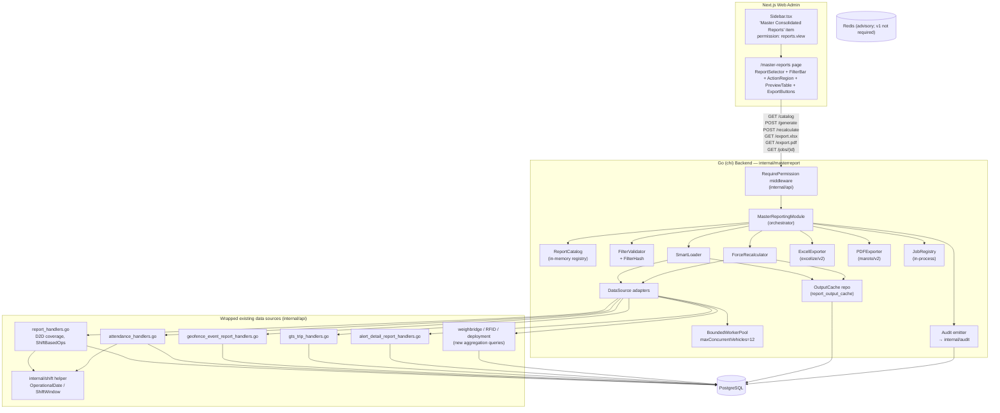
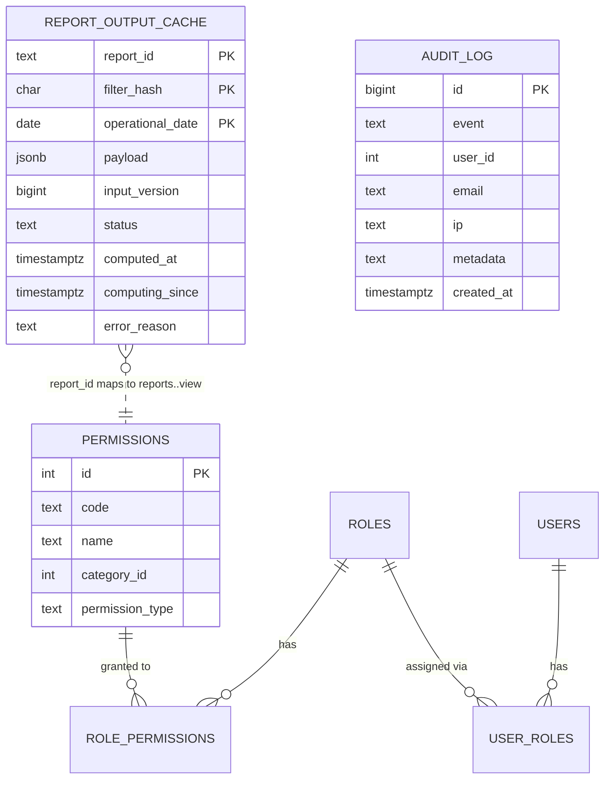
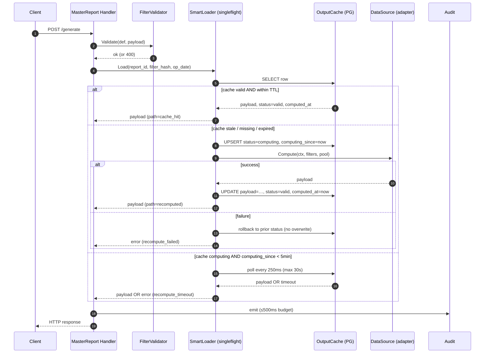
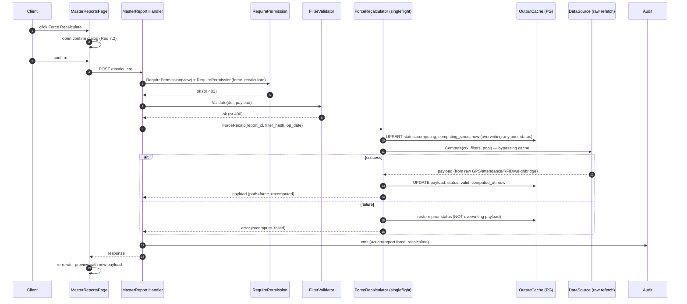

# Design Document: Master Consolidated Reporting

## Overview

*Section 1.*

The Master Consolidated Reporting (MCR) module replaces the manual workflow of stitching together ~25 shift-based operational reports into a daily `ULTIMATE REPORTING.xlsx` workbook. It provides a single Next.js page (`/master-reports`) where operations staff pick a report from a catalog, apply a per-report filter set, preview the result laid out identically to the source Excel worksheet, and export to Excel or PDF.

The module is **additive over the existing reporting subsystem**, not a rewrite:

- Existing handlers in `internal/api/report_handlers.go`, `geofence_event_report_handlers.go`, `gts_trip_handlers.go`, `alert_detail_report_handlers.go`, `attendance_handlers.go`, `vehicle_summary_report_handlers.go`, `unauthorized_movement_handlers.go`, `early_departure_handlers.go`, `active_vehicle_summary_handlers.go`, and `lane_monitoring_handlers.go` become **data sources**, wrapped behind a `DataSource` adapter interface. None of them are duplicated.
- The single-report `internal/ultimatereport/` registry is generalized into a 25-entry `Report_Catalog` under a new `internal/masterreport/` package. The Excel template-driven engine is preserved as one strategy among many.
- The Smart Load freshness model (`docs/reporting-architecture-redesign.md` §11.3) is composed with — not replaced by — a new `report_output_cache` table that keys on `(report_id, filter_hash, operational_date)`.
- Operational-date / shift-window logic currently duplicated across four files is consolidated into a new `internal/shift` helper (per redesign doc §6) and MCR is its first consumer.

PBT applies: 12 of the 15 acceptance-criteria-derived properties are universal invariants over generated inputs (filter hashing, RBAC gating, cache idempotence, etc.), 2 are example-shaped (operational-date anchoring, sidebar gate), and 1 is a property over a closed type space (preview/Excel value equivalence). Property tests live in `internal/masterreport/*_test.go` using `pgregory.net/rapid`; frontend property tests live in `web/__tests__/master-reports/*` using `fast-check`.

Out of scope for v1: mobile surface, scheduled delivery, email delivery, recurring background generation (per Req 13.3, 13.4).

---

## Architecture

*Section 2.*

### 2.1 Component Diagram



### 2.2 Module boundaries

- **`internal/masterreport/`** — new package. Owns: `Catalog`, `ReportDefinition`, `FilterValidator`, `FilterHash`, `DataSource` interface, adapter wrappers, `SmartLoader`, `OutputCacheRepo`, `JobRegistry`, `ExcelExporter`, `PDFExporter`, HTTP handler methods (registered onto `*api.Handler`).
- **`internal/api/`** — unchanged report handlers; one new file `master_report_handlers.go` thinly wires routes onto the `masterreport` package. `RequirePermission` reused as-is. `rbac_permissions.go` extended with one runtime-merged source for `reports.<id>.*` entries.
- **`internal/shift/`** — new helper extracted from duplicated logic (redesign doc §6). Provides `OperationalDate(now time.Time, cutoff time.Duration) time.Time`, `ShiftWindow(date time.Time, shift Shift) (start, end time.Time)`, `IsShiftActive(now, date, shift) bool`.
- **`internal/ultimatereport/`** — kept on disk during a transition window; the existing "Daily Master Consolidated Report" Report_Definition is preserved as a single catalog entry that wraps the legacy `ExcelEngine` and `BuildReportData`. No code is moved or deleted in this design; the migration of its content is a Phase 2 task referenced in §20.

### 2.3 Request lifecycle (success path)

```
HTTP request → AuthMiddleware → RequirePermission(reports.<id>.view)
  → Mod.Handle*
    → FilterValidator.Validate(report_def, payload)
    → FilterHash(payload)
    → SmartLoader.Load(report_id, filter_hash, op_date)
        → OutputCache.Get → hit? return; else
        → DataSource.Compute(ctx, filters, BWP) → OutputCache.Put → return
    → (optional) ExcelExporter / PDFExporter
  → Audit emit (≤500ms budget, non-blocking failure)
  → response
```

---

## Components and Interfaces

*Section 3.*

### 3.1 `ReportDefinition` and `Catalog`

Authoritative Go struct shape (validates Req 1.1, 1.5, 2.1):

```go
package masterreport

type ReportID string // matches ^[a-z0-9_]+$, ≤64 chars (Req 1.5)

type Category string
const (
    CategoryRoadSweeping     Category = "road_sweeping"
    CategoryOpenDepot        Category = "open_depot"
    CategoryAttendance       Category = "attendance"
    CategoryZoneCoverage     Category = "zone_coverage"
    CategoryRFID             Category = "rfid"
    CategoryWeighbridge      Category = "weighbridge"
    CategoryDeployment       Category = "deployment"
    CategoryActiveVehicle    Category = "active_vehicle"
    CategoryAlerts           Category = "alerts"
    CategoryConsolidated     Category = "consolidated"
)

type FilterKey string
const (
    FilterDate        FilterKey = "date"
    FilterDateRange   FilterKey = "date_range"
    FilterZone        FilterKey = "zone"
    FilterWard        FilterKey = "ward"
    FilterShift       FilterKey = "shift"
    FilterVehicle     FilterKey = "vehicle"
    FilterRoute       FilterKey = "route"
    FilterRouteType   FilterKey = "route_type"
    FilterDepartment  FilterKey = "department"
    FilterDesignation FilterKey = "designation"
    FilterEmployee    FilterKey = "employee"
)

type FilterControl struct {
    Key      FilterKey `json:"key"`
    Required bool      `json:"required"`           // Req 2.2: exactly required|optional
    DefaultJSON []byte `json:"default,omitempty"`  // canonical default for UI
}

type PreviewLayout struct {
    Columns       []ColumnSpec   `json:"columns"`
    MergeRanges   []MergeRange   `json:"merge_ranges"`
    ColorRules    []ColorRule    `json:"color_rules"`
    TotalsRows    []TotalsRow    `json:"totals_rows"`
    RemarksColumn *ColumnRef     `json:"remarks_column,omitempty"`
    TotalWidthMM  float64        `json:"total_width_mm"` // drives PDF A4 vs A3 (Req 5.4, 5.7)
}

type ColumnSpec struct {
    Key      string `json:"key"`
    Header   string `json:"header"`
    WidthMM  float64 `json:"width_mm"`
    Type     string `json:"type"` // "int" | "decimal2" | "date_ymd" | "time_hm" | "text"
    Align    string `json:"align"`
    FillHex  string `json:"fill_hex,omitempty"`
}

type ReportDefinition struct {
    ID              ReportID
    Name            string                 // 1–120 chars, Req 1.5
    Category        Category
    Filters         []FilterControl
    PermissionKey   string                 // reports.<id>.view, ≤64 chars (Req 1.5, 8.1)
    DataSource      DataSource             // §3.4
    TemplateXLSX    string                 // path under storage/report-templates/, optional
    Preview         PreviewLayout
    OperationalCutoff time.Duration        // default 4h, per-report override (Req 12.3)
}
```

Catalog loading (validates Req 1.6, 1.8):

```go
type Catalog struct {
    mu     sync.RWMutex
    defs   map[ReportID]*ReportDefinition
    order  []ReportID
}

// MustRegister panics on duplicate ID or invalid schema — fail-fast at boot (Req 1.8).
func (c *Catalog) MustRegister(def *ReportDefinition) { /* … */ }

// Validate runs at boot: checks every TemplateXLSX file exists, every DataSource is non-nil,
// every PermissionKey matches a row that will be seeded (§12).
func (c *Catalog) Validate(ctx context.Context, templateDir string, rbac *repository.RBACRepository) error
```

### 3.2 The 25 reports → data-source mapping

Table maps every named report from Req 1.2 (and the rest discovered from `ULTIMATE REPORTING.xlsx`) to either an existing handler or a new aggregation. "Wraps" means the adapter calls the existing handler's underlying repository function, not its HTTP shell. Validates Req 1.3, 1.4.

| `report_id` | Display name | Category | Filters (R=required) | Data source mapping |
|---|---|---|---|---|
| `road_sweeping_0700` | 07:00 AM Road Sweeping | road_sweeping | date(R), zone | Wraps `GetShiftBasedOpsReport` (shift=morning_sweep) |
| `open_depot_gvp_0730` | 07:30 AM Open Depot GVP Coverage | open_depot | date(R), zone | Wraps `open_depot_handlers.GetOpenDepotDashboard` + cleaning submission repo |
| `helper_attendance_0800` | 08:00 AM Helper Attendance | attendance | date(R), department, designation | Wraps `GetAttendance` (designation=helper) |
| `zone_coverage_hmz` | Zone-wise Coverage — Hawamahal-Amer (HMZ) | zone_coverage | date(R), shift | Wraps `GetD2DRouteCoverageReport` (zone filter pinned) |
| `zone_coverage_clz` | Zone-wise Coverage — Civil Lines (CLZ) | zone_coverage | date(R), shift | Same, zone=CLZ |
| `zone_coverage_kpz` | Zone-wise Coverage — Kishanpole (KPZ) | zone_coverage | date(R), shift | Same, zone=KPZ |
| `zone_coverage_anz` | Zone-wise Coverage — Adarsh Nagar (ANZ) | zone_coverage | date(R), shift | Same, zone=ANZ |
| `zone_coverage_sw` | Zone-wise Coverage — Street Waste (SW) | zone_coverage | date(R), shift | Same, zone=SW |
| `rfid_collection` | RFID Collection | rfid | date(R), zone, ward | **New aggregation**: query `rfid_scan_log` joined to `wards`, grouped by `(zone, ward, vehicle)`. No existing handler covers this. |
| `weighbridge_gts_trip` | Weighbridge / GTS Trip | weighbridge | date(R), shift | Wraps `GetGTSTripReport` + weighbridge repo join (`weighbridge_data`). |
| `daily_vehicle_deployment` | Daily Vehicle Deployment | deployment | date(R), zone, ward | **New aggregation**: query `vehicle_route_assignments` ∩ `gps_data` first-ping-per-day, classify deployed/idle. |
| `active_vehicle_summary` | Active Vehicle Summary | active_vehicle | date(R), zone | Wraps `GetActiveVehicleSummaryReport` |
| `active_vehicle_by_ward` | Ward-wise Active Vehicle Summary | active_vehicle | date(R), zone, ward | Wraps `GetActiveVehicleSummaryByWardReport` |
| `driver_attendance_summary` | Driver Attendance Summary | attendance | date(R), zone, department | Wraps `GetAttendance` (designation=driver) |
| `supervisor_attendance_summary` | Supervisor Attendance Summary | attendance | date(R), zone, department | Wraps `GetAttendance` (designation=supervisor) |
| `zone_manager_attendance_summary` | Zone Manager Attendance Summary | attendance | date(R), zone | Wraps `GetAttendance` (designation=zone_manager) |
| `unauthorized_movement` | Unauthorized Movement | active_vehicle | date(R), zone, vehicle | Wraps `GetUnauthorizedMovementReport` |
| `early_departure` | Early Departure | active_vehicle | date(R), zone | Wraps `GetEarlyDepartureReport` |
| `geofence_events` | Geofence Events | alerts | date_range(R), zone, vehicle | Wraps `GetGeofenceEventReport` |
| `ward_geofence` | Ward Geofence Coverage | zone_coverage | date(R), zone, ward | Wraps `GetWardGeofenceReport` |
| `alert_detail` | Alert Detail | alerts | date_range(R), vehicle | Wraps `GetAlertDetailReport` |
| `vehicle_summary` | Vehicle Summary | active_vehicle | date(R), vehicle | Wraps `GetVehicleSummaryReport` |
| `lane_monitoring` | Lane Monitoring | zone_coverage | date(R), zone, ward, route | Wraps `GetLaneMonitoringReport` |
| `gts_weighbridge_summary` | GTS Weighbridge Summary | weighbridge | date_range(R) | **New aggregation**: SUM(weighbridge_data.weight) GROUP BY date, gts. |
| `daily_consolidated` | Daily Master Consolidated Report | consolidated | date(R) | Wraps the existing `ultimatereport.UltimateReportService.BuildReportData` |

Total: **25 Report_Definitions**, satisfying Req 1.1.

Catalog initialization fails startup if any of the above resolves to a missing handler, a duplicate `report_id`, or a template file not present in `storage/report-templates/` (Req 1.8).

### 3.3 `FilterControl` validation and `Filter_Hash`

`Validates: Req 2.4, 2.5, 2.6, 2.7.`

```go
type FilterPayload map[FilterKey]any // value is one of: string, int, []int, [2]time.Time, time.Time

func (v *FilterValidator) Validate(def *ReportDefinition, p FilterPayload) error {
    schema := def.Filters
    declared := make(map[FilterKey]FilterControl, len(schema))
    for _, fc := range schema { declared[fc.Key] = fc }

    var missing, unsupported []FilterKey
    for _, fc := range schema {
        if fc.Required {
            v, ok := p[fc.Key]
            if !ok || isEmpty(v) { missing = append(missing, fc.Key) }
        }
    }
    for k := range p {
        if _, ok := declared[k]; !ok { unsupported = append(unsupported, k) }
    }
    if len(missing) > 0 || len(unsupported) > 0 {
        return &ValidationError{Missing: missing, Unsupported: unsupported}
    }
    return nil
}
```

**Filter_Hash algorithm** (Req 2.6, 12.1; Property 1):

1. Reject the payload unless `Validate` returned nil.
2. Canonicalize each value to a stable byte form:
   - `time.Time` → `time.UTC().Format(time.RFC3339Nano)`.
   - `[]int` → sort ascending, deduplicate, join with `,`.
   - `string` → UTF-8 bytes, no trim, no case change.
   - `int`, `float64` → `strconv` with `%g` precision (no locale).
3. Sort filter keys lexicographically.
4. Emit `key=value;key=value;...` (`;` separator, no trailing).
5. `SHA-256` → lowercase hex (64 chars). This is the `filter_hash`.

The deterministic step ordering guarantees order independence (Property 1: `FilterHash(F) == FilterHash(permutation(F))`).

### 3.4 `DataSource` adapter interface

`Validates: Req 1.3, 1.4, 12.2.`

```go
type Payload struct {
    Rows         []map[string]any `json:"rows"`
    Totals       map[string]any   `json:"totals"`
    Header       map[string]any   `json:"header"`   // date label, applied filter summary
    GeneratedAt  time.Time        `json:"generated_at"`
    InputVersion int64            `json:"input_version"` // monotonic; bumps on invalidation
}

type DataSource interface {
    // Compute runs the underlying query. Must honor ctx cancellation and use the
    // shared BoundedWorkerPool when fanning out per-vehicle/zone/ward (Req 11.1).
    Compute(ctx context.Context, f FilterPayload, pool *BoundedWorkerPool) (Payload, error)

    // InputVersion returns the current monotonically increasing version of the
    // underlying input data for the given filter set. Used by Output_Cache for
    // staleness checks (Req 12.2). Implementations that have no version concept
    // return time.Now().UnixMilli() — i.e., always-stale-on-route-edit semantics
    // applies only where the source surfaces a real version.
    InputVersion(ctx context.Context, f FilterPayload) (int64, error)
}
```

Two adapter shapes:

```go
// existingHandlerAdapter wraps a handler that already exists in internal/api.
// It calls the handler's repository methods directly (NOT its HTTP shell), so
// permission and audit happen exactly once at the masterreport layer.
type existingHandlerAdapter struct {
    handler *api.Handler
    fn      func(ctx context.Context, h *api.Handler, f FilterPayload, pool *BoundedWorkerPool) (Payload, error)
    inputVer func(ctx context.Context, h *api.Handler, f FilterPayload) (int64, error)
}

// newAggregationAdapter is used for the 3 reports that have no existing handler
// (rfid_collection, daily_vehicle_deployment, gts_weighbridge_summary).
type newAggregationAdapter struct {
    pool *pgxpool.Pool
    sql  string
    args func(FilterPayload) []any
    versionSQL string
}
```

The `existingHandlerAdapter` is the bridge that satisfies Req 1.3: we do **not** copy SQL or business logic out of `report_handlers.go` etc.; we call the same underlying repository methods through a thin functional shim.

### 3.5 `BoundedWorkerPool`

`Validates: Req 11.1, 11.6; Property 13.`

```go
type BoundedWorkerPool struct {
    sem     chan struct{}    // capacity = maxConcurrentVehicles (12)
    backlog chan func()      // FIFO queue, cap = 1000
    wg      sync.WaitGroup
}

const MaxConcurrentVehicles = 12
const MaxBacklog = 1000

func NewBoundedWorkerPool() *BoundedWorkerPool { /* … */ }

// Submit enqueues; returns ErrPoolFull when backlog is at MaxBacklog (Req 11.6).
func (p *BoundedWorkerPool) Submit(work func()) error
```

The semaphore pattern matches `GetD2DRouteCoverageReport`'s existing `maxConcurrentVehicles = 12`. The single pool instance is constructed in `MasterReportingModule.New` and shared across all in-flight requests; this prevents request 2 from launching its own 12-worker pool while request 1 is already saturating the DB pool.

---

## Data Models

*Section 4.*

### 4.1 `report_output_cache` (new table)

`Validates: Req 6.1–6.7, 7.3, 11.3, 12.1–12.7.`

```sql
-- migrations/063_master_reporting_module.sql
CREATE TABLE IF NOT EXISTS report_output_cache (
    report_id         TEXT NOT NULL,
    filter_hash       CHAR(64) NOT NULL,            -- SHA-256 hex
    operational_date  DATE NOT NULL,
    payload           JSONB,                        -- nullable while status='computing'
    input_version     BIGINT NOT NULL DEFAULT 0,
    status            TEXT NOT NULL DEFAULT 'valid' -- valid|stale|computing|error
                      CHECK (status IN ('valid','stale','computing','error')),
    computed_at       TIMESTAMPTZ NOT NULL DEFAULT now(),
    computing_since   TIMESTAMPTZ,
    error_reason      TEXT,
    PRIMARY KEY (report_id, filter_hash, operational_date)
);

CREATE INDEX IF NOT EXISTS idx_roc_eviction ON report_output_cache (computed_at);
CREATE INDEX IF NOT EXISTS idx_roc_report_status ON report_output_cache (report_id, status);
CREATE INDEX IF NOT EXISTS idx_roc_computing ON report_output_cache (status, computing_since)
    WHERE status = 'computing';
```

**TTL / eviction:**
- Live-day TTL: 60 seconds (`computed_at` < now() - 60s on `operational_date = today` → recompute). Req 6.4.
- Historical TTL: 24 hours (Req 6.2). Historical = `operational_date < today`. Implementation note: the TTL check is in code, not in a DB constraint, because "today" depends on per-report `operational_cutoff`.
- Hard eviction: rows with `computed_at` older than 30 days are deleted by a daily cron (`internal/cron/output_cache_evict.go`). Req 12.6.

**Coalescence semantics** (Req 6.6, 7.8, 11.3, 12.4):
- Read row with `SELECT ... FOR UPDATE SKIP LOCKED` is **not** used; coalescence is implemented at the application layer with an in-process `singleflight.Group` keyed by `(report_id, filter_hash, operational_date)`. Reasoning: the cache row exists or doesn't; concurrent goroutines on the same process serialize through singleflight. Cross-process coalescence is rare in v1 (single backend instance) but if two processes both see `status='computing'` with `computing_since` < 5min, both wait on the row, polling every 250ms with backoff; whichever observes `status='valid'` first returns it. The status-and-`computing_since` design exists precisely to enable this.

### 4.2 ER diagram



### 4.3 No new in-memory data structures for the catalog at rest

The `Catalog` is a Go map populated at boot from constants in `internal/masterreport/registry.go`. It is **not** persisted to the DB. Rationale: definitions are code (filters, preview layout, template path, data-source binding are all compile-time), and a code-defined registry catches `Validate` errors at startup rather than at first request.

---

## Correctness Properties

*Section 5.*

*A property is a characteristic or behavior that should hold true across all valid executions of a system — essentially, a formal statement about what the system should do. Properties serve as the bridge between human-readable specifications and machine-verifiable correctness guarantees.*

The fifteen properties below are the consolidated, redundancy-free set produced after the prework analysis of every acceptance criterion in `requirements.md`. They map back to the per-criterion test classifications. Properties P3 and P15 are frontend properties tested with `fast-check`; the remainder are backend properties tested with `pgregory.net/rapid`.

### Property 1: Filter_Hash Order Independence

*For any* validated FilterPayload `F` and any permutation `F'` of the same key-value pairs, `FilterHash(F) == FilterHash(F')`.

**Validates: Requirements 2.6, 12.1.**

### Property 2: FilterValidator Rejection Completeness

*For any* ReportDefinition `D` and any FilterPayload `P` that either omits one or more `Required` keys in `D.Filters` or supplies one or more keys not present in `D.Filters`, `FilterValidator.Validate(D, P)` returns a `ValidationError` whose `Missing` and `Unsupported` slices together name **every** offending key in `P`, and the DataSource is not invoked.

**Validates: Requirements 2.4, 2.5.**

### Property 3: FilterSchema Visibility Invariant (frontend)

*For any* ReportDefinition `D` and any prior session state `S`, after the user selects `D` the Shared_Filter_Bar renders exactly the set of FilterControl keys declared in `D.Filters` — no superset, no subset — and any value bound to a key not in `D.Filters` is discarded.

**Validates: Requirements 2.3, 2.7.**

### Property 4: Output Equivalence (Preview ≡ Excel ≡ PDF)

*For any* `(report_id, filter_set)` invocation in the same session, the multiset of `(row_index, column_key, value)` triples produced by the In_Page_Preview view-model equals the multiset produced by the Excel_Exporter and the multiset produced by the PDF_Exporter, after applying the Report_Definition's column type formatting rules (two decimal places for percentages, integer for counts, `YYYY-MM-DD` for dates) and with no whitespace trimming or case changes.

**Validates: Requirements 3.2, 4.1, 5.1.**

### Property 5: Excel/PDF Structural Fidelity

*For any* PreviewLayout `L` and any Payload `P`, the produced `.xlsx` file's merge ranges equal `L.MergeRanges` exactly, the column-header fill colors equal `L.Columns[i].FillHex` for every column, the totals-row positions equal `L.TotalsRows`, and the remarks-column position equals `L.RemarksColumn`. The produced `.pdf` file's page size equals `A4 landscape` iff `L.TotalWidthMM ≤ 297`, equals `A3 landscape` iff `297 < L.TotalWidthMM ≤ 420`, and the request is rejected iff `L.TotalWidthMM > 420`.

**Validates: Requirements 4.2, 5.4, 5.7.**

### Property 6: Smart_Load Recompute Trigger and Idempotence

*For any* cache state `C ∈ {absent, valid-fresh, valid-expired, stale, computing-fresh, computing-stale, error}` for a key `K = (report_id, filter_hash, operational_date)`:

- `SmartLoad(K)` invokes `DataSource.Compute` iff `C ∈ {absent, valid-expired, stale, computing-stale, error}`.
- When `C = valid-fresh`, two consecutive `SmartLoad(K)` calls return payloads that are byte-equal and the second call invokes `Compute` zero times.
- The response field `path` equals `cache_hit` iff `Compute` was not invoked, and `recomputed` iff it was.
- Live-day TTL is 60 seconds when `operational_date = today` (under the per-report cutoff); historical TTL is 24 hours.

**Validates: Requirements 6.2, 6.3, 6.4, 6.5.**

### Property 7: Concurrent Recompute Coalescence

*For any* number `N ≥ 2` of concurrent SmartLoad and/or Force_Recalculate requests for the **same** key `K`, the `DataSource.Compute` function is invoked at most **one** time across the `N` requests, and every request observes the same final payload (or the same coalesced error).

**Validates: Requirements 6.6, 7.8, 12.4.**

### Property 8: Force_Recalculate State Transition

*For any* key `K`, a successful Force_Recalculate transitions the Output_Cache row through `* → computing → valid`, ends with `computed_at` equal to the recompute completion timestamp, returns `path = force_recomputed` in the response, and a SmartLoad issued immediately afterward for `K` returns the Force_Recalculate's recomputed payload (cache hit).

**Validates: Requirements 7.3, 7.7, 12.1.**

### Property 9: RBAC Enforcement Completeness

*For any* ReportDefinition `R` and any principal `P`:

- The Report_Catalog returned to `P` contains `R` iff `P` holds `reports.<R.report_id>.view`.
- Every Generate, Export-to-Excel, and Export-to-PDF request for `R` from `P` returns a permission-denied response iff `P` does not hold `reports.<R.report_id>.view`.
- Every Force_Recalculate request from `P` returns a permission-denied response iff `P` does not hold both `reports.<R.report_id>.view` and `reports.force_recalculate`.
- For every `P` that holds `reports.<R.report_id>.view`, Export-to-Excel and Export-to-PDF requests are accepted without requiring a separate export permission.

**Validates: Requirements 1.6, 7.4, 8.3, 8.4, 8.5, 8.7.**

### Property 10: Audit Completeness

*For any* request (success or error) to Generate, Force_Recalculate, Export-to-Excel, or Export-to-PDF, exactly one audit record exists in the audit store with matching `user_id`, `action`, `report_id`, `filter_hash`, and HTTP status code, regardless of whether the audit emit itself succeeded — when the emit fails, the response is still returned and the failure is logged at error level.

**Validates: Requirements 10.1, 10.4.**

### Property 11: Bounded Concurrency Invariant

*For any* sequence of work items submitted to the shared BoundedWorkerPool during any Generate or Force_Recalculate request, the number of concurrently executing worker goroutines never exceeds `MaxConcurrentVehicles = 12`, and the pool rejects any submit when the FIFO backlog has reached 1000 unstarted items.

**Validates: Requirements 11.1, 11.6.**

### Property 12: Async Job State Machine

*For any* request whose synchronous computation crosses 30 seconds, a 202 response with a job_id (16–64 alphanumeric chars) is emitted within 1 second of the threshold; for any concurrent request to the same key while the job is running, the same job_id is returned within 200ms without spawning a duplicate job or reserving an extra pool slot; for any poll within 24 hours the JobRegistry returns a status in `{pending, running, done, error}` with the documented payload shape; for any job exceeding 15 minutes the status transitions to `error` and the pool slot is released.

**Validates: Requirements 11.2, 11.3, 11.4, 11.5.**

### Property 13: Operational_Date Anchoring

*For any* shift `S` whose `end_time` is earlier in the day than its `start_time` (i.e., crosses midnight), and any clock time `now` that lies within the shift window `[S.start_day, S.start_day + 1)`, `OperationalDate(now, S.cutoff)` equals `S.start_day`. Every SmartLoad issued at any clock time within the shift resolves to the same Output_Cache key.

**Validates: Requirements 12.3.**

### Property 14: Catalog ↔ Permissions Coherence

*For every* ReportDefinition registered in the Report_Catalog at boot time, a row with `code = reports.<report_id>.view`, `code = reports.<report_id>.export`, and `code = reports.<report_id>.generate` exists in the `permissions` table under category `Reports`. Conversely, *for every* `permissions` row whose code matches `reports.*.view`, either a ReportDefinition with the matching `report_id` exists in the Report_Catalog or the report has been explicitly marked retired in the registry. Boot fails if either direction is violated.

**Validates: Requirements 1.1, 1.5, 1.8, 8.1, 8.8.**

### Property 15: Sidebar Visibility Gate (frontend)

*For every* principal `P`, the "Master Consolidated Reports" sidebar item appears in the rendered DOM iff `P` holds `reports.view`; when absent, the item is neither visible nor focusable via keyboard navigation.

**Validates: Requirements 9.3, 9.4.**

---

## Error Handling

*Section 6.*

### 6.1 Error categories

| Category | HTTP status | Response field | Source |
|---|---|---|---|
| `validation_error` | 400 | `error.missing[]`, `error.unsupported[]` | FilterValidator |
| `auth_required` | 401 | `error.code = auth_required` | AuthMiddleware |
| `permission_denied` | 403 | `error.code = permission_denied` | RequirePermission |
| `not_found` | 404 | `error.code = report_not_found \| job_not_found` | Catalog / JobRegistry |
| `method_not_allowed` | 405 | `error.code = mobile_surface_disabled` | Mobile router rejection (Req 13.3) |
| `pool_overload` | 429 | `error.code = pool_overload, retry_after_seconds` | BoundedWorkerPool (Req 11.6) |
| `recompute_failed` | 502 | `error.code = recompute_failed, error.stage = data_source\|cache_write\|excel\|pdf` | DataSource / Exporters |
| `recompute_timeout` | 504 | `error.code = recompute_timeout` | 30s sync, 15min async ceiling |
| `export_too_wide` | 400 | `error.code = export_too_wide_for_pdf` | PDFExporter (Req 5.7) |

### 6.2 Failure-mode contracts

- **DataSource failure during SmartLoad recompute**: prior cache state preserved (status stays whatever it was, `computed_at` unchanged). Response is `recompute_failed`. Audit emits with `outcome = error`. (Req 6.7, 12.7.)
- **DataSource failure during Force_Recalculate**: prior cache state preserved. Status returns to whatever it was before being set to `computing`. Response is `recompute_failed`. Audit emits with `outcome = error`. (Req 7.6.)
- **OutputCache write failure after successful recompute**: response carries the recomputed payload anyway (Req 12.5). Log at `warn` with the cache key and failure reason. Subsequent SmartLoad will recompute again.
- **Excel/PDF generation failure**: response is `recompute_failed` with `error.stage` identifying the failing stage. No partial content is streamed; `Content-Type` and `Content-Disposition` headers are not written until at least the first byte of the produced file is ready (Req 4.6, 5.6).
- **Audit emit failure**: response is unaffected. The `internal/audit` logger writes an error-level log line with `user_id`, `action`, `report_id`, `filter_hash`. No retry. (Req 10.4.)
- **Async job exceeds 15-minute ceiling**: pool slot is released, cache row transitions to `status = error` with `error_reason` populated, job record retained for 1 hour. Subsequent polls return `error`. (Req 11.5.)

### 6.3 Client-visible state preservation

`Validates: Req 3.7, 7.6, 14.5.`

- On Generate/Force_Recalculate failure, the page keeps any previously rendered preview rather than clearing it. Generate and Force_Recalculate controls re-enable; Export controls re-enable iff a prior preview exists.
- On catalog load failure, the page renders an inline error banner and a `Retry` button; prior `selectedReportId` and filter values in component state are preserved.

---

## Testing Strategy

*Section 7.*

### 7.1 Dual approach

- **Property tests** (`pgregory.net/rapid` backend, `fast-check` frontend): the 15 properties from §5. Minimum **100 iterations** per property test, controlled via `rapid.MakeCheck(t, ..., rapid.Check())`. Each property test is tagged in a comment with `// Feature: master-consolidated-reporting, Property N: <text>`.
- **Example / integration tests** (`testify` + `httptest`): the criteria classified EXAMPLE / EDGE_CASE / SMOKE / INTEGRATION in the prework. These cover specific HTTP shapes, header values, snapshot of UI at desktop viewports, fixed-input edge cases like zero-rows.

### 7.2 Test-to-property cross-reference

| Property | Test file | Fixture / generator (1-line) |
|---|---|---|
| P1 Filter_Hash order independence | `internal/masterreport/filter_hash_property_test.go` | rapid generates a 1–11-element `FilterPayload` over the closed FilterKey enum; permutes; hashes both. |
| P2 Validator rejection completeness | `internal/masterreport/filter_validator_property_test.go` | rapid generates a `ReportDefinition` with random `Filters`, then a payload that randomly drops required keys and/or adds non-schema keys. |
| P3 Filter bar visibility (FE) | `web/__tests__/master-reports/filter-bar.property.test.tsx` | fast-check generates `(reportDef, priorSessionState)`; uses RTL to render `<FilterBar>` and asserts rendered control keys. |
| P4 Preview≡Excel≡PDF | `internal/masterreport/output_equivalence_property_test.go` | rapid generates a `Payload` of up to 200 rows × 20 columns; runs preview view-model + excel exporter + pdf exporter; compares `(row,col,value)` multisets. |
| P5 Structural fidelity | `internal/masterreport/excel_pdf_structure_property_test.go` | rapid generates `PreviewLayout`; produces xlsx and pdf; re-parses both and asserts merges/colors/page-size match. |
| P6 SmartLoad trigger/idempotence | `internal/masterreport/smart_loader_property_test.go` | rapid produces a starting cache state ∈ enum; SmartLoad twice; mock DataSource counts invocations. |
| P7 Concurrent coalescence | `internal/masterreport/coalesce_property_test.go` | rapid generates N∈[2,32] concurrent SmartLoad/ForceRecalc calls on the same key against an instrumented DataSource. |
| P8 Force_Recalculate transition | `internal/masterreport/force_recalculate_property_test.go` | rapid generates `(report_id, filter_set, prior_cache_state)`; runs Force_Recalc; observes status sequence and response field. |
| P9 RBAC completeness | `internal/masterreport/rbac_property_test.go` | rapid generates a principal with a random permission subset over the 25 reports + `reports.force_recalculate`; calls each endpoint. |
| P10 Audit completeness | `internal/masterreport/audit_property_test.go` | rapid generates request sequences; in-memory audit recorder collects rows; assert per-request row count. |
| P11 Bounded concurrency | `internal/masterreport/pool_property_test.go` | rapid generates a batch of N∈[1,2000] no-op tasks; instrument the pool with an atomic counter for peak concurrency. |
| P12 Async job state machine | `internal/masterreport/job_registry_property_test.go` | rapid generates a slow DataSource with a controllable delay; drive the JobRegistry; poll at every state transition. |
| P13 Operational_Date anchoring | `internal/masterreport/shift_anchor_property_test.go` | rapid generates a Shift with `end<start` and a `now` within `[start_day, start_day+1)`; assert `OperationalDate(now, cutoff) == start_day`. |
| P14 Catalog↔permissions coherence | `internal/masterreport/catalog_validate_property_test.go` | rapid perturbs the registered Catalog (drop entry, duplicate id, miss permission row); assert Validate returns specific error. |
| P15 Sidebar visibility (FE) | `web/__tests__/master-reports/sidebar.property.test.tsx` | fast-check generates principals with random permission sets; RTL renders `<Sidebar>` and asserts presence of the MCR item. |

### 7.3 Unit and integration tests (non-property)

- HTTP contract tests for every endpoint in §16: status codes, headers, request/response JSON shapes.
- Snapshot tests for `<MasterReportsPage>` at viewports 1280, 1920, 2560 (Req 13.1) and 1024 (Req 13.2).
- Integration test: full Generate → Cache → Force_Recalculate → Export cycle against a Postgres test container.
- Smoke test: boot the app, assert `RegisterAllPermissions` seeded all `reports.<id>.{view,export,generate}` rows plus `reports.view` and `reports.force_recalculate`.

### 7.4 Property test config and tagging

```go
// Feature: master-consolidated-reporting, Property 1: Filter_Hash Order Independence
func TestProperty_FilterHash_OrderIndependence(t *testing.T) {
    rapid.Check(t, func(t *rapid.T) {
        payload := genFilterPayload(t)
        permuted := permutePayload(t, payload)
        require.Equal(t, FilterHash(payload), FilterHash(permuted))
    })
}
```

Iteration count: `rapid` defaults to 100 iterations per `Check`; we set `RAPID_CHECKS=200` in CI for the report module.

---

## 8. Async Job Model

`Validates: Req 11.2, 11.3, 11.4, 11.5, 11.7.`

### 8.1 In-process vs DB-backed: decision

Req 11 specifies a 30-second sync threshold, a 15-minute hard ceiling, a 24-hour poll window, and explicit "in-process job registry" wording. We choose **in-process** with the following rationale:

- v1 is single-instance backend; cross-process coordination is not required.
- Job lifetimes are bounded at 15 minutes, well inside one process uptime.
- The 24-hour poll requirement is satisfied by retaining the in-memory record for 24 hours after completion, gated by an LRU cap (10,000 jobs).
- The Output_Cache row already provides cross-restart durability for the eventual result; the job_id is a transient handle, not the result.
- DB-backed queues add migration, retry, and visibility-timeout complexity without v1 value.

If multi-instance backend is introduced later, the JobRegistry interface is the swap point; the cache and audit are already DB-backed.

### 8.2 `JobRegistry` interface

```go
package masterreport

type JobStatus string
const (
    JobPending JobStatus = "pending"
    JobRunning JobStatus = "running"
    JobDone    JobStatus = "done"
    JobError   JobStatus = "error"
)

type Job struct {
    ID            string    // 32-char base32, ≥16 ≤64 (Req 11.2)
    Key           string    // report_id|filter_hash|operational_date
    Status        JobStatus
    SubmittedAt   time.Time
    StartedAt     time.Time
    CompletedAt   time.Time
    Payload       json.RawMessage
    ErrorReason   string
}

type JobRegistry interface {
    SubmitOrGet(ctx context.Context, key string, run func(context.Context) (Payload, error)) (*Job, error)
    Poll(ctx context.Context, id string) (*Job, error)
}
```

### 8.3 ID format

`base32(random 20 bytes)` → 32 characters in `[a-z0-9]`, lowercase. Always satisfies the 16–64 alphanumeric bound in Req 11.2.

### 8.4 Polling endpoint

`GET /api/master-reports/jobs/{job_id}` (§16). Response shape:

```json
{
  "id": "kd7c9xq2...",
  "status": "running" | "done" | "error" | "pending",
  "submitted_at": "2026-...",
  "completed_at": "2026-...",   // null until done|error
  "payload": { ... },           // present iff done; alternative: "payload_url"
  "error_reason": "..."         // present iff error
}
```

When `status == done` and the payload is large (>1 MB), the response substitutes `payload_url` pointing at the cached payload (`GET /api/master-reports/{report_id}/generate?from_cache=1` with the same filters), valid for ≥1 hour because the cache TTL is at least 60s (live) or 24h (historical) (Req 11.4).

### 8.5 Deduplication

`SubmitOrGet(key, run)` does:

```
hold lock
if existing := jobsByKey[key]; existing != nil && existing.Status ∈ {pending, running}:
    return existing
new := mkJob(key)
jobsByKey[key] = new
jobs[new.ID] = new
spawn goroutine: drive Run/Status; on done/error, leave entry; schedule cleanup at +24h
return new
```

This guarantees Req 11.3 (200ms p99 for concurrent same-key) and Property 7 (Compute called at most once).

---

## 9. Excel Exporter

`Validates: Req 4.1–4.7, P4, P5.`

### 9.1 Library choice: `github.com/xuri/excelize/v2`

Already used by `internal/ultimatereport/engine.go`. Mature, supports merges, fills, formula preservation, and streaming writes. No reason to introduce a second xlsx library.

### 9.2 Template-driven design

For each ReportDefinition whose layout matches a `ULTIMATE REPORTING.xlsx` worksheet, the design stores a per-report template `.xlsx` under `storage/report-templates/master/<report_id>.xlsx`. At boot, each template is **loaded once** into an in-memory byte buffer cache (the file is not parsed; it's stored raw):

```go
type templateStore struct {
    mu   sync.RWMutex
    bufs map[ReportID][]byte // raw bytes
}

func (s *templateStore) Open(id ReportID) (*excelize.File, error) {
    s.mu.RLock(); raw := s.bufs[id]; s.mu.RUnlock()
    return excelize.OpenReader(bytes.NewReader(raw))
}
```

Per request:

1. `templateStore.Open(report_id)` clones the template into a fresh `excelize.File`.
2. `ExcelExporter.fill(file, payload, def.Preview)` writes data cells using `SetCellValue` (never `SetCellStyle`), preserving template merges/fills.
3. `file.Write(w)` streams directly to the HTTP response.

This is exactly the pattern the existing `ultimatereport.ExcelEngine` uses and is being generalized.

### 9.3 Streaming response

```go
w.Header().Set("Content-Type", "application/vnd.openxmlformats-officedocument.spreadsheetml.sheet")
w.Header().Set("Content-Disposition", fmt.Sprintf(`attachment; filename="%s_%s.xlsx"`, report_id, op_date.Format("2006-01-02")))
// Note: headers are written AFTER fill() succeeds, before file.Write(w) starts.
// On fill() failure, an error JSON is returned and headers are not committed.
```

This satisfies Req 4.6 (no partial content on failure).

### 9.4 Reports without templates

The 3 "new aggregation" reports (`rfid_collection`, `daily_vehicle_deployment`, `gts_weighbridge_summary`) ship with templates created from `ULTIMATE REPORTING.xlsx`'s corresponding worksheets. If a report has no template (transitional state, optional), the exporter falls back to a programmatic generator that produces headers + data rows using `PreviewLayout.Columns`. This path is also property-tested (P5) so it stays correct.

---

## 10. PDF Exporter

`Validates: Req 5.1–5.7.`

### 10.1 Library candidates and recommendation

| Library | Pros | Cons |
|---|---|---|
| `github.com/jung-kurt/gofpdf` | Mature, widely used, A4/A3 control, table primitives | Project archived (read-only since 2022); no SVG; manual merge-cell math |
| `github.com/signintech/gopdf` | Active fork-ish, lighter API | Weaker table/merge support |
| `github.com/johnfercher/maroto/v2` | Active, declarative grid + page-size API, supports background colors and merges via grid spans, builds on gofpdf | Layout abstraction sometimes fights pixel-accurate layouts |
| Headless renderer (chromedp + Chrome) | Best fidelity to HTML preview, automatic merge/color handling | Heavy: requires a browser binary in the deploy artifact, adds 200+ MB, slow cold start; violates "Go backend" simplicity |

**Recommendation: `github.com/johnfercher/maroto/v2`.** Reasoning: it gives a declarative grid that maps cleanly onto `PreviewLayout.Columns` + `MergeRanges`, supports A4/A3 landscape via `config.NewBuilder().WithPageSize(consts.A4).WithOrientation(consts.Landscape)`, supports colored cell backgrounds, and is built on `gofpdf` for output fidelity. It compiles to a single Go binary — no Chrome dependency. The trade-off vs headless Chrome (less pixel-perfect on edge cases) is acceptable given the design requires only "match the In_Page_Preview's structural layout" (Req 5.1), not "match the preview's CSS visual rendering exactly".

### 10.2 Page-size logic

```go
func choosePage(layout PreviewLayout) (consts.PageSize, error) {
    switch {
    case layout.TotalWidthMM > 420:
        return "", ErrExportTooWide        // Req 5.7
    case layout.TotalWidthMM > 297:
        return consts.A3, nil              // Req 5.4
    default:
        return consts.A4, nil
    }
}
```

Orientation is always Landscape for table reports. This drives Property 5 (page-size selection).

### 10.3 Streaming response

```go
w.Header().Set("Content-Type", "application/pdf")
w.Header().Set("Content-Disposition", fmt.Sprintf(`attachment; filename="%s_%s.pdf"`, report_id, op_date.Format("2006-01-02")))
```

Failure handling mirrors §9.3: headers committed only after layout succeeds.

### 10.4 Timeout

`maroto` exposes a synchronous `Generate()` call. We wrap it in a `context.WithTimeout(ctx, 30*time.Second)` (Req 5.6). On timeout, abort and return `recompute_timeout`.

---

## 11. RBAC Integration

`Validates: Req 7.1, 7.4, 7.5, 8.1–8.8, P9.`

### 11.1 Boot-time idempotent permission seeding

A new function `MasterReportPermissions(catalog *Catalog) []repository.Permission` returns:

- One `reports.<id>.view`, one `reports.<id>.export`, and one `reports.<id>.generate` row per ReportDefinition (75 rows for 25 reports). All under `CategoryID = 5` ("Reports"). Req 8.1, 8.8.
- One `reports.view` row (already exists; left unchanged if present). Req 8.2.
- One `reports.force_recalculate` row. Req 8.2.

`cmd/server/main.go` is extended:

```go
// After RegisterAllPermissions (line 208)
mcrPerms := masterreport.PermissionsForCatalog(catalog)
if err := rbacRepo.RegisterPermissions(ctx, mcrPerms); err != nil {
    log.Warn().Err(err).Msg("Failed to register master report permissions")
}
```

`repository.RBACRepository.RegisterPermissions` is already idempotent (uses `ON CONFLICT DO NOTHING`), so re-runs are safe (Req 8.1).

### 11.2 Middleware composition per endpoint

| Endpoint | Middleware chain |
|---|---|
| `GET /api/master-reports/catalog` | `Auth` → no extra perm; catalog is filtered server-side by `reports.<id>.view` (Req 1.6, 8.5). |
| `POST /api/master-reports/{id}/generate` | `Auth` → `RequirePermission("reports.<id>.view")` |
| `POST /api/master-reports/{id}/recalculate` | `Auth` → `RequirePermission("reports.<id>.view")` → `RequirePermission("reports.force_recalculate")` |
| `GET /api/master-reports/{id}/export.xlsx` | `Auth` → `RequirePermission("reports.<id>.view")` |
| `GET /api/master-reports/{id}/export.pdf` | `Auth` → `RequirePermission("reports.<id>.view")` |
| `GET /api/master-reports/jobs/{job_id}` | `Auth` only; job ownership checked against `claims.UserID` |

`reports.<id>.view` is resolved at request time from the chi URL param. To avoid 25 separate middleware registrations, a thin helper:

```go
func (h *Handler) requireReportPermission(suffix string) func(http.Handler) http.Handler {
    return func(next http.Handler) http.Handler {
        return http.HandlerFunc(func(w http.ResponseWriter, r *http.Request) {
            id := chi.URLParam(r, "report_id")
            if !isValidReportID(id) { RespondWithError(w, 400, "invalid report_id"); return }
            perm := "reports." + id + "." + suffix
            h.RequirePermission(perm)(next).ServeHTTP(w, r)
        })
    }
}
```

### 11.3 Roles page UI grouping

`web/src/app/vswm/employee-management/roles/page.tsx` already groups permissions by category. The boot-time seed places all `reports.<id>.*` rows under `category = Reports`. The page renders them in a single collapsible section. Toggle behavior is unchanged (existing per-permission checkbox UI). Req 8.6.

### 11.4 Force_Recalculate visibility

Frontend reads `usePermissions()` and renders the `<ForceRecalculateButton>` iff both `reports.<currentReportId>.view` and `reports.force_recalculate` are present. When omitted, the DOM node is not rendered at all (not just hidden) — satisfies Req 7.5 and Property 15.

---

## 12. Audit_Logger Integration

`Validates: Req 10.1–10.5, P10.`

### 12.1 Action enum

New audit `EventType` constants added to `internal/audit/audit.go`:

```go
const (
    EventReportGenerate         EventType = "report.generate"
    EventReportForceRecalculate EventType = "report.force_recalculate"
    EventReportExportExcel      EventType = "report.export.excel"
    EventReportExportPDF        EventType = "report.export.pdf"
)
```

### 12.2 Record shape

`metadata` map populated per record:

```go
audit.Log(ctx, action, userID, email, ip, map[string]interface{}{
    "report_id":         reportID,
    "filter_hash":       filterHash,
    "filters":           filtersJSON,           // truncated to 16384 bytes if longer
    "filters_truncated": filtersTruncated,
    "operational_date":  opDate.Format("2006-01-02"),
    "outcome":           "success" | "error",
    "http_status":       w.statusCode,
    "request_ts_ms":     time.Now().UTC().UnixMilli(),
})
```

`user_id = "anonymous"`, `email = "anonymous"` when claims are nil (Req 10.3). Action call site captures the status code via a `responseRecorder` wrapper.

### 12.3 The 500ms emit budget

`internal/audit.Logger.Log` already runs in a goroutine. We wrap the per-request audit emit in a context with a 500ms timeout and a buffered `done` channel:

```go
done := make(chan struct{}, 1)
go func() {
    audit.Log(ctx, action, ...)
    done <- struct{}{}
}()
select {
case <-done:
case <-time.After(500 * time.Millisecond):
    // continue; the goroutine inside audit.Log will write or log its own failure
}
```

The response is returned regardless of which case fires. The 500ms budget is the time spent waiting on emit *before* returning the response (Req 10.2); the goroutine inside `audit.Log` may finish later.

### 12.4 Failure-doesn't-block-response rule

`audit.Log` writes a `log.Error()` line internally on DB write failure (`internal/audit/audit.go` already does this). The response is never mutated by audit failures. Req 10.4.

### 12.5 No alternative store

All audit writes flow through `internal/audit/audit.go`. The design does not introduce a new audit table. Req 10.5.

---

## 13. Sidebar Consolidation

`Validates: Req 9.1, 9.2, 9.3, 9.4, 9.5, P15.`

### 13.1 Concrete diff against `web/src/components/Sidebar.tsx`

**Remove** the following entries from `fullNavData`:

- The entire `Reports` root item (`label: "Reports", icon: BarChart3`) and all six sub-groups (`Primary Reports`, `Vehicle & Movement`, `Waste Collection & D2D`, `Weighbridge & TS`, `Alerts & Events`, `Operations`).
- The entire `Master Consolidated Report` root item (`label: "Master Consolidated Report", icon: TrendingUp`) and its sub-item `Daily Master Consolidated Report → /ultimate-reports/daily`.

**Add** exactly one root item in their place:

```tsx
{
  label: "Master Consolidated Reports",
  icon: BarChart3,
  href: "/master-reports",
  permission: "reports.view",
},
```

### 13.2 Behavior under `usePermissions`

`filterByPermissions` already filters items whose `permission` field the principal does not hold. With `permission: "reports.view"` on the new item:

- Principals holding `reports.view` see the item, enabled, clickable. Req 9.4.
- Principals not holding it see nothing — the item is filtered out before render, i.e., absent from the DOM (Req 9.3, Property 15).

The flyout-mega-menu code path is not used for this entry because the item has `href` (not `children`). Click navigates to `/master-reports` via the existing `<Link>` (Req 9.5).

### 13.3 Verification

A frontend property test (P15) generates principals with random permission subsets and asserts presence/absence of the item. A separate snapshot test asserts no DOM node with the legacy labels exists (Req 9.2).

---

## 14. Frontend Page Architecture

`Validates: Req 9.5, 13.1, 13.2, 14.1–14.6, P3.`

### 14.1 Route

`web/src/app/master-reports/page.tsx` — exactly one route. Req 14.6. The page is a Next.js App Router server component that returns the client root `<MasterReportsPage>`.

### 14.2 Component tree

```
<MasterReportsPage>                       (client component, owns top-level state)
  <ReportSelector>                        DOM id: mcr-selector
    <SearchBox/>                          Req 14.2 — case-insensitive substring filter
    <ReportList>                          renders Report_Catalog filtered by search
  <FilterBar>                             DOM id: mcr-filter-bar
    <FilterControl/> × N                  one per FilterControl in selected def
  <ActionRegion>                          DOM id: mcr-actions
    <GenerateButton/>
    <ForceRecalculateButton/>             rendered iff principal holds force_recalculate
  <PreviewTable>                          DOM id: mcr-preview
    <PreviewHeader/>                      name + op-date + filter summary (Req 3.3)
    <PreviewBody/>                        driven by Preview_Layout
    <ExportButtons>                       DOM id: mcr-exports
      <ExcelButton/>
      <PdfButton/>
  <NoticeBar/>                            Req 13.2 — desktop-only notice below 1280px
```

### 14.3 State model

```ts
type PageState = {
  catalog: ReportDefinition[] | "loading" | { error: string };
  selectedReportId: string | null;
  filterValues: Record<FilterKey, unknown>;
  generation: "idle" | "inflight" | { ok: true; payload: Payload }
            | { ok: false; error: string };
  jobId: string | null;            // when 202 received
  searchQuery: string;
};
```

State transitions on report change reset `filterValues` to schema defaults, clear `generation` to `idle`, disable Export buttons (Req 14.4). State transitions on Generate failure preserve the prior `generation.payload` (Req 3.7, 14.5).

### 14.4 API client

Uses the existing `@/lib/api` auth helper. Polling for async jobs uses `useEffect` with `setInterval(2000)`, cleared on unmount or terminal status.

### 14.5 Error handling (catalog load failure path)

`Validates: Req 14.5.`

```tsx
if (catalog === "loading") return <Skeleton/>;
if (typeof catalog === "object" && "error" in catalog) {
  return (
    <ErrorBanner message={catalog.error}>
      <RetryButton onClick={() => refetchCatalog()} />
    </ErrorBanner>
  );
}
```

`selectedReportId` and `filterValues` live in `useState` and are not cleared on catalog refetch.

### 14.6 Desktop-only viewport behavior

```tsx
const [w, setW] = useState(typeof window !== "undefined" ? window.innerWidth : 1920);
useEffect(() => { const h = () => setW(window.innerWidth); window.addEventListener("resize", h); return () => window.removeEventListener("resize", h); }, []);
const showMobileNotice = w < 1280;
```

The notice bar renders above the four primary regions; the regions themselves are not rearranged and remain horizontally scrollable in a `<div style={{ overflowX: 'auto' }}>` wrapper (Req 13.2).

---

## 15. API Contract

All endpoints are mounted under the existing authenticated router group in `internal/api/router.go`. The mobile router (`internal/api/mobile_handlers.go`) does **not** mount any of these (Req 13.3); requests to mobile paths return 404 / 405.

### 15.1 `GET /api/master-reports/catalog`

**Permission**: any authenticated principal; result filtered server-side by per-report `reports.<id>.view`.

Response 200:
```json
{
  "reports": [
    {
      "report_id": "zone_coverage_hmz",
      "name": "Zone-wise Coverage — Hawamahal-Amer (HMZ)",
      "category": "zone_coverage",
      "filters": [
        {"key":"date","required":true},
        {"key":"shift","required":false}
      ],
      "permission_key": "reports.zone_coverage_hmz.view"
    }
  ]
}
```

Response when principal has no accessible reports (Req 1.7):
```json
{"reports": [], "error": {"code": "no_accessible_reports"}}
```
HTTP 200 (the principal is authenticated; the catalog is just empty), but the `error` field signals the auth-style reason.

### 15.2 `POST /api/master-reports/{report_id}/generate`

**Permission**: `reports.<report_id>.view`.

Request:
```json
{
  "filters": {
    "date": "2026-06-05",
    "shift": "morning"
  }
}
```

Response 200 (sync, cache hit):
```json
{
  "report_id": "zone_coverage_hmz",
  "filter_hash": "a1b2...",
  "operational_date": "2026-06-05",
  "path": "cache_hit",
  "payload": { ... },
  "computed_at": "2026-06-06T03:14:15Z"
}
```

Response 200 (sync, recomputed):
```json
{ ..., "path": "recomputed", "payload": { ... } }
```

Response 202 (async, exceeded 30s threshold):
```json
{
  "job_id": "kd7c9xq2zmlf...",
  "status": "running",
  "report_id": "zone_coverage_hmz",
  "filter_hash": "a1b2..."
}
```

Errors: 400 validation, 403 permission, 429 pool-overload, 502 recompute-failed, 504 recompute-timeout.

### 15.3 `POST /api/master-reports/{report_id}/recalculate`

**Permission**: `reports.<report_id>.view` AND `reports.force_recalculate`.

Request body: same as generate.

Response 200:
```json
{
  "report_id": "zone_coverage_hmz",
  "filter_hash": "a1b2...",
  "operational_date": "2026-06-05",
  "path": "force_recomputed",
  "payload": { ... },
  "computed_at": "2026-06-06T03:14:18Z"
}
```

Errors: same as `/generate`, plus 403 with `error.code = force_recalculate_required` when `reports.force_recalculate` is missing.

### 15.4 `GET /api/master-reports/{report_id}/export.xlsx`

**Permission**: `reports.<report_id>.view`.

Query params: filters serialized as form-encoded values for GET (e.g. `?date=2026-06-05&shift=morning`). Alternatively POST with JSON body for filters that don't fit URL constraints.

Response 200: streaming bytes; headers:
```
Content-Type: application/vnd.openxmlformats-officedocument.spreadsheetml.sheet
Content-Disposition: attachment; filename="zone_coverage_hmz_2026-06-05.xlsx"
```

Errors: 400 validation, 403, 502 with `error.stage = excel`, 504.

### 15.5 `GET /api/master-reports/{report_id}/export.pdf`

**Permission**: `reports.<report_id>.view`.

Same query/body shape as Excel export. Headers:
```
Content-Type: application/pdf
Content-Disposition: attachment; filename="zone_coverage_hmz_2026-06-05.pdf"
```

Errors: 400 with `error.code = export_too_wide_for_pdf` (Req 5.7), 502 with `error.stage = pdf`, 504.

### 15.6 `GET /api/master-reports/jobs/{job_id}`

**Permission**: any authenticated principal that owns the job (matched by `user_id`).

Response 200 (running):
```json
{"id": "kd7c9...", "status": "running", "submitted_at": "..."}
```

Response 200 (done):
```json
{
  "id": "kd7c9...", "status": "done",
  "submitted_at": "...", "completed_at": "...",
  "payload": { ... }
}
```

Response 200 (error):
```json
{"id": "kd7c9...", "status": "error", "error_reason": "data_source_timeout"}
```

Response 404 (unknown / >24h old): `{"error": {"code": "job_not_found"}}` (Req 11.7).

---

## 16. Smart Load Flow

`Validates: Req 6.1–6.7, 12.1–12.7, P6, P7.`



In-process singleflight by `(report_id, filter_hash, operational_date)` ensures Property 7 (Compute called at most once for concurrent same-key requests).

---

## 17. Force Recalculate Flow

`Validates: Req 7.1–7.8, P8.`



---

## 18. Database Migrations

`Validates: Req 8.1, 8.8, 12.1, 12.6.`

### 18.1 New migration: `migrations/063_master_reporting_module.sql`

```sql
-- 063_master_reporting_module.sql
-- Master Consolidated Reporting module: Output_Cache table.
-- Permissions for reports.<id>.{view,export,generate} are seeded in code
-- via masterreport.PermissionsForCatalog at boot; no SQL inserts here.

BEGIN;

CREATE TABLE IF NOT EXISTS report_output_cache (
    report_id         TEXT NOT NULL,
    filter_hash       CHAR(64) NOT NULL,
    operational_date  DATE NOT NULL,
    payload           JSONB,
    input_version     BIGINT NOT NULL DEFAULT 0,
    status            TEXT NOT NULL DEFAULT 'valid'
                      CHECK (status IN ('valid','stale','computing','error')),
    computed_at       TIMESTAMPTZ NOT NULL DEFAULT now(),
    computing_since   TIMESTAMPTZ,
    error_reason      TEXT,
    PRIMARY KEY (report_id, filter_hash, operational_date)
);

CREATE INDEX IF NOT EXISTS idx_roc_eviction
    ON report_output_cache (computed_at);

CREATE INDEX IF NOT EXISTS idx_roc_report_status
    ON report_output_cache (report_id, status);

CREATE INDEX IF NOT EXISTS idx_roc_computing
    ON report_output_cache (status, computing_since)
    WHERE status = 'computing';

COMMIT;
```

### 18.2 No alterations to existing tables

The design **does not** alter `permissions`, `roles`, `role_permissions`, `user_roles`, `audit_log`, or any existing report tables. The 75 `reports.<id>.{view,export,generate}` rows plus `reports.force_recalculate` and `reports.view` are inserted at boot via `repository.RBACRepository.RegisterPermissions(ctx, masterreport.PermissionsForCatalog(c))`, which uses `ON CONFLICT DO NOTHING`. Re-runs are idempotent (Req 8.1).

### 18.3 Existing rows in `permissions` that overlap

`rbac_permissions.go` already declares `{CategoryID: 5, Code: "reports.view", ...}`, `reports.export`, `reports.master`. These remain. The new seeding is additive. The legacy `reports.master` permission key is left in place during the transition window and is not used by the new module (the new module uses per-id keys).

### 18.4 File naming convention

Migration numbering continues the existing sequence (`062_drop_actual_ignition_column.sql` is the last numbered migration not counting `999_fix_everything.sql`). The new file is `063_master_reporting_module.sql`.

---

## 19. Performance Plan

`Validates: Req 11.1, 11.6, P11.`

### 19.1 BoundedWorkerPool sizing and placement

- Single instance per process. Capacity = 12 (matches `GetD2DRouteCoverageReport`'s existing `maxConcurrentVehicles`). Backlog = 1000.
- Constructed in `masterreport.New(...)`. Passed into every `DataSource.Compute` call.
- Each existing handler adapter that already uses its own pool internally must be refactored to **use the injected pool instead**. This is the only invasive change to existing handlers, and it preserves the cap globally (not per-request).
- Bench target: a single `Generate` request for `zone_coverage_hmz` (~80 vehicles fanning out) completes in < 10s on a warm Postgres; under 8 parallel such requests, p99 stays under 30s (within the async-threshold envelope).

### 19.2 Where stalling could happen and the mitigation

| Stall location | Mitigation |
|---|---|
| Per-vehicle GPS scan in `recalculateCoverage` / lane-point engine | Use shared pool (cap 12) + `context.WithTimeout(30s)` on each goroutine. |
| HTTP handler blocking on `wg.Wait()` | Async escape: at 30s, return 202 with job_id; computation continues in the background until the 15min ceiling. |
| Cache write contention | Single UPSERT per recompute; no SELECT-FOR-UPDATE. |
| Singleflight starvation | LRU on the singleflight map; cleared on completion. |
| Audit emit | 500ms budget enforced via `select { case <-done: case <-time.After(500ms): }`. |

### 19.3 Memory

The in-memory `JobRegistry` is LRU-capped at 10,000 jobs (24-hour retention window × expected concurrency). The template `bufs` map holds up to 25 raw `.xlsx` blobs; each `ULTIMATE REPORTING.xlsx` worksheet is < 200 KB → < 5 MB total. Negligible.

---

## 20. Risks & Open Questions

### 20.1 Mapping uncertainty for less-clear worksheets

The table in §3.2 names 25 reports. The following mappings need a confirmation pass against the actual `ULTIMATE REPORTING.xlsx` workbook before implementation:

- **`open_depot_gvp_0730`**: currently bound to `open_depot_handlers.GetOpenDepotDashboard` + the cleaning submission repo. If the source worksheet aggregates fields not present in those handlers (e.g., per-GVP photo counts), `daily_vehicle_deployment` could share that adapter or a fourth "new aggregation" may be needed.
- **`rfid_collection`**: currently marked "new aggregation". An RFID handler may exist (the project has RFID permission categories). If a handler does exist (search `rfid` in `internal/api/`), the adapter should wrap it, not duplicate.
- **`weighbridge_gts_trip`** vs **`gts_weighbridge_summary`**: these may overlap with `GetGTSTripReport` more than the design assumes. A pass over each worksheet's column set is needed.

### 20.2 PDF library trade-off

`maroto/v2` is the chosen path. The trade-off is fidelity vs deploy weight:

- If pixel-accurate visual parity with the In_Page_Preview becomes a hard requirement (e.g., stakeholder rejects table layouts because of font kerning differences), the fallback is a headless Chrome via `chromedp`, which adds a Chrome binary (~200 MB) to the deploy artifact.
- This design recommends accepting `maroto`'s output, which matches Req 5.1's stated "match means identical row count, identical column count and ordering, identical column header text, identical cell values, identical merged title cells, identical color shading per the Report_Definition's Preview_Layout descriptor, identical totals rows, and identical remarks columns" — Req 5.1 explicitly does not require pixel-perfect CSS rendering.

### 20.3 `internal/ultimatereport/` transition window

The existing single-report registry is preserved as a catalog entry (`daily_consolidated`) wrapping the legacy `UltimateReportService.BuildReportData`. Two open options:

1. **Keep both during transition** (this design's recommendation): the legacy `/api/ultimate-reports/*` endpoints stay live so any external scripts continue to work; the new `/api/master-reports/*` is preferred for UI traffic. The legacy sidebar items are still removed (Req 9.2) — only the API endpoints are kept. Deprecate the legacy endpoints in v1.1.
2. **Migrate `internal/ultimatereport/` content** into `internal/masterreport/` and delete the package. Higher up-front risk (test re-baseline), but cleaner code. Recommended for v2.

### 20.4 Cross-process Output_Cache coalescence

The current design uses in-process singleflight. If the backend is scaled to multiple instances later, the application-level coalescence breaks and two instances may both recompute the same key. The `status='computing'` + `computing_since` column shape is the migration path: it lets each instance poll the row instead of holding a local lock. v1 ships single-instance; multi-instance is a v2 concern.

### 20.5 RBAC blast radius on first install

The first boot after deploying this module inserts up to 78 new permission rows. Existing roles will not automatically receive `reports.<id>.view` for any of the 25 reports — admins must grant them explicitly on the Roles page. **Operational implication**: in the first hour after deploy, no non-admin user will see any reports until an admin opens Roles → Reports section and toggles permissions for their role. This is intentional (zero-trust default) but should be communicated in the release notes.

### 20.6 Open question: per-report `operational_cutoff`

The design sets a default 04:00 cutoff but lets each ReportDefinition override it. For some reports (e.g., `geofence_events` for a 24h date_range filter) the cutoff is meaningless. Decision needed: should ReportDefinition declare `Operational: { Mode: "calendar_date" | "shift_date", Cutoff time.Duration }` explicitly, or should we treat shift_date as the default and have `geofence_events` declare `Mode: calendar_date`? Recommend the latter (explicit override is rare).

### 20.7 Open question: `payload_url` vs inline payload on async-done

Req 11.4 says the poll response on `done` includes "the generated payload or a payload-fetch URL". Inline is simpler; URL is friendlier for large payloads. The design picks "inline if < 1 MB, URL otherwise". Confirm threshold with stakeholders before coding.

