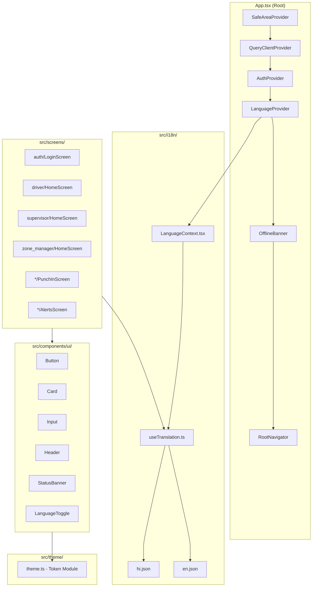

# Design Document: Mobile App UI Redesign

## Overview

This design document covers the comprehensive UI redesign of the SWIFT (Smart Waste Integrated Fleet Tracking) React Native (Expo) mobile application. The redesign introduces:

1. A centralized **Emerald Design System** with typed tokens for colors, typography, spacing, and border radius
2. A **bilingual localization engine** (Hindi + English) using React Context and AsyncStorage
3. A **reusable component library** aligned with the emerald theme and accessibility standards
4. **Screen-by-screen layout changes** for Login, Driver Home, Supervisor Home, Zone Manager Home, Punch In flow, Alerts, and Coverage screens
5. **Accessibility optimizations** for non-tech-savvy field workers (large touch targets, simple navigation, high contrast)

The app currently uses a blue-tinted palette (#1565C0 accents), hard-coded English strings, 44px input heights, and inconsistent styling across screens. This redesign standardizes everything under an emerald visual identity and adds full Hindi language support.

### Key Design Decisions

| Decision | Rationale |
|----------|-----------|
| React Context for i18n (not i18next) | Lightweight, no extra dependency, simple key-value lookups sufficient for 2 languages |
| AsyncStorage for language preference | Already a dependency; aligns with existing persistence patterns |
| Single theme module export | Avoids scattered magic values; enables future dark mode without screen changes |
| Segmented control for language toggle | More visible than dropdown; works well for exactly 2 languages |
| 56px minimum button height | Exceeds Android's 48dp minimum; accommodates older users with limited dexterity |

---

## Architecture

### High-Level Architecture



### Provider Hierarchy (Updated App.tsx)

```
SafeAreaProvider
  └── QueryClientProvider
       └── AuthProvider
            └── LanguageProvider        ← NEW
                 └── OfflineBanner
                      └── RootNavigator
```

The `LanguageProvider` wraps the navigation tree so every screen and component can access translations via the `useTranslation()` hook.

### Directory Structure (New/Modified Files)

```
mobile/src/
├── theme/
│   └── theme.ts                    ← NEW: Design tokens
├── i18n/
│   ├── LanguageContext.tsx          ← NEW: Provider + context
│   ├── useTranslation.ts           ← NEW: Hook for components
│   ├── en.json                     ← NEW: English translations
│   └── hi.json                     ← NEW: Hindi translations
├── components/
│   ├── ui/                         ← NEW: Reusable component library
│   │   ├── Button.tsx
│   │   ├── Card.tsx
│   │   ├── Input.tsx
│   │   ├── Header.tsx
│   │   ├── StatusBanner.tsx
│   │   └── LanguageToggle.tsx
│   ├── OfflineBanner.tsx           ← MODIFIED: Use theme + i18n
│   ├── AlertBanner.tsx             ← MODIFIED: Use theme + i18n
│   └── ...
├── screens/
│   ├── auth/LoginScreen.tsx        ← MODIFIED: Emerald theme + i18n
│   ├── driver/HomeScreen.tsx       ← MODIFIED: Emerald theme + i18n
│   ├── supervisor/HomeScreen.tsx   ← MODIFIED: Emerald theme + i18n
│   ├── zone_manager/HomeScreen.tsx ← MODIFIED: Emerald theme + i18n
│   └── ...
└── ...
```

---

## Components and Interfaces

### 1. Theme Module (`src/theme/theme.ts`)

```typescript
export const theme = {
  colors: {
    primary: '#10B981',        // Emerald
    primaryHover: '#059669',   // Darker emerald (pressed state)
    primaryLight: '#D1FAE5',   // Light emerald (backgrounds)
    background: '#F3F4F6',     // Base gray background
    surface: '#FFFFFF',        // Cards, inputs
    textDark: '#1E293B',       // Primary text
    textDim: '#64748B',        // Secondary text
    border: '#E2E8F0',         // Default borders
    success: '#16A34A',        // Success indicators
    warning: '#F59E0B',        // Warnings, amber
    warningLight: '#FEF3C7',   // Warning backgrounds
    error: '#EF4444',          // Errors
    errorLight: '#FEF2F2',     // Error backgrounds
  },
  typography: {
    fontFamily: undefined,     // System default
    heading: {
      fontSize: 20,
      fontWeight: '600' as const,
      lineHeight: 26,          // 20 * 1.3
    },
    body: {
      fontSize: 16,
      fontWeight: '400' as const,
      lineHeight: 24,          // 16 * 1.5
    },
    secondary: {
      fontSize: 14,
      fontWeight: '400' as const,
      lineHeight: 21,
    },
    caption: {
      fontSize: 12,
      fontWeight: '400' as const,
      lineHeight: 18,
    },
  },
  spacing: {
    xs: 4,
    sm: 8,
    md: 12,
    base: 16,
    lg: 20,
    xl: 24,
    xxl: 32,
  },
  borderRadius: {
    card: 8,
    button: 12,
    input: 12,
    modal: 16,
  },
  sizes: {
    touchTarget: 48,
    buttonHeight: 56,
    inputHeight: 56,
    headerHeight: 56,
    cardMinHeight: 120,
  },
} as const;

export type Theme = typeof theme;
```

### 2. Language Context (`src/i18n/LanguageContext.tsx`)

```typescript
import React, { createContext, useContext, useState, useEffect, useCallback } from 'react';
import AsyncStorage from '@react-native-async-storage/async-storage';
import en from './en.json';
import hi from './hi.json';

type Language = 'hi' | 'en';
type TranslationMap = Record<string, string>;

interface LanguageContextType {
  language: Language;
  setLanguage: (lang: Language) => void;
  t: (key: string) => string;
}

const translations: Record<Language, TranslationMap> = { en, hi };
const STORAGE_KEY = 'iswm_language_preference';

const LanguageContext = createContext<LanguageContextType | undefined>(undefined);

export function LanguageProvider({ children }: { children: React.ReactNode }) {
  const [language, setLanguageState] = useState<Language>('hi');
  const [isReady, setIsReady] = useState(false);

  useEffect(() => {
    async function loadLanguage() {
      try {
        const stored = await AsyncStorage.getItem(STORAGE_KEY);
        if (stored === 'en' || stored === 'hi') {
          setLanguageState(stored);
        }
      } catch {
        // Default to Hindi if read fails
      } finally {
        setIsReady(true);
      }
    }
    loadLanguage();
  }, []);

  const setLanguage = useCallback((lang: Language) => {
    setLanguageState(lang);
    AsyncStorage.setItem(STORAGE_KEY, lang).catch(() => {
      // Persist failure is non-blocking; language still applies for session
    });
  }, []);

  const t = useCallback((key: string): string => {
    return translations[language]?.[key] 
      ?? translations['en']?.[key] 
      ?? key;
  }, [language]);

  if (!isReady) return null; // Prevent flash of wrong language

  return (
    <LanguageContext.Provider value={{ language, setLanguage, t }}>
      {children}
    </LanguageContext.Provider>
  );
}

export function useLanguage() {
  const ctx = useContext(LanguageContext);
  if (!ctx) throw new Error('useLanguage must be used within LanguageProvider');
  return ctx;
}
```

### 3. Translation Hook (`src/i18n/useTranslation.ts`)

```typescript
import { useLanguage } from './LanguageContext';

export function useTranslation() {
  const { t, language, setLanguage } = useLanguage();
  return { t, language, setLanguage };
}
```

### 4. Reusable UI Components

#### Button (`src/components/ui/Button.tsx`)

```typescript
interface ButtonProps {
  title: string;
  onPress: () => void;
  variant?: 'primary' | 'secondary' | 'danger';
  disabled?: boolean;
  loading?: boolean;
  size?: 'default' | 'small';
}
```

- Primary: emerald background (#10B981), white text, 56px height, 12px radius
- Secondary: white background, emerald border, emerald text
- Danger: error-red background, white text
- Pressed state: shifts to `primaryHover` (#059669) with opacity 0.9
- Disabled: 50% opacity, non-interactive

#### Card (`src/components/ui/Card.tsx`)

```typescript
interface CardProps {
  children: React.ReactNode;
  onPress?: () => void;
  highlighted?: boolean;   // Emerald accent border
  dimmed?: boolean;        // 40% opacity for locked state
  style?: ViewStyle;
}
```

- White background, 1px border (#E2E8F0), 8px radius, elevation 2
- When `highlighted`: 2px left border in emerald
- When `dimmed`: opacity 0.4
- Minimum height: 120px for navigation cards
- Pressed feedback: opacity change within 100ms

#### Input (`src/components/ui/Input.tsx`)

```typescript
interface InputProps {
  label: string;
  value: string;
  onChangeText: (text: string) => void;
  placeholder?: string;
  error?: string;
  secureTextEntry?: boolean;
  keyboardType?: KeyboardTypeOptions;
  maxLength?: number;
}
```

- 56px height, 12px radius, 16px horizontal padding
- Label above in secondary font (14px, textDim)
- Error state: error-red border + error message below
- Font size: 16px for input text

#### Header (`src/components/ui/Header.tsx`)

```typescript
interface HeaderProps {
  title: string;
  showBack?: boolean;
  onBack?: () => void;
  rightActions?: Array<{
    icon: string;
    onPress: () => void;
    accessibilityLabel: string;
  }>;
}
```

- Fixed 56px height, white background, 1px bottom border
- Back arrow: 48x48 touch target
- Title: heading typography, truncated with ellipsis
- Maximum 2 right-side action buttons, each 48x48

#### StatusBanner (`src/components/ui/StatusBanner.tsx`)

```typescript
interface StatusBannerProps {
  status: 'success' | 'warning' | 'error' | 'info';
  message: string;
}
```

- Success: `primaryLight` (#D1FAE5) background, success text
- Warning: `warningLight` (#FEF3C7) background, warning text
- Error: `errorLight` (#FEF2F2) background, error text
- Padding: 12px vertical, 16px horizontal

#### LanguageToggle (`src/components/ui/LanguageToggle.tsx`)

```typescript
interface LanguageToggleProps {
  compact?: boolean;  // For header placement
}
```

- Segmented control with "हिंदी" and "English"
- Active segment: emerald background (#10B981), white text
- Inactive segment: transparent background, dark text
- Minimum touch target: 48x48 per segment
- Calls `setLanguage()` from LanguageContext on tap

---

## Data Models

### Translation File Structure

Translation files are flat JSON key-value maps organized by screen/feature prefix:

```json
// en.json (example subset)
{
  "login.title": "SWIFT",
  "login.subtitle": "Smart Waste Integrated Fleet Tracking",
  "login.employeeId": "Employee ID or Phone",
  "login.password": "Password",
  "login.signIn": "Sign In",
  "login.errorInvalid": "Invalid credentials. Please try again.",
  "login.errorNetwork": "Network error. Check your connection.",
  "login.errorTimeout": "Request timed out. Please try again.",
  "login.fieldRequired": "This field is required",
  
  "home.greeting.morning": "Good Morning",
  "home.greeting.afternoon": "Good Afternoon",
  "home.greeting.evening": "Good Evening",
  "home.punchedIn": "Punched In – Shift Active",
  "home.notPunchedIn": "Not Punched In",
  "home.punchInRequired": "Please punch in first to access this feature",
  
  "menu.punchIn": "Punch In",
  "menu.punchIn.subtitle": "Start your shift",
  "menu.alerts": "Alerts",
  "menu.alerts.subtitle": "View warnings",
  "menu.coverage": "Coverage",
  "menu.coverage.subtitle": "Check completion",
  "menu.routeMap": "Route Map",
  "menu.routeMap.subtitle": "View path & points",
  "menu.blockage": "Blockage Report",
  "menu.blockage.subtitle": "Report obstacles",
  "menu.liveTracking": "Live Tracking",
  "menu.liveTracking.subtitle": "Real-time view",
  "menu.attendance": "Attendance",
  "menu.attendance.subtitle": "View records",
  
  "punch.step.gps": "GPS Verification",
  "punch.step.camera": "Photo Capture",
  "punch.step.confirm": "Confirmation",
  "punch.gpsLoading": "Determining your location...",
  "punch.gpsError": "You are outside your assigned ward: {ward}",
  "punch.cameraInstruction": "Take a front-facing photo",
  "punch.photoError.noFace": "No face detected. Please try again.",
  "punch.photoError.tooMany": "Multiple faces detected. Only you should be in frame.",
  "punch.photoError.blurry": "Image is blurry. Hold still and try again.",
  "punch.photoError.dark": "Insufficient lighting. Move to a brighter area.",
  "punch.success": "Punch-in successful!",
  
  "offline.banner": "No internet connection. Some features may be limited.",
  "common.logout": "Logout",
  "common.back": "Back",
  "common.retry": "Retry",
  "common.loading": "Loading..."
}
```

```json
// hi.json (example subset)
{
  "login.title": "SWIFT",
  "login.subtitle": "स्मार्ट वेस्ट इंटीग्रेटेड फ्लीट ट्रैकिंग",
  "login.employeeId": "कर्मचारी आईडी या फोन",
  "login.password": "पासवर्ड",
  "login.signIn": "साइन इन करें",
  "login.errorInvalid": "अमान्य क्रेडेंशियल। कृपया पुनः प्रयास करें।",
  "login.errorNetwork": "नेटवर्क त्रुटि। अपना कनेक्शन जांचें।",
  "login.errorTimeout": "अनुरोध का समय समाप्त। कृपया पुनः प्रयास करें।",
  "login.fieldRequired": "यह फ़ील्ड आवश्यक है",
  
  "home.greeting.morning": "शुभ प्रभात",
  "home.greeting.afternoon": "शुभ दोपहर",
  "home.greeting.evening": "शुभ संध्या",
  "home.punchedIn": "पंच इन – शिफ्ट सक्रिय",
  "home.notPunchedIn": "पंच इन नहीं हुआ",
  "home.punchInRequired": "इस सुविधा को एक्सेस करने के लिए कृपया पहले पंच इन करें",
  
  "menu.punchIn": "पंच इन",
  "menu.punchIn.subtitle": "अपनी शिफ्ट शुरू करें",
  "menu.alerts": "अलर्ट",
  "menu.alerts.subtitle": "चेतावनियाँ देखें",
  "menu.coverage": "कवरेज",
  "menu.coverage.subtitle": "पूर्णता जांचें",
  "menu.routeMap": "रूट मैप",
  "menu.routeMap.subtitle": "पथ और बिंदु देखें",
  "menu.blockage": "अवरोध रिपोर्ट",
  "menu.blockage.subtitle": "बाधाओं की रिपोर्ट करें",
  "menu.liveTracking": "लाइव ट्रैकिंग",
  "menu.liveTracking.subtitle": "रीयल-टाइम दृश्य",
  "menu.attendance": "उपस्थिति",
  "menu.attendance.subtitle": "रिकॉर्ड देखें",
  
  "punch.step.gps": "GPS सत्यापन",
  "punch.step.camera": "फोटो कैप्चर",
  "punch.step.confirm": "पुष्टि",
  "punch.gpsLoading": "आपका स्थान निर्धारित किया जा रहा है...",
  "punch.gpsError": "आप अपने निर्धारित वार्ड के बाहर हैं: {ward}",
  "punch.cameraInstruction": "सामने से एक फोटो लें",
  "punch.photoError.noFace": "चेहरा नहीं मिला। कृपया पुनः प्रयास करें।",
  "punch.photoError.tooMany": "एक से अधिक चेहरे मिले। केवल आप फ्रेम में होने चाहिए।",
  "punch.photoError.blurry": "तस्वीर धुंधली है। स्थिर रहें और पुनः प्रयास करें।",
  "punch.photoError.dark": "प्रकाश अपर्याप्त है। उजले स्थान पर जाएं।",
  "punch.success": "पंच-इन सफल!",
  
  "offline.banner": "इंटरनेट कनेक्शन नहीं है। कुछ सुविधाएं सीमित हो सकती हैं।",
  "common.logout": "लॉगआउट",
  "common.back": "वापस",
  "common.retry": "पुनः प्रयास",
  "common.loading": "लोड हो रहा है..."
}
```

### Translation Key Naming Convention

```
{screen}.{section}.{element}
```

Examples:
- `login.signIn` — Login screen, sign-in button
- `home.greeting.morning` — Home screen, greeting section, morning variant
- `menu.punchIn.subtitle` — Menu card, punch-in item, subtitle text
- `punch.photoError.noFace` — Punch flow, photo error, no face variant
- `common.logout` — Shared across screens

### Theme Token TypeScript Type

```typescript
// src/theme/theme.ts exports
export type ColorToken = keyof typeof theme.colors;
export type SpacingToken = keyof typeof theme.spacing;
export type BorderRadiusToken = keyof typeof theme.borderRadius;
export type SizeToken = keyof typeof theme.sizes;
```

### Language Persistence Model

| Key | Storage | Format | Default |
|-----|---------|--------|---------|
| `iswm_language_preference` | AsyncStorage | `'hi'` or `'en'` | `'hi'` |

---

## Screen-by-Screen Layout Changes

### Login Screen

```
┌─────────────────────────────┐
│  [हिंदी | English] toggle   │  ← Header area
├─────────────────────────────┤
│                             │
│      [JMC Logo]             │
│      SWIFT                  │
│   (subtitle in language)    │
│                             │
│  ┌───────────────────────┐  │
│  │ Employee ID / Phone   │  │  ← 56px height, 16px font
│  └───────────────────────┘  │
│  ┌───────────────────────┐  │
│  │ Password     [Show]   │  │  ← 56px height, 16px font
│  └───────────────────────┘  │
│                             │
│  ┌───────────────────────┐  │
│  │     Sign In           │  │  ← 56px, emerald bg, bold white
│  └───────────────────────┘  │
│                             │
│  [Error banner if needed]   │  ← Red bg, localized message
│                             │
└─────────────────────────────┘
```

### Driver Home Screen

```
┌─────────────────────────────┐
│ Hello, {name}    [Logout]   │  ← 56px header, greeting in lang
│ {greeting in language}      │
├─────────────────────────────┤
│ ● Punched In / Not Punched  │  ← StatusBanner (emerald/amber)
├─────────────────────────────┤
│ [Alert banner if any]       │  ← Error-red, count in lang
├─────────────────────────────┤
│                             │
│  ┌──────────┐ ┌──────────┐ │
│  │ ⏰       │ │ 🗺️       │ │  ← 2-column grid
│  │ Punch In │ │ Route Map│ │     Min 120px per card
│  │ subtitle │ │ subtitle │ │     Emerald accent on Punch In
│  └──────────┘ └──────────┘ │
│  ┌──────────┐ ┌──────────┐ │
│  │ 📈       │ │ 🔔       │ │     Dimmed at 40% if not
│  │ Coverage │ │ Alerts   │ │     punched in (except PunchIn)
│  │ subtitle │ │ subtitle │ │
│  └──────────┘ └──────────┘ │
│  ┌──────────┐ ┌──────────┐ │
│  │ 🚧       │ │ 📍       │ │
│  │ Blockage │ │ Live     │ │     Max 6 cards per grid
│  │ subtitle │ │ Tracking │ │
│  └──────────┘ └──────────┘ │
│                             │
└─────────────────────────────┘
```

### Punch In Flow (Step Indicator)

```
┌─────────────────────────────┐
│ [←]  Punch In        [lang] │  ← Header with back + title
├─────────────────────────────┤
│                             │
│  ●━━━━━○━━━━━○              │  ← Step indicator
│  GPS    Photo   Confirm     │    Active: emerald fill
│                             │    Done: checkmark
│                             │    Upcoming: muted
│ ┌─────────────────────────┐ │
│ │                         │ │
│ │   [Step Content Area]   │ │  ← GPS status / Camera / Form
│ │                         │ │
│ └─────────────────────────┘ │
│                             │
│ ┌─────────────────────────┐ │
│ │    [Primary Action]     │ │  ← 56px emerald button
│ └─────────────────────────┘ │
└─────────────────────────────┘
```

---


## Correctness Properties

*A property is a characteristic or behavior that should hold true across all valid executions of a system — essentially, a formal statement about what the system should do. Properties serve as the bridge between human-readable specifications and machine-verifiable correctness guarantees.*

### Property 1: Translation Completeness

*For any* translation key referenced in the application source code, calling `t(key)` in either language mode ('hi' or 'en') SHALL return a string that is NOT equal to the raw key itself — proving the key resolved to an actual translation value.

**Validates: Requirements 3.2**

### Property 2: Language Persistence Round-Trip

*For any* valid language value ('hi' or 'en'), calling `setLanguage(lang)` followed by reading `AsyncStorage.getItem('iswm_language_preference')` SHALL return the same language value that was set, and re-mounting the LanguageProvider SHALL initialize with that persisted language.

**Validates: Requirements 3.3, 14.3**

### Property 3: English Fallback for Missing Translations

*For any* translation key that exists in the English (en) translation file but does NOT exist in the Hindi (hi) translation file, calling `t(key)` with language set to 'hi' SHALL return the English translation value (not the raw key string).

**Validates: Requirements 3.7, 4.6**

### Property 4: Touch Target Minimum Size

*For any* interactive UI component (Button, Card with onPress, LanguageToggle segment, Header action) rendered with default props, the computed touchable area (width × height) SHALL both be >= 48 density-independent pixels.

**Validates: Requirements 5.1**

### Property 5: Primary Button Height Minimum

*For any* text string (varying lengths, Hindi or English characters), a primary Button component rendered with that text SHALL have a computed height >= 56 density-independent pixels.

**Validates: Requirements 5.2**

### Property 6: Input MaxLength Enforcement

*For any* string of arbitrary length provided to an Input component with a specified `maxLength`, the resulting value stored in the input SHALL have length <= `maxLength`. No characters beyond the limit are retained.

**Validates: Requirements 6.2**

### Property 7: Step Indicator State Correctness

*For any* current step value (1, 2, or 3) in the Punch In flow step indicator, all steps with index < current SHALL display a completed state (checkmark), the step at index == current SHALL display an active state (emerald highlight), and all steps with index > current SHALL display an upcoming state (muted).

**Validates: Requirements 10.1**

---

## Error Handling

### Language System Errors

| Error Scenario | Behavior | User Impact |
|---------------|----------|-------------|
| AsyncStorage read fails on launch | Default to Hindi ('hi') | None — app loads in default language |
| AsyncStorage write fails on toggle | Apply language in-memory for session; show non-blocking toast notification | Language works for session but won't persist across restarts |
| Translation key missing in selected language | Fall back to English translation | User sees English text for that specific string |
| Translation key missing in BOTH languages | Return the raw key string (development warning) | Dev-only concern; should never reach production |

### Login Errors

| Error Scenario | Behavior | User Impact |
|---------------|----------|-------------|
| Invalid credentials (401) | Show red error banner with localized "Invalid credentials" message | User can retry immediately |
| Network error (no connectivity) | Show red error banner with localized "Network error" message | User can retry when connectivity returns |
| Request timeout (30s) | Re-enable Sign In button, show localized timeout error | User can retry |
| Empty field submission | Highlight field with red border, show localized "required" message | Prevents API call, user fills field |

### Punch In Flow Errors

| Error Scenario | Behavior | User Impact |
|---------------|----------|-------------|
| GPS outside assigned ward | Show error with ward name in selected language; block progression to camera step | User must physically move to ward |
| GPS permission denied | Show error prompting user to enable location services | User enables in system settings |
| Photo: no face detected | Show localized retry prompt specifying "no face" | User repositions and retaps capture |
| Photo: multiple faces | Show localized retry prompt specifying "too many faces" | User ensures only they are in frame |
| Photo: blurry image | Show localized retry prompt specifying "blurry" | User holds steady and retries |
| Photo: insufficient light | Show localized retry prompt specifying "low light" | User moves to brighter area |
| Punch submission API failure | Show error with retry button | User taps retry |

### Network Errors (Global)

| Error Scenario | Behavior | User Impact |
|---------------|----------|-------------|
| Device goes offline | Show persistent amber banner at top; dim network-dependent buttons | User knows features are limited |
| Device comes back online | Remove banner within 3 seconds; restore full interactivity | Seamless resumption |

---

## Testing Strategy

### Testing Approach

This feature uses a **dual testing approach**:

1. **Property-Based Tests** — Verify universal properties that should hold across all valid inputs (translation system, component sizing, input validation)
2. **Example-Based Unit Tests** — Verify specific UI rendering, styling, interaction behaviors, and error states

### Property-Based Testing

**Library:** [fast-check](https://github.com/dubzzz/fast-check) (JavaScript/TypeScript property-based testing)

**Configuration:**
- Minimum 100 iterations per property test
- Each property test tagged with: `Feature: mobile-app-ui-redesign, Property {N}: {title}`

**Properties to implement:**

| Property | Test Focus | Generator Strategy |
|----------|-----------|-------------------|
| P1: Translation Completeness | `t(key)` never returns raw key | Generate keys from actual key set (extracted from source) |
| P2: Language Persistence Round-Trip | setLanguage → read → same | Generate random sequence of 'hi'/'en' toggles |
| P3: English Fallback | Missing hi key → returns en value | Generate keys that exist in en.json but not hi.json |
| P4: Touch Target Size | All interactive components >= 48x48 | Generate varying props (text length, language, disabled state) |
| P5: Button Height | Primary Button always >= 56dp | Generate arbitrary text strings (length 1-50, Hindi/English chars) |
| P6: Input MaxLength | Input value.length <= maxLength | Generate strings of length 0-100 with maxLength 1-64 |
| P7: Step Indicator States | Correct visual states per step | Generate currentStep in {1, 2, 3} |

### Example-Based Unit Tests

**Framework:** Jest + React Native Testing Library

**Coverage areas:**
- Theme module exports correct token values (smoke tests)
- Color contrast ratio >= 4.5:1 for specified pairs
- Each UI component renders with correct styles (Button, Card, Input, Header, StatusBanner, LanguageToggle)
- Login screen error states (invalid credentials, network error, timeout, empty fields)
- Home screen conditional rendering (punched-in vs not, dimmed cards, alert banners)
- Punch In step transitions (GPS → Camera → Confirm)
- Offline banner visibility based on network state
- Language toggle visual states (active/inactive segments)

### Integration Tests

- Full login flow: enter credentials → submit → navigate to role-appropriate Home
- Full punch-in flow: GPS → Camera → Form → Success → Auto-navigate home
- Language toggle: switch language → verify all text updates across navigation
- Offline → online transition: verify banner appears/disappears correctly

### Test File Organization

```
mobile/__tests__/
├── theme/
│   └── theme.test.ts              ← Token value checks, contrast ratios
├── i18n/
│   ├── translation.property.test.ts  ← P1, P2, P3
│   └── LanguageContext.test.tsx       ← Example tests for context behavior
├── components/
│   ├── Button.property.test.tsx       ← P5
│   ├── Input.property.test.tsx        ← P6
│   ├── TouchTarget.property.test.tsx  ← P4
│   ├── Card.test.tsx
│   ├── Header.test.tsx
│   ├── StatusBanner.test.tsx
│   └── LanguageToggle.test.tsx
├── screens/
│   ├── LoginScreen.test.tsx
│   ├── DriverHome.test.tsx
│   ├── SupervisorHome.test.tsx
│   ├── ZoneManagerHome.test.tsx
│   └── PunchInScreen.test.tsx        ← Includes P7
└── integration/
    ├── loginFlow.test.tsx
    ├── punchInFlow.test.tsx
    └── languageSwitch.test.tsx
```
