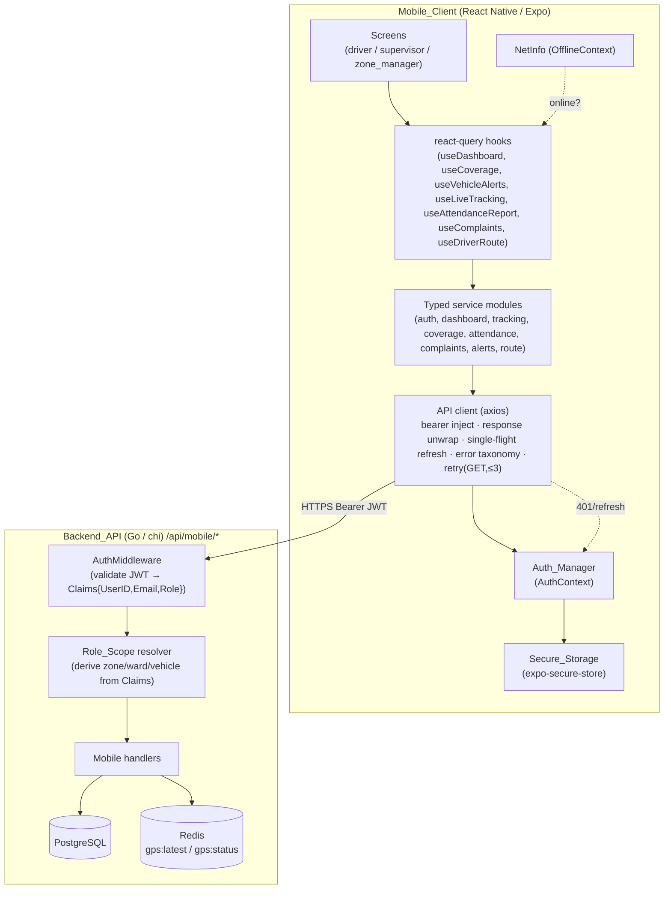
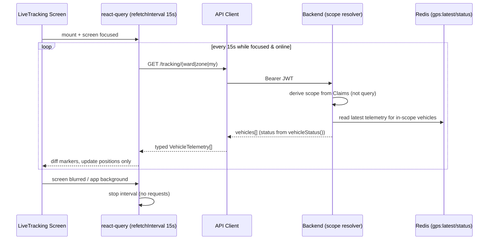
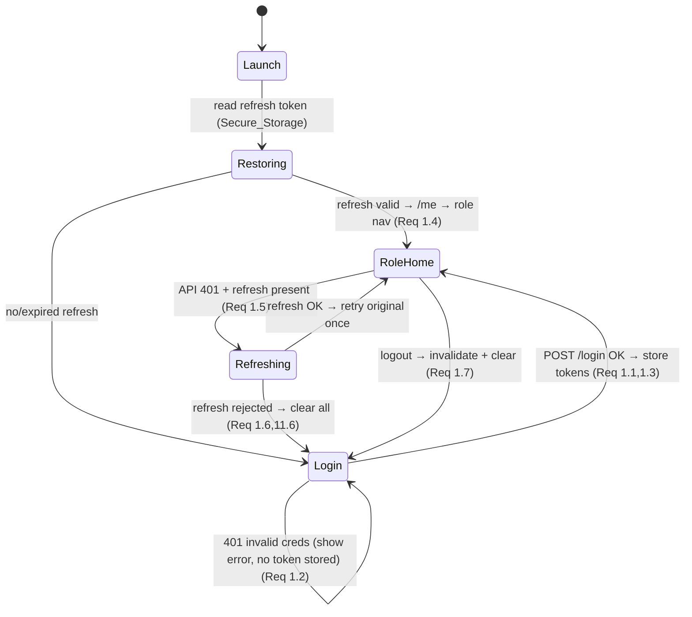

# Design Document: Mobile Backend Integration

## Overview

This design replaces all dummy, placeholder, and mocked data in the React Native (Expo) mobile client with secure, role-scoped integrations against the existing Go (chi) backend under `/api/mobile/*`. The work is a **data-source migration**, not a redesign: every existing screen layout, navigation card, and visual component is preserved (Requirement 13). Only the source of the data — and the way it is fetched, secured, and cached — changes.

The design is grounded in the actual codebase:

- **Backend** (`internal/api/router.go`, `internal/api/mobile_handlers.go`): the mobile route group already exists and is mounted behind `AuthMiddleware`. Authentication (`MobileLogin`, `MobileRefresh`, `MobileLogout`, `MobileMe`), attendance (punch-in/out/mark/status/list), blockages, and open-depot handlers are **real, DB-backed**. Coverage, alerts, route-ward, and live-tracking handlers return **hardcoded data** and must be replaced.
- **Mobile** (`mobile/src/services/api.ts`, `mobile/src/context/AuthContext.tsx`): a single axios instance already implements a request interceptor (bearer token), a response unwrapper (`response.data.data`), and a **single-flight 401 refresh queue**. Tokens are currently persisted in `AsyncStorage`; `expo-secure-store` is installed but unused. `@tanstack/react-query` and `@react-native-community/netinfo` are installed.

### Key findings that shape the design

| Finding | Source | Design impact |
|---|---|---|
| Response envelope is `{success, data, error}`; `RespondWithJSON` always sets `success:true` and nests payload under `data` | `internal/api/response.go` | Mobile interceptor already unwraps `data`; typed service layer maps `data` to typed models. |
| `AuthMiddleware` injects `*auth.Claims` (UserID, Email, Role) into context; `GetClaims(r)` reads it | `internal/api/middleware.go` | Role scope **must** be derived from `claims`, never from query params. |
| `MobileLiveTrackingWard` reads `ward_id` from the **query string** and hardcodes `status:"moving"` | `mobile_handlers.go` | Violates Req 2.2/4.7; replace with JWT-derived scope and real status. |
| A canonical status function `vehicleStatus(lastTime, speed)` already exists (offline if `nil`/`>15min`, running if `speed>3`) | `internal/repository/vehicle_repo.go` | Reuse this exact logic in mobile telemetry handlers (Req 4.6/4.7). |
| A websocket hub (`/ws/track`) broadcasts **all** vehicles via Redis pubsub, is **unauthenticated**, and is **not role-scoped** | `internal/ws/hub.go` | Not suitable for role-scoped mobile live tracking; use REST polling ≤15s (Req 4.3). |
| Complaints exist only as a **web-side dummy page**; no backend table or handler exists | `web/src/app/complaints/page.tsx` | Complaints requires a **new** backend table + read endpoint (Req 7). |
| `MobileMyRoutes` returns `ward: {name:"Mock Ward"}` and every lane point `status:"upcoming"` | `mobile_handlers.go` | Replace ward with real route→ward join; compute lane-point status from coverage (Req 9.4). |

## Architecture

The mobile client uses a layered architecture. Screens never call HTTP directly; they consume **typed service modules** through **react-query hooks**. Services use a single **API client** that owns auth, refresh, error normalization, and retry. The client reads/writes tokens through an **Auth/Secure-Storage** layer.



### Live-update data flow (foreground polling)



## Components and Interfaces

### Mobile components

| Component | Responsibility | New / Modified |
|---|---|---|
| `services/api.ts` (API client) | axios instance; bearer inject; response unwrap; single-flight refresh; **error taxonomy**; **retry for idempotent GET (≤3)** | Modified — migrate storage calls to secure-store; add retry + error mapping |
| `services/secureStorage.ts` | thin wrapper over `expo-secure-store` with one-time `AsyncStorage→SecureStore` migration | New |
| `services/*.ts` (auth, dashboard, tracking, coverage, attendance, complaints, alerts, route) | typed request functions returning typed models | New (split out of ad-hoc calls) |
| `hooks/use*.ts` | react-query hooks: caching, `staleTime`, `refetchInterval`, debounce, pagination | New / extend existing `useAlerts`, `usePunchStatus` |
| `context/AuthContext.tsx` (Auth_Manager) | auto-login on launch (validate refresh), role-based navigation gating, logout, secure-store persistence | Modified |
| `context/OfflineContext.tsx` | NetInfo-driven offline indicator; defer dependent requests | Modified (already exists) |
| Screens | swap dummy/local data for hooks; hide controls per role | Modified (no layout change) |

The screens map 1:1 to the existing files under `mobile/src/screens/{driver,supervisor,zone_manager}`. The only structural change is **removing the Zone Alerts module and presenting a Vehicle Alerts module in its place** (Req 8.1) — reusing the existing `AlertsScreen` layout and `AlertBanner`/`StatusBadge` components.

### Backend handlers (mobile group)

Scope resolution is centralized in a single helper used by every scoped handler:

```go
// resolveScope derives the authoritative Role_Scope from the JWT claims.
// It NEVER trusts client-supplied ward_id/zone_id.
type RoleScope struct {
    Role      string // "zone_manager" | "supervisor" | "driver"
    UserID    int
    EmployeeID int
    ZoneID    *int   // set for zone_manager
    WardID    *int   // set for supervisor (and resolved for driver via route)
    VehicleID *int   // set for driver
}

func (h *Handler) resolveScope(ctx context.Context, claims *auth.Claims) (RoleScope, error)
```

Every scoped handler calls `resolveScope`, builds its SQL `WHERE` clause from the returned scope, and returns **HTTP 403** when a requested resource id falls outside the scope (Req 2.6).

## Screen → API Mapping

Backend handler state legend: **Exists** (real, DB-backed), **Replace** (currently dummy/hardcoded), **Create** (no handler today).

| Screen / Module | Endpoint(s) | Method | Role scope | Backend state |
|---|---|---|---|---|
| Auth / Login | `/api/mobile/login` | POST | public | **Exists** |
| Token refresh | `/api/mobile/refresh` | POST | public | **Exists** |
| Profile / session | `/api/mobile/me` | GET | self | **Exists** |
| Logout | `/api/mobile/logout` | POST | self | **Exists** |
| Driver Home dashboard | `/api/mobile/dashboard` | GET | driver (own) | **Create** (aggregate stats) |
| Supervisor Home dashboard | `/api/mobile/dashboard` | GET | supervisor (ward) | **Create** |
| Zone Manager Home dashboard | `/api/mobile/dashboard` | GET | zone (all wards) | **Create** |
| Live Tracking (driver) | `/api/mobile/tracking/my` | GET | driver (own vehicle) | **Create** |
| Live Tracking (supervisor) | `/api/mobile/tracking/ward` | GET | ward (JWT-derived) | **Replace** (query-param scope + hardcoded `status:"moving"`) |
| Live Tracking (zone manager) | `/api/mobile/tracking/zone` | GET | zone (JWT-derived) | **Replace** (hardcoded `status:"moving"`) |
| Coverage (driver) | `/api/mobile/coverage/my` | GET | driver (own) | **Replace** (fully hardcoded) |
| Coverage (supervisor) | `/api/mobile/coverage/wards` | GET | ward | **Replace** (fully hardcoded) |
| Coverage (zone manager) | `/api/mobile/coverage/zone` | GET | zone | **Replace** (fully hardcoded) |
| Attendance marking (existing flow) | `/api/mobile/attendance/punch-in` · `/punch-out` · `/mark` · `/status` | POST/GET | self / supervisor | **Exists** (keep, Req 6.6) |
| Attendance Report | `/api/mobile/attendance/list` | GET | ward / zone | **Replace** (no scope, no filter/search, no pagination) |
| Complaints (read-only) | `/api/mobile/complaints` · `/complaints/{id}` | GET | role-scoped | **Create** (new table + handler) |
| Vehicle Alerts (list) | `/api/mobile/alerts/(my\|ward\|zone)` | GET | role-scoped | **Replace** (fully hardcoded) |
| Vehicle Alert read | `/api/mobile/alerts/{id}/read` | POST | self | **Create** (current `acknowledge` is a no-op stub) |
| Manual alert send | `/api/mobile/alerts/manual` | POST | zone_manager / supervisor | **Replace** (`MobileSendCustomAlert` is a no-op stub; add recipient-role validation) |
| Driver Route | `/api/mobile/routes/my` | GET | driver (own) | **Replace** ("Mock Ward" + all lane points `upcoming`) |
| Blockages (driver/supervisor) | `/api/mobile/blockages` | GET/POST/PATCH | role-scoped | **Exists** (out of scope for data migration) |
| Open Depot | `/api/mobile/open-depot/*` | GET/POST | operator | **Exists** (out of scope) |

> Note: the existing route names `alerts/my|ward|zone` are retained for compatibility, but their **payload becomes the unified Vehicle_Alert shape**. `alerts/acknowledge/{id}` is superseded by `alerts/{id}/read`; the acknowledge route may remain as a deprecated alias mapped to the same handler.

## Role / Permission Matrix

The backend is the **single enforcement point** (Req 2.2, 11.2). The mobile client only hides controls (Req 2.7, 8.8); it never grants access.

| Capability | Zone Manager | Supervisor | Driver |
|---|---|---|---|
| Dashboard scope | entire zone (all wards) | own ward | own vehicle/route |
| Live tracking scope | all vehicles in zone | vehicles in ward | own vehicle only (Req 4.5) |
| Coverage scope | zone + per-ward breakdown | own ward | own route |
| Attendance report scope | zone | ward | — (own status only) |
| Complaints scope | zone | ward (Req 7.4) | own vehicle/routes (Req 7.5) |
| Vehicle alerts scope | zone | ward | own |
| **Send Manual_Alert** | ✅ to Supervisor **and** Driver (Req 8.5) | ✅ to Driver **only** (Req 8.6) | ❌ hidden + rejected (Req 8.8) |
| Mark driver attendance | ✅ | ✅ | ❌ |

**Manual-alert recipient validation (backend, Req 8.5–8.7):**

| Sender role \ Recipient role | zone_manager | supervisor | driver |
|---|---|---|---|
| zone_manager | 403 | ✅ accept | ✅ accept |
| supervisor | 403 (Req 8.7) | 403 | ✅ accept |
| driver | 403 | 403 | 403 |

Out-of-scope recipient ids (e.g., a supervisor targeting a driver in another ward) also return 403.

## Auth & Token Lifecycle Design

The lifecycle reuses the existing single-flight refresh logic in `api.ts` and adds secure storage + launch/restore + navigation gating.



Design points:

1. **Token model.** Access JWT (short-lived) + Refresh JWT (7-day, server-tracked in `refresh_tokens` with revocation) — already issued by `MobileLogin`/`MobileRefresh`. Refresh rotates: the old token is revoked and a new one stored on every refresh (already implemented).
2. **Secure-store migration.** `KEYS.{ACCESS_TOKEN,REFRESH_TOKEN,USER_PROFILE}` move from `AsyncStorage` to `expo-secure-store`. On first launch after upgrade, `secureStorage.migrate()` copies any existing `AsyncStorage` values into SecureStore, then deletes them from `AsyncStorage` (Req 11.1). On web (where secure-store is unavailable) it falls back to `AsyncStorage`.
3. **Single-flight refresh.** Keep the existing `isRefreshing` + `refreshQueue` mechanism so that concurrent 401s trigger exactly one refresh and all queued requests retry with the new token (Req 1.8). Each request is retried **once** (`originalRequest._retry`) (Req 1.5).
4. **Auto-login on launch.** `AuthContext` reads the refresh token; if present and not expired, it requests a fresh access token and loads `/me`, then routes to the role-appropriate stack without prompting (Req 1.4). If refresh fails, it clears storage and routes to Login (Req 1.6).
5. **Auto-logout.** On refresh failure the interceptor clears tokens (already does `multiRemove`; switch to secure-store `clear`) and the `AuthContext` transitions to Login. Logout calls `POST /logout` to revoke server-side, then clears storage (Req 1.7, 11.6).
6. **Role-based navigation gating.** `RootNavigator` selects the stack from `user.role` returned by the backend (Req 2.1). No screen is reachable for a role that should not see it; controls for disallowed actions are not rendered (Req 2.7).
7. **Log hygiene.** A small redaction utility ensures token/credential values are never written to logs or surfaced in error messages (Req 11.5).

## Data Models

These TypeScript interfaces live in `mobile/src/types/index.ts` (extending the existing definitions) and mirror the backend response shapes. Existing `User`, `AttendanceRecord`, `LanePoint`, `RouteDetails` are retained; `Alert`/`LiveVehicle` are extended.

```typescript
// ---- Auth / Profile ----
export interface AuthTokens { access_token: string; refresh_token: string; }
export interface LoginResponse extends AuthTokens { user: User; }
// User (existing): { id, email, role, name, employee_id?, contact_no? }

// ---- Dashboard (Req 3.2) ----
export interface DashboardStats {
  coverage_percent: number;
  total_vehicles: number;
  running_vehicles: number;
  completed_routes: number;
  pending_routes: number;
  active_drivers: number;
  attendance_present: number;
  attendance_total: number;
  alert_count: number;
  complaint_count: number;
}

// ---- Vehicle telemetry (Req 4.2) ----
export type VehicleStatus = 'running' | 'idle' | 'stopped' | 'offline';
export interface VehicleTelemetry {
  vehicle_id: number;
  vehicle_number: string;
  driver_name: string;
  lat: number;
  lng: number;
  speed: number;
  ignition: boolean;
  status: VehicleStatus;        // derived server-side, never a fixed default
  last_update: string;          // ISO timestamp
}

// ---- Coverage (Req 5.2) ----
export interface CoverageSummary {
  date: string;
  total_lane_points: number;
  completed_lane_points: number;
  remaining_lane_points: number;
  coverage_percent: number;
  covered_distance_km: number;
  pending_distance_km: number;
}
export interface WardCoverage {
  ward_id: number; ward_name: string;
  coverage_percent: number; vehicles_active: number; drivers_present: number;
}
export interface ZoneCoverage {
  zone: { id: number; name: string; total_wards: number; total_vehicles: number };
  coverage_percent: number; active_vehicles: number; drivers_present: number;
  wards: WardCoverage[];
}

// ---- Attendance report (Req 6.2) ----
export type AttendanceStatus = 'present' | 'absent' | 'late' | 'leave';
export interface AttendanceReportRecord {
  id: string; employee_name: string; date: string;
  status: AttendanceStatus; check_in?: string; check_out?: string;
}
export interface Paginated<T> {
  items: T[]; page: number; page_size: number; total: number; total_pages: number;
}

// ---- Complaint (read-only) (Req 7.2) ----
export type ComplaintPriority = 'low' | 'medium' | 'high' | 'critical';
export type ComplaintStatus = 'open' | 'in_progress' | 'resolved' | 'closed';
export interface Complaint {
  id: number; title: string; description: string;
  priority: ComplaintPriority; status: ComplaintStatus;
  assigned_vehicle?: string; assigned_driver?: string;
  location?: { lat: number; lng: number; address?: string };
  images: string[];
  created_at: string; updated_at: string;
}

// ---- Vehicle alert (Req 8) ----
export type AlertType =
  | 'overspeed' | 'geofence_entry' | 'geofence_exit' | 'idle'
  | 'ignition' | 'offline' | 'battery' | 'harsh_braking' | 'manual';
export type AlertSeverity = 'minor' | 'major' | 'critical';
export interface VehicleAlert {
  id: string; type: AlertType; source: 'automatic' | 'manual';
  message: string; severity: AlertSeverity;
  vehicle_number?: string; created_at: string;
  read: boolean;                       // per-user read state (Req 8.9)
  sender_role?: string;                // for manual alerts
}
export interface AlertFeed { alerts: VehicleAlert[]; unread_count: number; }
export interface ManualAlertRequest {
  recipient_role: 'supervisor' | 'driver';
  recipient_ids: number[]; message: string; severity: AlertSeverity;
}

// ---- Driver route (Req 9.2) ----
export interface DriverRouteResponse {
  ward: { id: number; name: string };   // real ward, not "Mock Ward"
  route: RouteDetails;                   // existing interface
  lane_points: LanePoint[];              // status computed from coverage
  completed_lane_points: number;
  remaining_lane_points: number;
  coverage_percent: number;
  current_position?: { lat: number; lng: number; updated_at: string };
}

// ---- Error taxonomy (Req 10.3) ----
export type ApiErrorKind =
  | 'unauthorized'  // 401
  | 'forbidden'     // 403
  | 'not_found'     // 404
  | 'server'        // 500
  | 'timeout'       // request timeout
  | 'offline'       // no connectivity
  | 'unknown';
export interface ApiError { kind: ApiErrorKind; status?: number; message: string; }
```

## Backend Changes Required

All scoped handlers must call `resolveScope(ctx, GetClaims(r))` and build their query from the returned scope. Client-supplied `ward_id`/`zone_id` query parameters are **ignored** for authorization (Req 2.2).

### Handlers to replace (currently dummy/hardcoded)

| Handler | Required real behavior | Requirements |
|---|---|---|
| `MobileMyCoverage` | Compute driver's daily lane-point completion, coverage %, covered/pending distance from `route_lane_points` + coverage data — consistent with web dashboard | 5.1–5.4, 5.6 |
| `MobileWardsCoverage` | Per-ward aggregates for the supervisor's ward (or zone manager's wards) from real coverage tables | 5.1–5.4 |
| `MobileZoneCoverage` | Zone totals + per-ward breakdown for the zone manager's assigned zone | 2.3, 5.1–5.4 |
| `MobileMyAlerts` / `MobileWardAlerts` / `MobileZoneAlerts` | Return unified `VehicleAlert` feed (automatic + manual) scoped by JWT, with `unread_count` and per-user `read` state | 8.2–8.4, 8.9 |
| `MobileLiveTrackingWard` / `MobileLiveTrackingZone` | Derive ward/zone from JWT (not query); set `status` via `vehicleStatus(lastTime, speed)`; include `ignition` | 2.2, 4.1–4.2, 4.6–4.7 |
| `MobileMyRoutes` | Join route→`route_wards`→ward for the **real** ward; compute each lane point's status from coverage; return completed/remaining counts and current position | 9.2–9.4, 9.6 |
| `MobileAcknowledgeAlert` → `MobileMarkAlertRead` | Persist per-user read state and return updated unread count | 8.10 |
| `MobileSendCustomAlert` → `MobileSendManualAlert` | Validate sender→recipient role matrix and scope; persist manual alert; **403** on disallowed recipient | 8.5–8.7 |
| `MobileAttendanceList` | Add JWT scope (ward/zone), `search`, `status`, `date` filters, and pagination | 6.1, 6.3–6.5 |

### New endpoints

| Endpoint | Purpose | Requirements |
|---|---|---|
| `GET /api/mobile/dashboard` | Single aggregate of all dashboard metrics, scoped by role | 3.1–3.2 |
| `GET /api/mobile/tracking/my` | Driver's own vehicle telemetry only | 4.5 |
| `GET /api/mobile/complaints` + `GET /api/mobile/complaints/{id}` | Read-only complaints scoped by role | 7.1–7.5 |
| `POST /api/mobile/alerts/{id}/read` | Mark a vehicle alert read | 8.10 |
| `POST /api/mobile/alerts/manual` | Send a manual alert (role-validated) | 8.5–8.7 |

### New persistence (complaints)

No complaints table exists today (the web page is dummy). A `complaints` table is introduced with columns aligned to the `Complaint` model (`id, title, description, priority, status, ward_id, assigned_vehicle_id, assigned_driver_id, location, images jsonb, created_at, updated_at`). The mobile endpoint is **read-only**; creation/editing remains a web concern (Req 7.3). A `vehicle_alerts` table (or reuse of the existing alerts source) plus a per-user `alert_reads` table back the unified alert feed and read state.

> Open dependency: complaint→ward/vehicle/driver association is the basis for supervisor/driver scoping. This must exist in the schema before Req 7.4/7.5 can be enforced. Flagged for the tasks phase.

## Live Tracking Strategy

- **Polling over websocket.** The existing `/ws/track` hub is unauthenticated and broadcasts every vehicle with no role scoping (`internal/ws/hub.go`). Reworking it for per-user scope and JWT auth is larger than this feature and risks the web client. Therefore mobile uses **REST polling** of `/tracking/(my|ward|zone)` at a **fixed 15-second interval** via react-query `refetchInterval` (Req 4.3).
- **Foreground only.** The interval is bound to React Navigation focus and `AppState`. On blur/background the query disables its interval, so no telemetry requests are issued (Req 4.4).
- **Marker reuse / diffing.** The map component keys markers by `vehicle_id` and updates coordinates of existing markers instead of recreating the marker set each refresh (Req 12.4). Unchanged vehicles are skipped via shallow comparison (Req 12.6).
- **Status from telemetry.** The backend sets `status` using the shared `vehicleStatus(lastTime, speed)` helper, so offline (`>15min` or no fix) and running/idle/stopped are consistent with the web (Req 4.6, 4.7).

## Cross-Cutting Concerns

### Error handling taxonomy (Req 10.3, 10.4)

The API client maps every failure to a single `ApiError` kind:

| Condition | `kind` | Screen behavior |
|---|---|---|
| HTTP 401 (after refresh fails) | `unauthorized` | route to Login |
| HTTP 403 | `forbidden` | show authorization message; render no restricted data (Req 2.8) |
| HTTP 404 | `not_found` | Empty_State (e.g., driver with no route, Req 9.5) |
| HTTP 500 | `server` | error state + retry control (Req 3.5) |
| timeout exceeded | `timeout` | error state + retry |
| no connectivity (NetInfo) | `offline` | offline indicator; defer request (Req 10.5) |

### Retry policy (Req 10.6)

Only **idempotent GET** requests retry, on transient network errors or HTTP 500, with exponential backoff, **bounded to 3 attempts** total before surfacing the error. POST/PUT/PATCH/DELETE are never auto-retried.

### Caching, debounce, deduplication (Req 12)

- **react-query** provides per-resource `staleTime` (stale-while-revalidate, Req 12.3) and request **deduplication** for shared keys across screens (Req 12.5).
- **Search debounce** of 300 ms before issuing a filtered request (Req 12.2).
- **Pagination**: list endpoints return `Paginated<T>`; screens request one page at a time (Req 12.1).

### Offline handling (Req 10.5)

`OfflineContext` subscribes to `@react-native-community/netinfo`. While offline, the `OfflineBanner` is shown and dependent queries are disabled/deferred; they resume automatically when connectivity returns.

### Loading and empty states (Req 3.3, 3.4, 10.7)

Each query exposes `isLoading`/`isError`/`data`. Screens render the existing loading placeholders for in-flight regions, zero/Empty_State for no records, and error+retry for failures — all within the existing layouts (Req 13).

## Correctness Properties

*A property is a characteristic or behavior that should hold true across all valid executions of a system — essentially, a formal statement about what the system should do. Properties serve as the bridge between human-readable specifications and machine-verifiable correctness guarantees.*

These properties target the pure-logic and security-sensitive parts of the feature (auth/refresh, role scoping, recipient permissions, error/retry, status derivation, arithmetic invariants). Pure UI preservation, timing, and configuration criteria are verified by example/snapshot/smoke tests instead (see Testing Strategy). Each property below is consolidated from the prework analysis to remove redundancy.

### Property 1: Token persistence round-trip

*For any* access/refresh token pair, persisting the pair to Secure_Storage and then reading it back returns the identical pair.

**Validates: Requirements 1.3**

### Property 2: Tokens reside only in Secure_Storage

*For any* stored token set, after persistence (and migration) the token keys are present in Secure_Storage and absent from AsyncStorage.

**Validates: Requirements 11.1**

### Property 3: Invalid credentials store no token

*For any* invalid credential pair, a login attempt fails and Secure_Storage contains no access or refresh token afterward.

**Validates: Requirements 1.2**

### Property 4: Single-flight refresh with one retry

*For any* number N ≥ 1 of concurrent authenticated requests that simultaneously receive HTTP 401 while a valid refresh token exists, the Auth_Manager performs exactly one refresh operation and each of the N requests is retried exactly once using the refreshed access token.

**Validates: Requirements 1.5, 1.8**

### Property 5: Session-end clears all tokens

*For any* stored token and cached-profile state, when the session ends (logout or refresh rejection), Secure_Storage contains no tokens and no cached profile, and the resulting route is Login.

**Validates: Requirements 1.6, 1.7, 11.6**

### Property 6: Navigation matches backend role

*For any* role returned by the Backend_API in {zone_manager, supervisor, driver}, the Mobile_Client selects the navigation stack designated for that role.

**Validates: Requirements 2.1**

### Property 7: Responses are confined to the token-derived scope

*For any* authenticated request and any backing dataset, the data returned is a subset of the caller's Role_Scope as derived from the JWT, regardless of any ward_id/zone_id value supplied by the client (zone manager → zone members; supervisor → assigned ward; driver → own vehicle/route/coverage/attendance/alerts/complaints).

**Validates: Requirements 2.2, 2.3, 2.4, 2.5, 4.1, 4.5, 5.1, 6.1, 7.1, 7.4, 7.5, 8.2**

### Property 8: Out-of-scope access is rejected

*For any* resource id that lies outside the caller's Role_Scope, the Backend_API returns HTTP 403.

**Validates: Requirements 2.6**

### Property 9: Control visibility follows the role permission matrix

*For any* authenticated role, a restricted action control is rendered if and only if the permission matrix grants that action to the role (in particular, the manual-alert control is hidden for Driver), and visibility is derived from the backend-provided role rather than any client-side permission value.

**Validates: Requirements 2.7, 8.8, 11.2**

### Property 10: JWT validation rejects invalid tokens

*For any* request carrying a missing, malformed, tampered, or expired JWT, the Backend_API returns HTTP 401.

**Validates: Requirements 11.3, 11.4**

### Property 11: Secrets are excluded from logs and errors

*For any* access token, refresh token, or credential value, the strings produced by the Mobile_Client's logging and error output do not contain that value.

**Validates: Requirements 11.5**

### Property 12: Vehicle status is derived from telemetry

*For any* telemetry sample (last-update time and speed), the returned vehicle status follows the shared derivation rule — offline when the last update is missing or older than the reporting interval, otherwise running/idle/stopped by speed — and is never a fixed default.

**Validates: Requirements 4.6, 4.7**

### Property 13: Telemetry rendering presence

*For any* list of vehicle telemetry records, the map renders exactly one marker per vehicle, each exposing location, status, speed, ignition state, and last-updated time.

**Validates: Requirements 4.2**

### Property 14: Coverage arithmetic invariant

*For any* coverage summary, remaining lane points equal total minus completed lane points, the coverage percentage lies within [0, 100], and all displayed coverage fields are present.

**Validates: Requirements 5.2**

### Property 15: Coverage parity with the web dashboard

*For any* date and scope, the coverage figures returned to the Mobile_Client equal the values produced for the web dashboard for the same date and scope.

**Validates: Requirements 5.4**

### Property 16: Dashboard metric presence

*For any* dashboard statistics payload, every listed metric (coverage %, total vehicles, running vehicles, completed routes, pending routes, active drivers, attendance summary, alert count, complaint count) is rendered with the backend-provided value.

**Validates: Requirements 3.2**

### Property 17: Attendance record presence and status domain

*For any* attendance report record, the attendance status is one of {Present, Absent, Late, Leave} and the record renders status, check-in time, check-out time, and date.

**Validates: Requirements 6.2**

### Property 18: Attendance filtering correctness

*For any* search term, status filter, or date filter applied to any dataset, every returned attendance record satisfies the applied filter(s) and lies within the caller's Role_Scope.

**Validates: Requirements 6.3, 6.4**

### Property 19: Pagination partitions the result set

*For any* result set and page size, the concatenation of all pages in order equals the full ordered result set with no duplicates and no gaps, and no page exceeds the requested page size.

**Validates: Requirements 6.5, 12.1**

### Property 20: Complaints module exposes no mutation control

*For any* authenticated role, the Complaints screen renders no control to create, edit, or delete a complaint.

**Validates: Requirements 7.3**

### Property 21: Complaint field presence

*For any* complaint record, the screen renders complaint id, title, description, priority, status, assigned vehicle, assigned driver, created date, updated date, location, and images.

**Validates: Requirements 7.2**

### Property 22: Manual-alert recipient permission matrix

*For any* (sender role, recipient role) pair, the Backend_API accepts the manual alert if and only if the pair is permitted by the matrix — zone_manager → {supervisor, driver}, supervisor → {driver} — and returns HTTP 403 for every other pair (including supervisor → zone_manager and any driver-originated send).

**Validates: Requirements 8.5, 8.6, 8.7, 8.8**

### Property 23: Unread count reflects read state and decrements correctly

*For any* alert feed, the displayed unread count equals the number of alerts with read = false; opening an alert sets it to read and decrements the unread count by exactly one when the alert was previously unread, and opening an already-read alert leaves the count unchanged (idempotent).

**Validates: Requirements 8.9, 8.10**

### Property 24: Driver route arithmetic and real ward

*For any* driver route response, completed lane points plus remaining lane points equal the total number of lane points, the progress percentage equals completed / total, and the returned ward equals the route's associated ward (never a placeholder such as "Mock Ward").

**Validates: Requirements 9.2, 9.3, 9.4**

### Property 25: Bearer token attached to authenticated requests

*For any* authenticated request issued by the API_Layer, the Authorization header carries the current access token as a bearer token.

**Validates: Requirements 10.1**

### Property 26: Typed model mapping round-trip

*For any* valid Backend_API payload, mapping the payload to its typed model preserves all required fields (the typed model can reproduce the payload's required field values).

**Validates: Requirements 10.2**

### Property 27: Error taxonomy mapping is total and correct

*For any* failure condition (HTTP 401, 403, 404, 500, request timeout, or no connectivity), the API_Layer maps it to exactly the corresponding categorized error kind defined in the taxonomy.

**Validates: Requirements 10.3, 10.4**

### Property 28: Bounded retry for idempotent GETs only

*For any* idempotent GET request that fails with a transient network error or HTTP 500, the API_Layer attempts the request at most 3 times before surfacing the error, stopping early on success; non-idempotent requests are attempted exactly once (never auto-retried).

**Validates: Requirements 10.6**

### Property 29: Search debounce bounds request rate

*For any* sequence of input keystrokes, the number of search requests issued is at most the number of 300 ms inactivity gaps in the sequence (a burst with no 300 ms gap yields at most one request).

**Validates: Requirements 12.2**

### Property 30: Concurrent identical queries are deduplicated

*For any* set of N concurrent queries sharing the same resource key, exactly one network request is in flight for that key.

**Validates: Requirements 12.5**

## Error Handling

- **Centralized mapping.** A single `toApiError(error)` in the API client converts axios/network failures into the `ApiError` taxonomy (Property 27). Screens branch on `error.kind`, not on raw status codes.
- **401:** handled transparently by the refresh interceptor; only surfaces as `unauthorized` after refresh fails, which triggers logout/route-to-login (Properties 4, 5).
- **403:** surfaced as `forbidden`; the screen shows an authorization message and renders no restricted data (Req 2.8).
- **404:** surfaced as `not_found`; consumed as Empty_State where meaningful (e.g., driver with no route, Req 9.5).
- **500 / transient network:** retried for idempotent GETs (≤3, Property 28), then surfaced as `server` with a retry control.
- **Timeout:** axios `timeout` (currently 10s) yields `timeout`.
- **Offline:** NetInfo gating produces `offline`; dependent queries are disabled and resume on reconnect (Req 10.5).
- **Backend:** handlers use the existing `RespondWithError(w, code, msg)` envelope; scope violations return 403, missing resources 404, invalid input 400, auth failures 401. Error messages never echo tokens (Property 11).

## Testing Strategy

A dual approach: **property-based tests** verify the universal properties above; **example/integration/snapshot/smoke tests** cover specific flows, UI preservation, timing, and configuration.

### Property-based testing

- **Libraries.** Mobile/TypeScript: **fast-check** with the Jest runner (already configured via `jest`). Backend/Go: **`testing/quick`** or **gopter** for scope/recipient/status logic. Do not hand-roll generators frameworks.
- **Iterations.** Each property test runs a **minimum of 100 generated cases**.
- **Tagging.** Each property test is tagged with a comment in the form
  `Feature: mobile-backend-integration, Property {number}: {property_text}`.
- **One test per property.** Each of Properties 1–30 is implemented by a single property-based test. Generators model the relevant domain (random token strings, role enums, datasets of vehicles/wards/zones with ownership, alert feeds, status/date filters, page sizes, telemetry samples with varied last-update ages, status codes, keystroke sequences).
- **Backend scoping/recipient/status properties** (7, 8, 12, 22) are tested against the handler logic with the database layer mocked/seeded so 100+ iterations stay cheap; the scope resolver is exercised with random ownership graphs.

### Example and integration tests

- **Auth flows:** valid login (1.1), auto-login on launch (1.4), logout endpoint call (1.7) — example tests over the AuthContext state machine with a mocked client.
- **Timing:** 15 s refresh while focused (4.3) and refresh stop on blur/background (4.4) using Jest fake timers.
- **Live tracking integration:** 1–2 end-to-end cases hitting `/tracking/*` with seeded Redis telemetry to confirm wiring and status derivation in situ.
- **Coverage parity (15):** a model-based integration test comparing the mobile coverage endpoint against the web coverage computation for shared seed data.
- **Feed composition:** automatic alert types present (8.3) and manual alerts present (8.4); alert detail/history (8.11).
- **Push notifications (8.12):** integration-only, gated on backend support; currently N/A.

### Snapshot / regression tests (UI preservation, Req 13)

- Snapshot tests for each migrated screen confirm layout, navigation structure, and components are unchanged while the data source switches (13.1, 13.2, 13.3), including loading (3.3, 10.7), empty (3.4, 5.5, 6.7, 7.6, 9.5), and error (3.5, 2.8) states, and the Zone Alerts → Vehicle Alerts swap (8.1).
- Marker reuse (12.4) and unchanged-item non-re-render (12.6) verified via render-count assertions.

### Smoke / static checks (no-dummy guarantees)

- Static assertions that the dashboard, coverage, route, and tracking handlers read from the database and that screens contain no literal metric/coverage/route constants (3.6, 5.6, 9.6).
- Lint/grep guard that the API layer imports no mock/dummy data module (10.8).

## Key Design Decisions

| Decision | Rationale | Requirements |
|---|---|---|
| REST polling (≤15s, focus-bound) for live tracking instead of the existing `/ws/track` hub | The hub is unauthenticated and broadcasts all vehicles with no role scoping; reworking it for per-user JWT scope is out of scope and risks the web client. Polling meets the interval requirement and is trivially role-scoped. | 4.3, 4.4, 4.5 |
| Centralize Role_Scope resolution in one `resolveScope(claims)` helper used by every scoped handler | Single enforcement point; prevents per-handler drift and client-supplied scope leaks (the current `ward_id` query param). | 2.2, 2.6 |
| Reuse existing `vehicleStatus(lastTime, speed)` for mobile status | Guarantees mobile/web status parity and removes the hardcoded `"moving"`. | 4.6, 4.7 |
| Keep the existing single-flight refresh queue in `api.ts`; extend rather than rewrite | It already satisfies the concurrency requirement; rewriting risks regressions. | 1.5, 1.8 |
| Migrate token storage to `expo-secure-store` with a one-time AsyncStorage→SecureStore copy | Meets the secure-storage requirement without forcing re-login; web falls back to AsyncStorage where secure-store is unavailable. | 11.1, 1.3 |
| Adopt react-query for caching, dedup, debounce, pagination, and `refetchInterval` | Already a dependency; provides stale-while-revalidate, request dedup, and interval polling without bespoke code. | 12.1, 12.2, 12.3, 12.5 |
| Add a new `complaints` table + read-only mobile endpoint (web complaints is currently dummy) | No complaints data source exists; read-only on mobile keeps creation a web concern. | 7.1, 7.3 |
| Unify the three alert endpoints onto one `VehicleAlert` shape; replace acknowledge stub with `read` + manual-send with role validation | Satisfies the unified Vehicle_Alerts module and the recipient permission matrix at the backend. | 8.1, 8.5–8.10 |
| Keep existing route names (`alerts/my|ward|zone`) but change payloads; add new endpoints (`dashboard`, `tracking/my`, `complaints`, `alerts/{id}/read`, `alerts/manual`) | Minimizes client churn and preserves UI while filling capability gaps. | 3.1, 4.5, 7.1, 8.5, 8.10 |
| UI unchanged — only data sources change; controls hidden by role on the client, enforced on the backend | Preserves familiarity and keeps authorization non-bypassable. | 13.1, 2.7, 11.2 |

---

The design is ready for your review. Notable points to confirm: (1) live tracking uses REST polling rather than the existing websocket hub because that hub is unauthenticated and not role-scoped; (2) Complaints needs a brand-new backend table and endpoint since the web complaints page is itself dummy data; (3) the manual-alert recipient matrix and all role scoping are enforced server-side from JWT claims. If you'd like to revisit any requirement (for example, websocket-based tracking or the complaints data source), I can return to requirements clarification.
