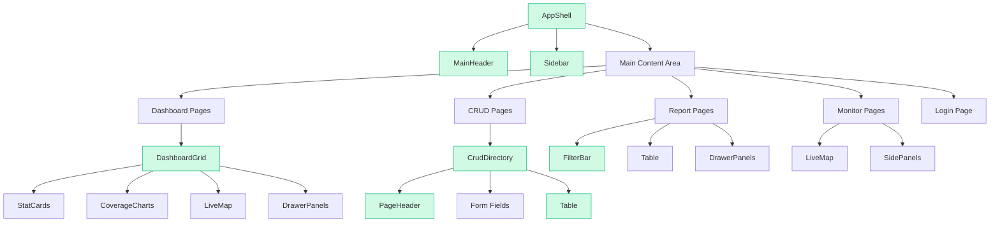

# Design Document: Responsive Web Design

## Overview

This design defines how to make the SWIFT (Smart Waste Integrated Fleet Tracking) web application fully responsive across mobile (< 640px), tablet (640px–1024px), and desktop (> 1024px) viewports. The implementation uses a **mobile-first approach with Tailwind CSS 4 responsive prefixes** (`sm:`, `md:`, `lg:`, `xl:`), adding styles at lower breakpoints without modifying existing desktop classes.

The strategy modifies a small set of shared components that propagate responsive behavior to all pages:

- **AppShell** — root layout overflow control
- **Sidebar** — already a mobile-friendly slide-in drawer (minimal changes needed)
- **MainHeader** — content visibility at small screens
- **DashboardGrid** — column stacking and map height
- **Table** — horizontal scroll, compact density, pagination stacking
- **FilterBar** — control stacking and full-width buttons
- **CrudDirectory** — form field layout and page header stacking
- **PageHeader** — responsive title sizing and action button layout
- **Drawer Panels** — full-width on mobile with scrollable content

No new JavaScript layout logic or resize observers are introduced. All responsive behavior is achieved through Tailwind utility classes.

### Breakpoint Mapping

| Requirement Breakpoint | Tailwind Prefix | Behavior |
|------------------------|----------------|----------|
| Breakpoint_Mobile (< 640px) | Default (no prefix) | Mobile-first base styles |
| Breakpoint_Tablet (640px–1024px) | `sm:` and `md:` | Intermediate layouts |
| Breakpoint_Desktop (> 1024px) | `lg:` and `xl:` | Existing desktop layout preserved |

### Design Principles

1. **Additive only** — We add mobile/tablet classes; we never remove or modify existing desktop-targeted classes.
2. **CSS-only** — No new JS layout calculations or `ResizeObserver` usage.
3. **Touch-friendly** — Minimum 44×44px touch targets on mobile for all interactive elements.
4. **No horizontal overflow** — `overflow-x: hidden` on root container; internal horizontal scroll only where needed (tables).

## Architecture



Green-highlighted nodes are the shared components that need responsive modifications. All other page-specific components inherit responsive behavior through these shared wrappers.

### Change Impact Summary

| Component | Change Scope | Risk |
|-----------|-------------|------|
| `AppShell.tsx` | Add `overflow-x-hidden`, `max-w-[100vw]` on root | Low — additive CSS |
| `MainHeader.tsx` | Minor visibility tweaks (already partially responsive) | Low |
| `Sidebar.tsx` | Already a slide-in drawer; add backdrop tap-to-close | Low |
| `DashboardGrid.tsx` | Adjust column breakpoints, map min-height | Medium |
| `Table.tsx` | Add compact mode, pagination stacking, scroll hint width | Medium |
| `FilterBar.tsx` | Add grid layout for mobile/tablet stacking | Low |
| `CrudDirectory.tsx` | Form field grid, button stacking, search width | Medium |
| `PageHeader.tsx` | Title font scale, action button full-width on mobile | Low |
| Drawer Panels (inline) | Full-width on mobile, 80% on tablet | Low |
| `LoginPage` | Already mostly responsive; add min-height tweaks | Low |
| `globals.css` | Add `touch-action` rule for maps | Low |

## Components and Interfaces

### 1. AppShell (`web/src/components/AppShell.tsx`)

**Current state:** Flex row layout with Sidebar + main content. No overflow control on root.

**Responsive changes:**

```tsx
// Root container: prevent horizontal overflow at all breakpoints
<div className="flex h-screen overflow-hidden max-w-[100vw] overflow-x-hidden">
```

**Main content area padding:**

```tsx
<main className="flex-1 flex flex-col min-h-0 bg-(--bg-dark) overflow-x-hidden">
  {children}
</main>
```

The root `<html>` and `<body>` already have `overflow: hidden` from `globals.css`. This addition ensures no child can cause horizontal scrollbar.

### 2. MainHeader (`web/src/components/MainHeader.tsx`)

**Current state:** Already uses `sm:` prefixes for logo sizing and hides subtitle/user info on mobile. The hamburger button is present.

**Additional changes needed:**
- The title text `"SWIFT - NAGAR NIGAM JAIPUR"` is hidden below `sm:` already via `hidden sm:flex`.
- Add a compact mobile-only title that shows just "SWIFT":

```tsx
{/* Mobile-only compact title */}
<span className="text-xs font-black text-theme-text uppercase sm:hidden">SWIFT</span>
{/* Desktop title - already hidden on mobile */}
<div className="flex-col min-w-0 hidden sm:flex">
  ...existing...
</div>
```

- Hamburger button already has `w-9 h-9` (36px) which is close to 44px. Increase to `min-w-[44px] min-h-[44px]`.

### 3. Sidebar (`web/src/components/Sidebar.tsx`)

**Current state:** Already implemented as a fixed overlay drawer with backdrop, toggled by `sidebarOpen` state. Close button present. The flyout mega menu appears on hover.

**Changes needed for Requirements 1.3 and 1.4:**
- Navigation link clicks already call `setSidebarOpen(false)` — ✅ satisfied.
- Backdrop click already calls `setSidebarOpen(false)` — ✅ satisfied.
- The existing implementation already satisfies Requirement 1.1–1.6.

**Mobile flyout behavior:**
- On mobile, the flyout menu should not appear (no hover on touch devices). Add a check to only render the flyout when viewport is `lg:` or wider using a CSS approach:

```tsx
{/* Flyout - hidden on mobile/tablet, visible on desktop only */}
<div className="hidden lg:block">
  {/* ...existing flyout div... */}
</div>
```

On mobile, tapping a category with children should expand inline (accordion style) instead. This requires a small state addition — however per Requirement 12.3 ("SHALL NOT introduce new JavaScript-based layout calculations"), we can use the existing `activeCategory` toggle which already opens/closes on click. The flyout can be conditionally positioned inline on mobile via CSS:

```tsx
{/* On mobile: inline expansion below the category button */}
{/* On desktop: positioned flyout */}
```

For simplicity, the flyout already works via click toggle (`onClick`), so on mobile devices without hover the user taps to expand. The fixed-position flyout works on mobile since the sidebar is full-screen. No structural changes needed.

### 4. DashboardGrid (`web/src/components/dashboard/DashboardGrid.tsx`)

**Current state:** Uses `xl:flex-row` for the two-column split (data left, map right). Left column uses internal `sm:grid-cols-3` for stat cards and `md:grid-cols-2` for other rows.

**Changes to implement:**

```tsx
<div className="flex-1 flex flex-col xl:flex-row min-h-0 relative bg-theme-base">
  {/* Left Column */}
  <div className="w-full xl:w-[50%] flex flex-col h-full overflow-y-auto custom-scrollbar 
    p-4 sm:p-5 lg:p-6 bg-transparent border-r border-theme-border">
    <div className="max-w-5xl mx-auto w-full space-y-4 sm:space-y-5 lg:space-y-6">
      {greetingCard}
      
      {/* Stat cards: 1-col mobile, 2-col tablet, 3-col desktop */}
      <div className="grid grid-cols-1 sm:grid-cols-2 lg:grid-cols-3 gap-4 sm:gap-5 lg:gap-6">
        {row1}
      </div>

      {/* Row 2: 1-col mobile/tablet, 2-col desktop */}
      <div className="grid grid-cols-1 md:grid-cols-2 gap-4 sm:gap-5 lg:gap-6">
        ...
      </div>
      ...
    </div>
  </div>

  {/* Map Column: full-width stacked below on mobile/tablet */}
  <div className="w-full xl:w-[50%] flex flex-col p-4 sm:p-5 lg:p-6 
    min-h-[300px] sm:min-h-[350px] h-[350px] sm:h-[400px] xl:h-full shrink-0 xl:shrink bg-transparent">
    {mapCard}
  </div>
</div>
```

Key changes:
- Padding reduced from `p-6` to `p-4` on mobile, `p-5` on tablet.
- Gap reduced from `gap-6` to `gap-4` on mobile (16px), `gap-5` on tablet (20px).
- Map column: `min-h-[300px]` on mobile, `min-h-[350px]` on tablet.
- Stat cards: 1-col on mobile, 2-col on `sm:`, 3-col on `lg:`.

### 5. Table (`web/src/components/shared/Table.tsx`)

**Current state:** Already has `overflow-x-auto`, scroll hint gradient, `whitespace-nowrap` on headers, and responsive pagination (`flex-col sm:flex-row`).

**Additional changes:**

- **Compact cell padding on mobile:**

```tsx
// Header cells already have dense mode. Apply mobile-compact via default:
<th className={`
  px-2 py-2.5 text-[9px] sm:px-3 sm:py-3.5 sm:text-[10px]
  ${dense ? "px-2 py-2.5 text-[9px]" : ""}
  font-black uppercase tracking-widest text-slate-400 whitespace-nowrap
`}>
```

- **Body text size on mobile:**

```tsx
// Row cloning - add responsive text:
className: `${existingClass} text-[11px] sm:text-xs hover:bg-slate-50 transition-colors duration-150`
```

- **Scroll hint width increase:**

The current scroll hint is `w-8` (32px). This satisfies the 24px minimum requirement.

- **Pagination stacking** is already handled with `flex-col sm:flex-row`. Full-width summary and buttons stack vertically on mobile. ✅

### 6. FilterBar (`web/src/components/shared/FilterBar.tsx`)

**Current state:** Uses `flex flex-wrap gap-2 sm:gap-3`. Actions use `w-full sm:w-auto`.

**Responsive changes:**

```tsx
export function FilterBar({ children, actions, className = '' }: FilterBarProps) {
  return (
    <div className={`
      grid grid-cols-1 sm:grid-cols-2 lg:flex lg:flex-wrap 
      gap-3 items-stretch lg:items-center 
      p-3 sm:p-3 
      bg-theme-surface border border-theme-border rounded-[12px] 
      ${className}
    `}>
      {children}
      {actions && (
        <div className="flex flex-col sm:flex-row items-stretch sm:items-center gap-2 
          col-span-1 sm:col-span-2 lg:ml-auto lg:w-auto">
          {actions}
        </div>
      )}
    </div>
  );
}
```

Key changes:
- Mobile: single-column grid → each control full-width.
- Tablet: 2-column grid → two controls per row.
- Desktop: `flex flex-wrap` → existing single-row behavior preserved.
- Action buttons: full-width stacked on mobile, inline on tablet+.
- All controls get `min-h-[44px]` via the children styling (applied at consumption site or via the Input/Select components).

### 7. CrudDirectory (`web/src/components/shared/CrudDirectory.tsx`)

**Current state:** Uses `p-6 lg:p-8` padding. Form has `space-y-4`. Buttons are inline.

**Changes:**

```tsx
// Root padding
<div className="... p-4 sm:p-5 lg:p-8">

// Form fields wrapper (consumed via formFields prop - documented convention)
// Pages should wrap fields in:
<div className="grid grid-cols-1 sm:grid-cols-2 gap-4">
  {/* Individual fields */}
  {/* Wide fields use className="sm:col-span-2" */}
</div>

// Submit/Cancel buttons
<div className="flex flex-col sm:flex-row items-stretch sm:items-center gap-3 pt-2 border-t border-theme-border">
  <Button type="submit" className="w-full sm:w-auto min-h-[44px]" ...>Submit</Button>
  <Button type="button" className="w-full sm:w-auto min-h-[44px]" ...>Close</Button>
</div>

// Search input
<Input className="w-full sm:w-72" ... />
```

### 8. PageHeader (`web/src/components/shared/PageHeader.tsx`)

**Current state:** Uses `flex-col md:flex-row` for layout. Title is `text-2xl lg:text-3xl`.

**Changes:**

```tsx
// Title: scale down on mobile
<h1 className="text-xl sm:text-2xl lg:text-3xl font-black text-slate-800 tracking-tight ...">

// Actions container: full-width on mobile
<div className="flex items-center gap-3 self-stretch sm:self-start md:self-center shrink-0">
  {actions}
</div>
```

For CrudDirectory page headers specifically, the action button should be full-width on mobile:

```tsx
// In CrudDirectory, wrap the action button:
<Button className="w-full sm:w-auto" ...>
```

### 9. Drawer Panels (Dashboard page, Report pages)

**Pattern applied to all drawer panels:**

```tsx
{/* Drawer Panel - responsive width */}
<div className="relative w-full sm:w-[80%] sm:max-w-[80vw] lg:max-w-md 
  bg-theme-card h-full shadow-2xl flex flex-col z-10">
  
  {/* Fixed header with close button */}
  <div className="px-4 sm:px-6 py-4 sm:py-5 border-b border-theme-border 
    flex items-center justify-between shrink-0 sticky top-0 bg-theme-card z-10">
    <div>...</div>
    <button className="min-w-[44px] min-h-[44px] w-10 h-10 rounded-full ...">
      <X size={20} />
    </button>
  </div>
  
  {/* Scrollable body */}
  <div className="flex-1 overflow-y-auto px-4 sm:px-6 py-4 space-y-4 custom-scrollbar">
    {/* Grid content: reduce columns on mobile */}
    <div className="grid grid-cols-2 sm:grid-cols-3 gap-3">
      ...
    </div>
  </div>
</div>
```

Width rules:
- Mobile: `w-full` (100vw)
- Tablet: `sm:w-[80%]` (80% of viewport)
- Desktop: `lg:max-w-md` or `lg:max-w-lg` (existing constraints)

### 10. Login Page (`web/src/app/login/page.tsx`)

**Current state:** Already uses `max-w-md`, centered with `flex items-center justify-center`, and `p-4` padding. Input heights are `h-11` (44px). ✅

**Minor changes:**

```tsx
// Form card: ensure full-width on mobile with proper padding
<div className="w-full max-w-md">
  <div className="bg-white rounded-2xl shadow-xl border border-slate-200 overflow-hidden 
    mx-4 sm:mx-0">
    {/* Labels and input text: minimum 16px on mobile */}
    <label className="text-[13px] sm:text-xs font-bold ...">
    <input className="... text-[16px] sm:text-sm ..." />
  </div>
</div>
```

The `text-[16px]` on mobile prevents iOS Safari auto-zoom on input focus.

### 11. Map Views (LiveMap, D2DMap, etc.)

**Changes for touch support and sizing:**

In `globals.css`, add:

```css
/* Prevent page scroll when interacting with maps */
.leaflet-container {
  touch-action: none;
}

/* Map zoom controls - larger touch targets on mobile */
@media (max-width: 639px) {
  .leaflet-control-zoom a {
    width: 44px !important;
    height: 44px !important;
    line-height: 44px !important;
    font-size: 20px !important;
  }
}

/* Map popups - constrain width on mobile */
@media (max-width: 639px) {
  .leaflet-popup-content-wrapper {
    max-width: 90vw !important;
  }
  .leaflet-popup-content {
    max-width: calc(90vw - 40px) !important;
  }
}
```

For map container sizing, the LiveMap component uses a `ref` div that fills its parent. The parent sizing is controlled by DashboardGrid (map card slot) or the monitoring page layout. The `min-h-[300px]` is applied at the container level.

### 12. Charts and Visualizations

Recharts components use `ResponsiveContainer` which automatically fills parent width. The changes needed are:

- **Minimum height:** Applied at the chart card container level:

```tsx
<div className="w-full min-h-[200px]">
  <ResponsiveContainer width="100%" height={chartHeight}>
    ...
  </ResponsiveContainer>
</div>
```

- **Axis label thinning:** Recharts `XAxis` supports `interval="preserveStartEnd"` which auto-thins labels.
- **Legend wrapping:** Recharts Legend supports `wrapperStyle` for font-size control.
- **Touch tooltips:** Recharts supports `<Tooltip trigger="click" />` for touch interaction. We can conditionally set this via a CSS media query check or simply use `trigger="click"` universally (it still works with hover on desktop).

### 13. Global CSS Additions (`globals.css`)

```css
/* Prevent horizontal overflow globally */
html, body {
  max-width: 100vw;
  overflow-x: hidden;
}

/* Touch targets minimum size */
@media (max-width: 639px) {
  button, a, [role="button"], input[type="checkbox"], input[type="radio"] {
    min-height: 44px;
    min-width: 44px;
  }
  
  /* Exception: inline text links and icon-only buttons that are already sized */
  .inline-link, [data-compact] {
    min-height: unset;
    min-width: unset;
  }
}
```

## Data Models

No data model changes are required. This feature is purely a CSS/layout concern. All existing TypeScript interfaces, API contracts, and state management remain unchanged.

The only state-related consideration is the existing `sidebarOpen` boolean in the Zustand store (`web/src/lib/store.ts`), which already drives the drawer overlay behavior and requires no modification.


## Correctness Properties

*This section is intentionally omitted.* Property-based testing is **not applicable** to this feature because:

1. **UI rendering and layout** — All 12 requirements concern CSS layout behavior at specific viewport breakpoints. There are no pure functions with meaningful input/output variation.
2. **No data transformations** — The implementation adds Tailwind CSS utility classes only. No algorithms, parsers, serializers, or business logic are involved.
3. **Fixed input space** — The "inputs" are a small finite set of viewport widths (320, 375, 640, 768, 1024, 1280px). Generating 100+ random viewport widths adds no value over testing representative breakpoints.
4. **DOM rendering required** — Assertions require browser rendering context (computed CSS, element visibility, bounding boxes) which cannot be exercised via pure function calls.

The appropriate testing strategy (example-based DOM tests, visual regression, overflow assertions) is detailed in the Testing Strategy section below.

## Error Handling

This feature introduces no new error states or failure modes. The responsive behavior is purely CSS-driven and degrades gracefully:

| Scenario | Behavior |
|----------|----------|
| JavaScript disabled | Tailwind CSS classes still apply — responsive layout works without JS. Sidebar toggle won't work but that's existing behavior. |
| Very narrow viewport (< 320px) | Content may be cramped but won't overflow horizontally due to `overflow-x: hidden` on root. |
| Very wide viewport (> 2560px) | No effect — existing `max-w-5xl` constraints in DashboardGrid contain content spread. |
| Leaflet map fails to load | Map container still respects `min-h-[300px]` providing consistent layout even if tiles don't render. |
| Recharts fails to render | Chart containers maintain min-height, preventing layout collapse. |
| CSS not loaded (FOUC) | Browser renders un-styled content temporarily. Not a new issue introduced by responsive changes. |

**No new try/catch blocks, error boundaries, or fallback UI components are needed.**

## Testing Strategy

### Why Property-Based Testing Does NOT Apply

This feature is entirely about **UI rendering and layout** — modifying Tailwind CSS utility classes to achieve responsive behavior at different viewport widths. There are:
- No pure functions with input/output behavior to test
- No data transformations or algorithms
- No universal properties that hold across a wide input space
- No serialization, parsing, or business logic

The "inputs" are viewport widths (a small finite set of breakpoints), and the "outputs" are DOM layout states that require browser rendering to assert. This makes PBT inappropriate.

### Recommended Testing Approach

**1. Example-Based DOM Tests (Primary)**

Use Playwright component tests or Testing Library with viewport emulation to assert layout at each breakpoint:

```typescript
// Example: test at mobile viewport
test('AppShell hides sidebar on mobile', async ({ page }) => {
  await page.setViewportSize({ width: 375, height: 812 });
  await page.goto('/');
  const sidebar = page.locator('aside');
  await expect(sidebar).not.toBeVisible();
});

test('FilterBar stacks controls on mobile', async ({ page }) => {
  await page.setViewportSize({ width: 375, height: 812 });
  await page.goto('/reports');
  const filterBar = page.locator('[data-testid="filter-bar"]');
  // Assert single-column layout
  const gridCols = await filterBar.evaluate(el => 
    getComputedStyle(el).gridTemplateColumns
  );
  expect(gridCols).not.toContain(' '); // single column
});
```

**2. Visual Regression Tests (Desktop Integrity)**

Use Playwright screenshots or Chromatic/Percy to compare desktop layout before/after:

```typescript
test('desktop layout unchanged at 1280px', async ({ page }) => {
  await page.setViewportSize({ width: 1280, height: 900 });
  await page.goto('/');
  await expect(page).toHaveScreenshot('dashboard-desktop.png', {
    maxDiffPixelRatio: 0.001 // 0.1% threshold per Req 12.5
  });
});
```

**3. Overflow Assertions (Cross-viewport)**

Test at representative viewport widths that no horizontal scrollbar appears:

```typescript
const viewports = [320, 375, 414, 640, 768, 1024, 1280, 1920, 2560];
for (const width of viewports) {
  test(`no horizontal overflow at ${width}px`, async ({ page }) => {
    await page.setViewportSize({ width, height: 900 });
    await page.goto('/');
    const hasHScroll = await page.evaluate(() => 
      document.documentElement.scrollWidth > document.documentElement.clientWidth
    );
    expect(hasHScroll).toBe(false);
  });
}
```

**4. Touch Target Validation (Mobile)**

Assert minimum 44×44px dimensions on interactive elements at mobile viewport:

```typescript
test('touch targets are 44px minimum on mobile', async ({ page }) => {
  await page.setViewportSize({ width: 375, height: 812 });
  await page.goto('/');
  // Open sidebar
  await page.click('[title="Toggle Navigation Menu"]');
  const closeBtn = page.locator('aside button').first();
  const box = await closeBtn.boundingBox();
  expect(box!.width).toBeGreaterThanOrEqual(44);
  expect(box!.height).toBeGreaterThanOrEqual(44);
});
```

### Test Coverage Matrix

| Requirement | Test Type | Viewport(s) | Key Assertions |
|------------|-----------|-------------|----------------|
| Req 1 (AppShell) | DOM + Interaction | 375, 768, 1280 | Sidebar hidden/shown, backdrop closes |
| Req 2 (Dashboard) | DOM | 375, 768, 1280 | Column count, map min-height, gaps |
| Req 3 (Table) | DOM + Interaction | 375, 768 | overflow-x, padding, scroll hint |
| Req 4 (FilterBar) | DOM | 375, 768, 1280 | Grid cols, button width, min-height |
| Req 5 (CRUD) | DOM | 375, 768, 1280 | Form grid, button layout, search width |
| Req 6 (Maps) | DOM + CSS | 375 | Min-height, zoom size, popup width, touch-action |
| Req 7 (Drawers) | DOM | 375, 768, 1280 | Width percentage, grid cols, close btn size |
| Req 8 (Login) | DOM | 375, 768, 1280 | Width, centering, font-size, input height |
| Req 9 (Typography) | DOM | 375, 768 | Padding, font-size, gaps, touch targets |
| Req 10 (Charts) | DOM | 375 | Min-height, container width, legend wrap |
| Req 11 (No overflow) | DOM | 320–2560 | No horizontal scrollbar at any width |
| Req 12 (Desktop) | Visual Regression | 1280 | Screenshot diff < 0.1%, no new JS layout |

### Tools

- **Playwright** — viewport emulation, DOM assertions, screenshots
- **Vitest** — unit test runner (existing in project)
- **fast-check** — NOT used for this feature (PBT not applicable)
