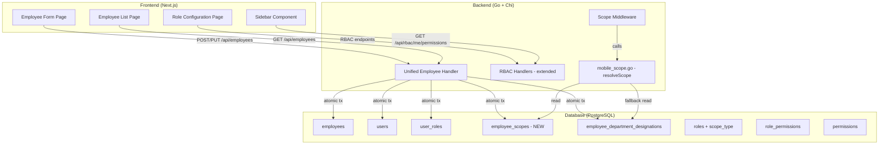
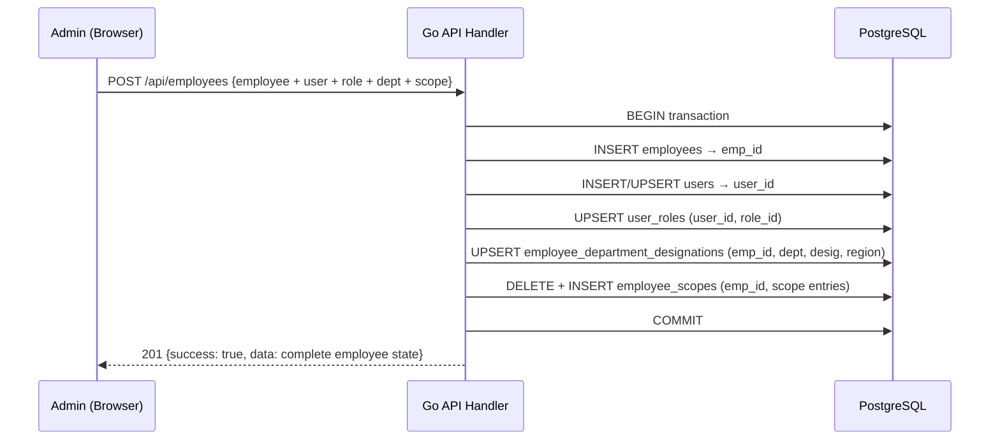
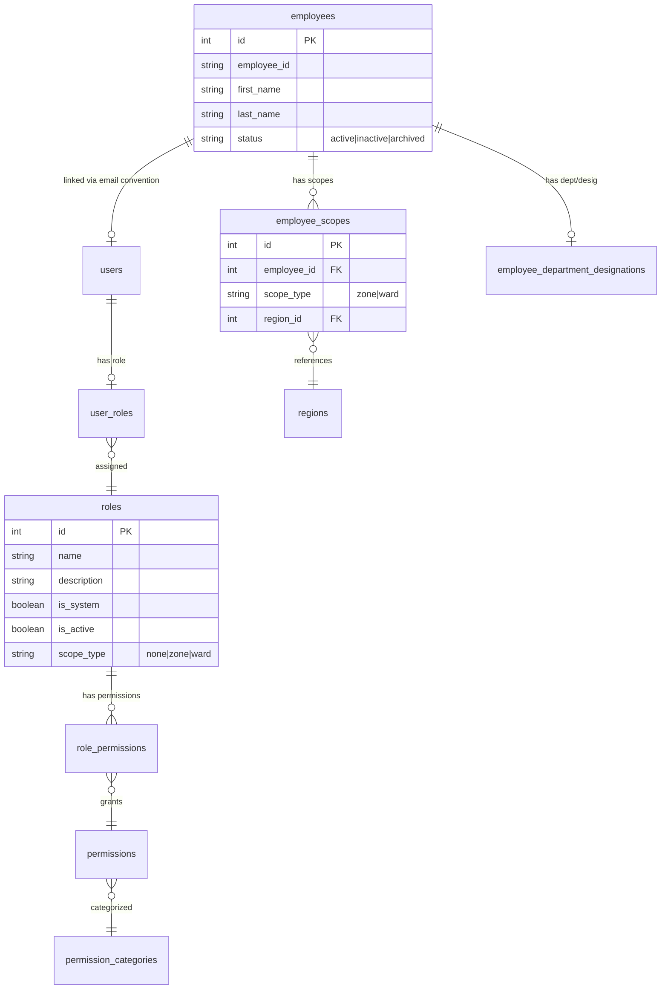

# Design Document: Unified Employee Management

## Overview

This design consolidates the fragmented HR/Staff, RBAC, Department, Designation, and scope management workflows into a unified Employee Management system. The current system requires Admins to navigate 5+ separate pages and make multiple uncoordinated API calls to onboard a single employee. The redesign delivers:

1. **Single-page Employee Form** — creates/edits Employee + User Account + Role + Department + Designation + Scope in one atomic transaction
2. **Discord-style Role Configuration Page** — create roles, configure permissions with category-grouped toggles, view assigned employees
3. **Scope-aware data access** — a new `employee_scopes` table replaces ad-hoc region lookups, integrating cleanly with the existing `resolveScope()` function in `mobile_scope.go`
4. **Simplified sidebar** — "Employee Management" replaces "HR / Staff" + standalone "RBAC"
5. **Migration strategy** — preserves all existing data while transitioning from the multi-table assignment system

### Key Design Decisions

| Decision | Rationale |
|----------|-----------|
| Single atomic API endpoint (POST/PUT `/api/employees`) | Eliminates partial-creation states; frontend never coordinates multiple calls |
| `employee_scopes` table with polymorphic `scope_type` | Decouples scope from `employee_department_designations`, enables multi-ward for supervisors |
| `scope_type` field on `roles` table | Drives dynamic form fields without hardcoding role names in frontend |
| Retain `employee_department_designations` during transition | Backward compatibility with existing `mobile_scope.go` employeeRegion() until full migration |
| Permission-based sidebar filtering | Replaces brittle `RequireRole("ADMIN")` checks with granular permission codes |

## Architecture



### Request Flow: Employee Creation



## Components and Interfaces

### Backend Components

#### 1. Unified Employee Handler (`internal/api/unified_employee_handlers.go`)

```go
// UnifiedEmployeeRequest is the single payload for create/update
type UnifiedEmployeeRequest struct {
    // Identity
    FirstName    string `json:"first_name" validate:"required"`
    MiddleName   string `json:"middle_name"`
    LastName     string `json:"last_name" validate:"required"`
    EmployeeID   string `json:"employee_id" validate:"required"`
    Email        string `json:"email"`
    AadhaarNo    string `json:"aadhaar_no"`
    ContactNo    string `json:"contact_no" validate:"required"`
    AltContactNo string `json:"alt_contact_no"`
    Address      string `json:"address"`
    OtherDetails string `json:"other_details"`

    // Login
    Password string `json:"password"` // required on create, optional on update

    // Organizational
    RoleID        int `json:"role_id" validate:"required"`
    DepartmentID  int `json:"department_id" validate:"required"`
    DesignationID int `json:"designation_id"`

    // Scope (dynamic based on role.scope_type)
    ZoneID  *int  `json:"zone_id"`  // for scope_type="zone"
    WardIDs []int `json:"ward_ids"` // for scope_type="ward"

    // Status
    IsActive *bool `json:"is_active"`
}

// UnifiedEmployeeResponse is the complete employee state returned by GET/POST/PUT
type UnifiedEmployeeResponse struct {
    ID           int    `json:"id"`
    FirstName    string `json:"first_name"`
    MiddleName   string `json:"middle_name"`
    LastName     string `json:"last_name"`
    EmployeeID   string `json:"employee_id"`
    Email        string `json:"email"`
    AadhaarNo    string `json:"aadhaar_no"`
    ContactNo    string `json:"contact_no"`
    AltContactNo string `json:"alt_contact_no"`
    Address      string `json:"address"`
    OtherDetails string `json:"other_details"`
    IsActive     bool   `json:"is_active"`
    CreatedAt    string `json:"created_at"`

    // Related
    UserID        int    `json:"user_id"`
    UserEmail     string `json:"user_email"`
    RoleID        int    `json:"role_id"`
    RoleName      string `json:"role_name"`
    DepartmentID  int    `json:"department_id"`
    DepartmentName string `json:"department_name"`
    DesignationID int    `json:"designation_id"`
    DesignationName string `json:"designation_name"`
    Scopes        []ScopeEntry `json:"scopes"`
}

type ScopeEntry struct {
    ScopeType string `json:"scope_type"` // "zone" or "ward"
    RegionID  int    `json:"region_id"`
    RegionName string `json:"region_name"`
}
```

**Handler methods:**
- `CreateUnifiedEmployee(w, r)` — POST `/api/employees` (new unified)
- `UpdateUnifiedEmployee(w, r)` — PUT `/api/employees/{id}` (new unified)
- `GetUnifiedEmployee(w, r)` — GET `/api/employees/{id}` (returns complete state)
- `GetUnifiedEmployees(w, r)` — GET `/api/employees` (list with joins)
- `DeactivateEmployee(w, r)` — PUT `/api/employees/{id}/status`

#### 2. Role Handler Extensions (`internal/api/rbac_handlers.go`)

New/modified endpoints:
- `GET /api/rbac/roles` — extended to include `scope_type` and assigned employee count
- `PUT /api/rbac/roles/{id}` — extended to accept `scope_type` field
- `GET /api/rbac/roles/{id}/employees` — list employees assigned to a role

#### 3. Scope Resolution Integration (`internal/api/mobile_scope.go`)

The existing `resolveScope()` will be updated to:
1. **First** check `employee_scopes` table for the employee
2. **Fallback** to existing `employee_department_designations` → `regions` join (backward compat during migration)

```go
// Updated employeeRegion function - checks employee_scopes first
func (h *Handler) employeeRegion(ctx context.Context, employeeID int) (int, int, *int, error) {
    db := h.gpsRepo.Pool()

    // Priority 1: New employee_scopes table
    var regionID, regionTypeID int
    var parentID *int
    err := db.QueryRow(ctx, `
        SELECT r.id, COALESCE(r.region_type_id, 0), r.parent_id
        FROM employee_scopes es
        JOIN regions r ON es.region_id = r.id
        WHERE es.employee_id = $1
        ORDER BY es.scope_type ASC  -- zone before ward
        LIMIT 1
    `, employeeID).Scan(&regionID, &regionTypeID, &parentID)

    if err == nil {
        return regionID, regionTypeID, parentID, nil
    }

    // Priority 2: Legacy employee_department_designations (backward compat)
    err = db.QueryRow(ctx, `
        SELECT r.id, COALESCE(r.region_type_id, 0), r.parent_id
        FROM employee_department_designations edd
        JOIN regions r ON edd.region_id = r.id
        WHERE edd.employee_id = $1
        LIMIT 1
    `, employeeID).Scan(&regionID, &regionTypeID, &parentID)

    if err != nil {
        if errors.Is(err, pgx.ErrNoRows) {
            return 0, 0, nil, nil
        }
        return 0, 0, nil, err
    }
    return regionID, regionTypeID, parentID, nil
}
```

### Frontend Components

#### 4. Employee Form Page (`web/src/app/vswm/employee-management/employees/[id]/page.tsx`)

Single-page form with sections:
- **Identity** — First/Middle/Last name, Employee ID, Aadhaar, Contact
- **Login** — Password (required on create, optional on edit)
- **Organization** — Department (dropdown), Designation (dropdown), Role (dropdown)
- **Scope** — Dynamic fields based on selected role's `scope_type`:
  - `scope_type = "zone"` → Zone single-select dropdown
  - `scope_type = "ward"` → Ward multi-select with zone filter
  - `scope_type = "none"` → No scope fields shown

#### 5. Role Configuration Page (`web/src/app/vswm/employee-management/roles/page.tsx`)

Discord-style layout:
- **Left panel** — Role list with search, active/inactive badges, employee count
- **Right panel** — Tabs: "Permissions" (category-grouped toggles), "Members" (assigned employees), "Settings" (name, description, scope_type, duplicate, delete)

#### 6. Sidebar Update (`web/src/components/Sidebar.tsx`)

```typescript
// New structure replacing "HR / Staff" + standalone "RBAC"
{
  label: "Employee Management",
  icon: Users,
  children: [
    { label: "Employees", href: "/vswm/employee-management/employees" },
    { label: "Roles & Permissions", href: "/vswm/employee-management/roles" },
    { label: "Departments", href: "/vswm/employee-management/departments" },
    { label: "Designations", href: "/vswm/employee-management/designations" },
    {
      label: "Operational Assignments",
      children: [
        { label: "Driver to Vehicle", href: "/vswm/employee-vehicle" },
      ],
    },
  ],
}
```

### API Interface Summary

| Method | Path | Description |
|--------|------|-------------|
| GET | `/api/employees` | List all employees with role/dept/scope joins |
| GET | `/api/employees/{id}` | Get single employee complete state |
| POST | `/api/employees` | Create employee + user + role + dept + scope atomically |
| PUT | `/api/employees/{id}` | Update employee atomically |
| PUT | `/api/employees/{id}/status` | Activate/deactivate employee |
| GET | `/api/rbac/roles` | List roles (extended: scope_type, employee_count) |
| GET | `/api/rbac/roles/{id}/employees` | List employees assigned to role |
| PUT | `/api/rbac/roles/{id}` | Update role (extended: scope_type) |
| GET | `/api/rbac/me/permissions` | Current user's permissions (existing) |

## Data Models

### New Table: `employee_scopes`

```sql
CREATE TABLE employee_scopes (
    id SERIAL PRIMARY KEY,
    employee_id INTEGER NOT NULL REFERENCES employees(id) ON DELETE CASCADE,
    scope_type VARCHAR(10) NOT NULL CHECK (scope_type IN ('zone', 'ward')),
    region_id INTEGER NOT NULL REFERENCES regions(id) ON DELETE CASCADE,
    created_at TIMESTAMP DEFAULT NOW(),
    UNIQUE(employee_id, region_id)
);

CREATE INDEX idx_employee_scopes_employee ON employee_scopes(employee_id);
CREATE INDEX idx_employee_scopes_region ON employee_scopes(region_id);
```

### Modified Table: `roles`

```sql
-- Add scope_type column to existing roles table
ALTER TABLE roles ADD COLUMN scope_type VARCHAR(10) DEFAULT 'none'
    CHECK (scope_type IN ('none', 'zone', 'ward'));

-- Set defaults based on existing role names
UPDATE roles SET scope_type = 'zone' WHERE LOWER(name) IN ('zone_manager', 'zone manager');
UPDATE roles SET scope_type = 'ward' WHERE LOWER(name) IN ('supervisor');
```

### Modified Table: `employees`

```sql
-- Add status column for lifecycle management
ALTER TABLE employees ADD COLUMN status VARCHAR(20) DEFAULT 'active'
    CHECK (status IN ('active', 'inactive', 'archived'));

-- Migrate existing is_active to status
UPDATE employees SET status = CASE WHEN is_active = false THEN 'inactive' ELSE 'active' END;
```

### Migration SQL (`060_unified_employee_management.sql`)

```sql
-- 1. Add scope_type to roles
ALTER TABLE roles ADD COLUMN IF NOT EXISTS scope_type VARCHAR(10) DEFAULT 'none'
    CHECK (scope_type IN ('none', 'zone', 'ward'));
UPDATE roles SET scope_type = 'zone' WHERE LOWER(name) LIKE '%zone%manager%';
UPDATE roles SET scope_type = 'ward' WHERE LOWER(name) = 'supervisor';

-- 2. Add status to employees
ALTER TABLE employees ADD COLUMN IF NOT EXISTS status VARCHAR(20) DEFAULT 'active'
    CHECK (status IN ('active', 'inactive', 'archived'));
UPDATE employees SET status = CASE WHEN COALESCE(is_active, true) = false THEN 'inactive' ELSE 'active' END;

-- 3. Create employee_scopes
CREATE TABLE IF NOT EXISTS employee_scopes (
    id SERIAL PRIMARY KEY,
    employee_id INTEGER NOT NULL REFERENCES employees(id) ON DELETE CASCADE,
    scope_type VARCHAR(10) NOT NULL CHECK (scope_type IN ('zone', 'ward')),
    region_id INTEGER NOT NULL REFERENCES regions(id) ON DELETE CASCADE,
    created_at TIMESTAMP DEFAULT NOW(),
    UNIQUE(employee_id, region_id)
);
CREATE INDEX IF NOT EXISTS idx_employee_scopes_employee ON employee_scopes(employee_id);
CREATE INDEX IF NOT EXISTS idx_employee_scopes_region ON employee_scopes(region_id);

-- 4. Populate employee_scopes from existing employee_department_designations
INSERT INTO employee_scopes (employee_id, scope_type, region_id)
SELECT
    edd.employee_id,
    CASE WHEN r.region_type_id = 2 THEN 'zone' ELSE 'ward' END,
    edd.region_id
FROM employee_department_designations edd
JOIN regions r ON edd.region_id = r.id
WHERE edd.region_id IS NOT NULL
ON CONFLICT (employee_id, region_id) DO NOTHING;

-- 5. Migrate users.role text → user_roles FK (where not already present)
INSERT INTO user_roles (user_id, role_id)
SELECT u.id, r.id
FROM users u
JOIN roles r ON LOWER(r.name) = LOWER(u.role)
WHERE NOT EXISTS (
    SELECT 1 FROM user_roles ur WHERE ur.user_id = u.id
)
AND u.role IS NOT NULL AND u.role <> '';
```

### Entity Relationship




## Correctness Properties

*A property is a characteristic or behavior that should hold true across all valid executions of a system — essentially, a formal statement about what the system should do. Properties serve as the bridge between human-readable specifications and machine-verifiable correctness guarantees.*

### Property 1: Atomic Creation Round-Trip

*For any* valid `UnifiedEmployeeRequest` payload, creating an employee via POST and immediately retrieving via GET should return a response where all fields (employee identity, user email, role, department, designation, and scopes) match the original request.

**Validates: Requirements 1.1, 2.1, 10.1, 10.2**

### Property 2: Dynamic Fields Driven by scope_type

*For any* Role with a `scope_type` value, the employee form field visibility rules should be: if `scope_type = "zone"` then zone selector is visible and ward selector is hidden; if `scope_type = "ward"` then ward multi-select is visible and zone selector is hidden; if `scope_type = "none"` then both selectors are hidden.

**Validates: Requirements 1.2, 1.3, 1.4, 1.5**

### Property 3: Validation Rejects Invalid Payloads

*For any* employee creation payload missing one or more required fields (employee_id, first_name, last_name, contact_no, department_id, role_id, password), the API should return HTTP 400 with a response body containing field-level error indicators, and no database records should be created.

**Validates: Requirements 1.6, 1.7, 10.4**

### Property 4: Atomic Update Preserves Unchanged Fields

*For any* existing employee and any valid partial update payload (where password is blank), the updated employee's password hash should remain unchanged, and all explicitly updated fields should reflect their new values in a subsequent GET.

**Validates: Requirements 2.3, 2.5**

### Property 5: Role Change Clears Stale Scopes

*For any* employee with scope assignments, when their role is changed to a role with a different `scope_type`, the employee's previous scope entries in `employee_scopes` should be removed and replaced with scope entries matching the new role's `scope_type` (or empty if `scope_type = "none"`).

**Validates: Requirements 2.2, 2.4**

### Property 6: Role Duplication Preserves Permission Set

*For any* role with an arbitrary set of granted permissions, duplicating that role under a new name should produce a new role whose permission set is identical to the original's.

**Validates: Requirements 3.5**

### Property 7: System Roles Cannot Be Deleted

*For any* role where `is_system = true`, a DELETE request should fail (or be rejected) and the role should remain present in subsequent role list queries.

**Validates: Requirements 3.6**

### Property 8: Single-Role-Per-User Invariant

*For any* user, after any sequence of role assignments, the `user_roles` table should contain at most one entry for that user, and it should be the most recently assigned role.

**Validates: Requirements 4.2, 4.4**

### Property 9: Role Removal Revokes All Permissions

*For any* user with an assigned role, after removing their role assignment, `GetUserPermissions` should return an empty permission set.

**Validates: Requirements 4.3**

### Property 10: Permissions Derived Exclusively from Role

*For any* employee where the designation name differs from the role name, the permissions returned by `GetUserPermissions` should exactly match the permission set configured for their assigned role, with zero influence from the designation value.

**Validates: Requirements 5.2, 5.3, 5.4**

### Property 11: Department Filter Returns Only Matching Employees

*For any* department ID used as a filter parameter on the employee list endpoint, every employee in the response should have that department ID, and no employee assigned to that department should be missing from the response.

**Validates: Requirements 6.3**

### Property 12: Scope Resolution Reflects Current employee_scopes

*For any* employee with entries in `employee_scopes`, the `resolveScope()` function should return a `RoleScope` with `ZoneID` or `WardID` matching the employee's current scope entries. After updating the scope, the next `resolveScope()` call should reflect the new scope immediately.

**Validates: Requirements 7.1, 7.2, 7.3**

### Property 13: Driver Role Change Removes Vehicle Assignment

*For any* employee with role "Driver" and an active `employee_vehicle_assignments` entry, changing their role to any non-Driver role should result in zero active vehicle assignments for that employee.

**Validates: Requirements 9.3**

### Property 14: Transaction Rollback on Partial Failure

*For any* employee creation request where one sub-operation is invalid (e.g., non-existent role_id or department_id), no records should be created in any of the affected tables (employees, users, user_roles, employee_scopes, employee_department_designations).

**Validates: Requirements 10.3**

### Property 15: Deactivation Excludes from Active Lists

*For any* active employee, after deactivation: (a) the employee's status should be "inactive", (b) the employee should not appear in the default (active-only) employee list, and (c) login with their credentials should fail with an authentication error.

**Validates: Requirements 13.1, 13.3**

### Property 16: Reactivation Restores Access

*For any* previously-active employee who was deactivated, reactivation should: (a) set status to "active", (b) re-enable login with existing credentials, and (c) restore the previous role assignment and associated permissions.

**Validates: Requirements 13.2**

### Property 17: Permission-Based Menu Filtering

*For any* user with a specific set of permission codes, the sidebar menu items visible to them should be exactly those items whose associated permission code is in the user's permission set (or all items if the user has the wildcard "*" permission).

**Validates: Requirements 14.1, 14.2, 14.3, 14.4**

### Property 18: scope_type Constraint Enforcement

*For any* string value not in the set {"none", "zone", "ward"}, attempting to create or update a role with that value as `scope_type` should fail with a validation error and the role should not be modified.

**Validates: Requirements 12.3**

## Error Handling

### API Error Response Format

All error responses follow a consistent JSON structure:

```json
{
  "success": false,
  "error": "Human-readable error message",
  "field_errors": {
    "first_name": "First name is required",
    "role_id": "Invalid role ID: role does not exist"
  }
}
```

### Error Categories

| Error Type | HTTP Status | Handling |
|------------|-------------|----------|
| Validation failure (missing/invalid fields) | 400 | Return field-level errors, no DB changes |
| Referenced entity not found (role_id, dept_id) | 400 | Return specific "not found" field error |
| Duplicate employee_id or contact_no | 409 | Return conflict error with duplicate field |
| Transaction failure (DB constraint) | 500 | Full rollback, log error, return generic message |
| Unauthorized | 401 | Standard auth middleware response |
| Forbidden (insufficient permissions) | 403 | "Insufficient permissions" message |
| Employee not found (for update/delete) | 404 | "Employee not found" message |

### Transaction Rollback Strategy

The unified handler uses a single PostgreSQL transaction for all sub-operations:

```go
tx, err := db.Begin(ctx)
defer tx.Rollback(ctx) // Always rollback if not committed

// All operations within tx...
// If any error: return error response (deferred rollback executes)
// If all succeed: tx.Commit(ctx)
```

### Scope Resolution Fallback

When `employee_scopes` has no entry for an employee:
1. Fall back to `employee_department_designations` → `regions` join (legacy path)
2. If no region found: admin-level roles get city-wide access; others get nil scope (no data visible)

### Migration Error Handling

- Conflicts (users.role ≠ user_roles): prefer `user_roles`, log conflict to `migration_conflicts` table
- Missing role mappings: log warning, skip that user's migration (manual resolution required)
- Dry-run mode: wraps all changes in a transaction that is always rolled back, reports planned changes

## Testing Strategy

### Property-Based Testing (fast-check)

The feature has significant pure logic suitable for property-based testing:
- Validation logic (which payloads are accepted/rejected)
- Scope resolution logic (mapping employee → zone/ward)
- Permission derivation (role → permission set)
- Filtering logic (department filter, active-only filter)
- Constraint enforcement (single-role, scope_type values)

**Library:** [fast-check](https://github.com/dubzzz/fast-check) for TypeScript tests (frontend logic, API contract tests)  
**Library:** Go's [rapid](https://github.com/flyingmutant/rapid) for backend unit tests

**Configuration:**
- Minimum 100 iterations per property test
- Each test tagged with: `Feature: unified-employee-management, Property {N}: {title}`

### Unit Tests (Example-Based)

- Specific role examples (Zone_Manager → zone field, Supervisor → ward field)
- Migration conflict resolution with concrete test data
- Sidebar structure assertions (specific items present/absent)
- Password retention on edit (specific flow)

### Integration Tests

- Full POST → GET round-trip against test database
- Migration script execution on seeded test data
- Scope resolution with real region hierarchy data
- RBAC permission check with real role-permission mappings
- Employee deactivation → login failure flow

### Test Organization

```
tests/
├── properties/
│   ├── employee_validation_props_test.go    // Properties 3, 14, 18
│   ├── scope_resolution_props_test.go       // Properties 5, 12
│   ├── role_management_props_test.go        // Properties 6, 7, 8, 9
│   ├── permission_derivation_props_test.go  // Properties 10, 17
│   └── employee_lifecycle_props_test.go     // Properties 1, 4, 13, 15, 16
├── integration/
│   ├── unified_employee_api_test.go
│   ├── migration_test.go
│   └── scope_resolution_integration_test.go
└── web/
    └── __tests__/
        ├── employeeForm.property.test.ts    // Property 2 (dynamic fields)
        ├── sidebarFilter.property.test.ts   // Property 17
        └── employeeForm.test.ts             // Example-based UI tests
```
