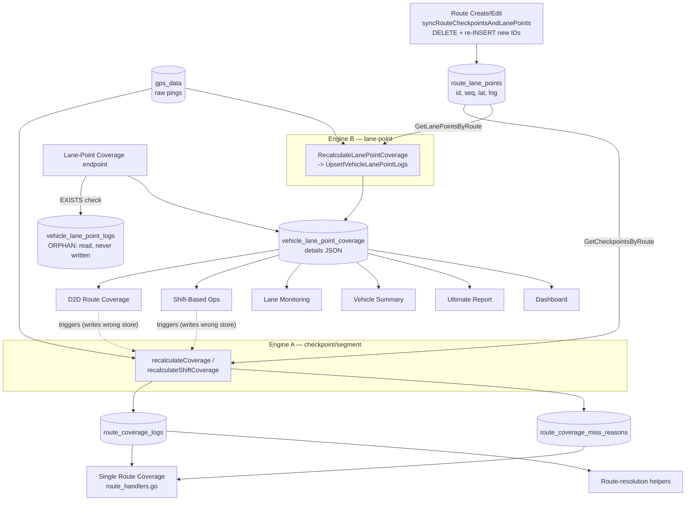

# Coverage Subsystem Investigation — Data Flow & Single-Source-of-Truth Plan

**Status:** Investigation only. No behavior changed. For review before any reconciliation.
**Goal:** Explain why coverage reports read from a different store than they write, decide the
single source of truth (SSOT), and propose a low-risk unification plan that must land *before*
versioning / stale-detection / smart-load.

---

## 1. TL;DR

There are **two independent coverage engines** that both compute "did vehicle V cover the
points of route R on date D", but persist to **different tables**:

- **Engine A — Checkpoint/segment engine** → writes `route_coverage_logs` +
  `route_coverage_miss_reasons`.
- **Engine B — Lane-point engine** → writes `vehicle_lane_point_coverage` (`details` JSON).

Several reports **call Engine A to recompute but read Engine B's table** (or vice-versa). The
clearest case is the **D2D Route Coverage report**: it triggers Engine A, yet reads its
percentages from Engine B's `vehicle_lane_point_coverage`. Engine A's writes are **dead data**
for that report. This is a **half-finished migration**, not an intentional design.

Both engines key their results on `route_lane_points.id`. Because a route edit deletes and
re-inserts `route_lane_points` with **new IDs** (and never refreshes the coverage tables), all
historical coverage becomes orphaned — the root cause behind the zero/incorrect values.

**Recommended SSOT: `vehicle_lane_point_coverage`** (most consumers already read it).

---

## 2. The two engines

### Engine A — Checkpoint/segment engine
| Aspect | Detail |
|--------|--------|
| Functions | `recalculateCoverage`, `recalculateShiftCoverage` (`internal/api/report_handlers.go`) |
| Geometry input | `GetCheckpointsByRoute(routeID)` → **reads `route_lane_points`** (aliased as "checkpoints"; `checkpoint_id == route_lane_points.id`) |
| GPS input | `gpsRepo.GetByVehicle(vehicle, dayStart, dayEnd)` (full-day raw GPS) |
| Algorithm | Per-segment / per-point proximity ≤10 m, optional sequential ordering + speed-limit checks |
| Writes | `route_coverage_logs` (hits), `route_coverage_miss_reasons` (misses) — inside a transaction (delete-then-insert) |
| Does NOT write | `vehicle_lane_point_coverage` |

### Engine B — Lane-point engine
| Aspect | Detail |
|--------|--------|
| Functions | `RecalculateLanePointCoverage` (`internal/api/lane_point_coverage.go`) → `UpsertVehicleLanePointLogs` (`internal/repository/route_repo.go`) |
| Geometry input | `GetLanePointsByRoute(routeID)` → **reads `route_lane_points`** |
| GPS input | Raw GPS, or AI-reconstructed path when `useReconstructed` |
| Algorithm | Sequential lane-point coverage with proximity |
| Writes | `vehicle_lane_point_coverage` (`details` JSON of `{lane_point_id,status,hit_time}`, plus `total_points`, `covered_points`, `coverage_percent`, `in_order`) |
| Does NOT write | `vehicle_lane_point_logs` (despite the function name) — see §6 orphan |

Both engines compute the same conceptual result over the **same geometry** (`route_lane_points`)
but store it in different shapes/tables.

---

## 3. Who writes what (writers)

| Table | Written by | Trigger points |
|-------|-----------|-----------------|
| `route_coverage_logs` | Engine A; `LogCheckpointHit` | D2D report (`GetD2DRouteCoverageReport`), single-route coverage (`route_handlers.go`), Shift-Based Ops (`recalculateShiftCoverage`) |
| `route_coverage_miss_reasons` | Engine A | same as above |
| `vehicle_lane_point_coverage` | Engine B (`UpsertVehicleLanePointLogs`) | Lane-Point Coverage endpoint (`lane_point_handlers.go`), Vehicle Summary report (`vehicle_summary_report_handlers.go`) |
| `vehicle_lane_point_logs` | **(no writer found)** | — (orphan) |
| `route_lane_points` / `route_checkpoints` | `syncRouteCheckpointsAndLanePoints` on route create/edit | route geometry (delete + re-insert with new IDs) |

## 4. Who reads what (readers)

| Report / Endpoint | Reads | Filled by | Recompute it triggers | Consistent? |
|-------------------|-------|-----------|------------------------|-------------|
| **D2D Route Coverage** | `GetCoverageHitLogs` → **`vehicle_lane_point_coverage.details`** | Engine B | **Engine A** (`recalculateCoverage`) | ❌ **read/write mismatch** |
| **Shift-Based Ops** | `GetCoverageHitLogs` → **`vehicle_lane_point_coverage`** | Engine B | **Engine A** (`recalculateShiftCoverage`) | ❌ **read/write mismatch** |
| Single Route Coverage (`route_handlers.go`) | `GetVisitedCheckpoints` → `route_coverage_logs` + `route_coverage_miss_reasons` | Engine A | Engine A | ✅ consistent |
| Lane-Point Coverage (`lane_point_handlers.go`) | `vehicle_lane_point_coverage`; `EXISTS` on `vehicle_lane_point_logs` | Engine B | Engine B | ⚠️ reads orphan table for "has history" |
| Lane Monitoring | `vehicle_lane_point_coverage.details` | Engine B | none (read-only) | ✅ |
| Vehicle Summary Report | `vehicle_lane_point_coverage` | Engine B | Engine B | ✅ consistent |
| Ultimate Report | `vehicle_lane_point_coverage.coverage_percent` | Engine B | none | ✅ |
| Dashboard (`GetDashboardCoverageData`) | `vehicle_lane_point_coverage` | Engine B | none | ✅ |
| Route resolution helpers (`route_repo.go` L191/294/458) | `route_coverage_logs`/`miss_reasons` (which routes a vehicle touched) | Engine A | none | side-dependency on Engine A |

**Consequence for D2D / Shift-Based Ops:** their displayed percentage depends entirely on Engine B
having been run for that `(vehicle, route, date)` by *some other* endpoint (Vehicle Summary or
Lane-Point Coverage). If Engine B never ran for that key, D2D shows 0% — and pressing
Recalculate (Engine A) does **not** fix it, because it writes a table D2D doesn't read.

---

## 5. Complete data-flow diagram

Dotted red lines = the inconsistency: D2D and Shift-Based Ops *recompute* via Engine A but
*read* from Engine B's `vehicle_lane_point_coverage`.

---

## 6. Intentional or regression? + duplication/orphans

**Regression from an incomplete migration.** Timeline from migrations:
- `010_route_coverage.sql` / `034_add_route_coverage_miss_reasons.sql` established the original
  **checkpoint** store (Engine A).
- `049a_lane_points_system.sql` introduced the **lane-point** store (Engine B) as the newer model.

Most *readers* were repointed to the new `vehicle_lane_point_coverage`, and
`GetCheckpointsByRoute` was repointed to `route_lane_points` — but the D2D / Shift recompute
functions were **never** migrated to write the new table. So Engine A persists became orphaned
for those reports.

**Duplicated data:** the same coverage truth (per `route_lane_points.id`, per vehicle, per date)
is stored twice — once as rows in `route_coverage_logs` and once as JSON in
`vehicle_lane_point_coverage.details`.

**Orphaned tables/paths:**
- `vehicle_lane_point_logs` — read by an `EXISTS` "has history" check in `lane_point_handlers.go`
  but has **no writer**, so that check is effectively always false (forces recompute).
- For D2D/Shift-Based Ops, `route_coverage_logs`/`miss_reasons` are **write-only dead data**.

---

## 7. Single Source of Truth — recommendation

**SSOT = `vehicle_lane_point_coverage`.**

Rationale: 6 of the consumer paths (D2D, Shift-Based Ops, Lane Monitoring, Vehicle Summary,
Ultimate, Dashboard) already read it; only the single-route-coverage endpoint and a few
route-resolution helpers depend on the legacy `route_coverage_logs`. Converging on the table the
majority already trust is the smaller, safer change.

### Unification plan (behavior-preserving, staged)

**U1 — Make Engine A write the SSOT (fix the mismatch).**
- Route D2D / Shift-Based Ops recompute to **Engine B** (`RecalculateLanePointCoverage`) instead
  of `recalculateCoverage`/`recalculateShiftCoverage`, OR have Engine A additionally upsert
  `vehicle_lane_point_coverage`. Preferred: call Engine B so there is one algorithm.
- Net effect: pressing Recalculate on D2D finally refreshes what D2D displays. No schema change.

**U2 — Repoint the remaining legacy reader.**
- Migrate single-route coverage (`route_handlers.go` `GetVisitedCheckpoints`) and the
  route-resolution helpers (`route_repo.go` L191/294/458) to read `vehicle_lane_point_coverage`.

**U3 — Deprecate the legacy store.**
- Stop writing `route_coverage_logs` / `route_coverage_miss_reasons`; keep tables read-only for a
  grace period, then drop. Remove the orphan `vehicle_lane_point_logs` and its `EXISTS` check.

**U4 — Reconcile algorithm differences.**
- Engines A and B differ (segment vs point matching, speed/sequence handling, reconstructed-path
  support). Before deleting Engine A, confirm Engine B reproduces the values the single-route
  coverage report expects (validate on a sample of historical dates). Carry over any Engine-A-only
  logic (e.g. miss-reason text, speed-limit violations) into Engine B / its `details` JSON.

### Risk & validation
- U1 is the highest-value, lowest-schema-risk step and directly removes the "Recalculate doesn't
  fix D2D" defect. Validate by recomputing a known date and diffing percentages before/after.
- Keep legacy tables intact (read-only) until U2–U4 are validated, so rollback is trivial.

---

## 8. Only after unification — build the higher layers

Once a single coverage store and single engine exist, layer on (from the earlier design doc):
Route Versioning → Engine/Report Versioning → Coverage Validity → Stale Detection → Smart Load →
Automatic Invalidation. Building these on the current dual-store inconsistency would encode the
bug into a new abstraction, so unification is a hard prerequisite.

---

## 9. Open questions for review
1. Confirm SSOT = `vehicle_lane_point_coverage` (vs. consolidating onto the checkpoint store).
2. For U1, prefer **switching D2D/Shift to Engine B**, or **making Engine A also upsert the SSOT**
   as a shorter-term bridge?
3. Is the single-route-coverage endpoint (`route_handlers.go`) still actively used? If deprecated,
   U2 shrinks significantly.
4. Are Engine A's miss-reason texts / speed-violation classifications surfaced in any UI we must
   preserve when consolidating onto Engine B?

---

## 10. Engine A vs Engine B — Business-Rule Parity Matrix

Required before removing Engine A. Source: `recalculateCoverage` / `recalculateShiftCoverage`
(`report_handlers.go`) vs `ValidateSequential` / `ValidateNonSequential` /
`RecalculateLanePointCoverage` (`lane_point_coverage.go`).

| Business rule | Engine A (checkpoint) | Engine B (lane-point) | Gap? |
|---------------|-----------------------|------------------------|------|
| Geometry source | `route_lane_points` (via GetCheckpointsByRoute) | `route_lane_points` (via GetLanePointsByRoute) | ✅ same |
| Proximity threshold | hard-coded **10 m** | **parameter** (10 m from lane-point endpoint, **50 m** from Vehicle Summary) | ⚠️ inconsistent inputs |
| Sequential matching | `expectedIdx` advance; only the expected next point can be hit | `ValidateSequential`: next-expected + forward scan for out-of-order | ✅ equivalent intent |
| Out-of-order / route-order violation | marks later point "Out of Sequence"; expected stays missed | sets `ViolationOccurred`; marks skipped points `missed`, credits the later hit | ✅ equivalent intent |
| Coverage % | `physical_hits / total_checkpoints` | `covered_points / total_points` (`coverage_percent`) | ✅ same formula |
| **Speed threshold** | **rejects hit if `speed > maxSpeed`**, records "Speed Too High" | **no speed handling at all** (`GPSCoord` has no Speed field) | ❌ **MISSING in B** |
| **Miss-reason text** | "Never Reached", "Speed Too High", "Out of Sequence", "Out of Sequence & Speed Too High" | only `pending/achieved/missed` status, no reason text | ❌ **MISSING in B** |
| Segment vs point matching | segment unless `Δt>60 s` or `Δd>200 m` (teleport guard) | segment unless `Δt>180 s` or `Δd>2000 m` | ⚠️ different leniency |
| Duplicate / already-hit handling | skips checkpoints already in `physicalHits` | sequential index never revisits achieved points | ✅ equivalent |
| GPS drift / invalid filtering | none explicit (uses raw points) | skips NaN/Inf/(0,0); applies `smoothGpsData`; drops (0,0) | ✅ **B is stricter (better)** |
| Reconstructed-path (AI) support | none | supported via `useReconstructed` | ✅ **B-only (extra)** |
| Time window | full day (`recalculateCoverage`); **shift window start/end** (`recalculateShiftCoverage`) | **full day only** (`dayStart..dayEnd`) | ❌ **shift window MISSING in B** |
| Night shift / operational date | shift variant receives `actualStart/actualEnd` from operational-date resolution | keyed by `report_date` (full day) | ⚠️ see note below |

### Notes that change the risk picture
- **The shift report already displays full-day Engine B numbers.** `GetShiftBasedOpsReport` reads
  `vehicle_lane_point_coverage` (keyed by `vehicle, route, report_date`). Engine A's
  `recalculateShiftCoverage` shift-window result was written to `route_coverage_logs` (never read
  by that report). So switching shift recompute to Engine B (full day) **preserves what users see
  today**; the shift-window math was dead. Adding true shift-window support is a separate,
  intentional improvement — not required to preserve current output.
- **Speed threshold + miss reasons are only actually surfaced by the single-route-coverage
  endpoint** (`route_handlers.go`), which reads Engine A directly. The reports targeted by U1
  (D2D, Shift) already read Engine B and therefore already show no-speed-threshold numbers.

### Conclusion for sequencing
- **U1 (D2D + Shift → Engine B) can preserve current displayed output** without first porting
  speed thresholds / miss reasons, because those reports already read Engine B.
- **Speed threshold + miss-reason text MUST be ported into Engine B before U2/U3** (when the
  single-route-coverage reader is migrated and Engine A is removed). This requires:
  - adding a `Speed` field to `GPSCoord` and threading it through validation,
  - extending `vehicle_lane_point_coverage.details` (or a sibling column) to carry a reason string,
  - making proximity/teleport-guard/speed configurable.

### Decisions needed before writing U1 code (they change displayed numbers)
1. **D2D recompute proximity:** use **10 m** (Engine A's historical intent and the lane-point
   endpoint's value) or **10 m** (what Vehicle Summary writes)? Today D2D shows whichever engine-B
   caller last ran, so it is already inconsistent; U1 should pin one value.
2. **`useReconstructed` for D2D recompute:** off (raw GPS) or follow each route's
   `ai_*` config flags?
3. **Shift recompute:** keep **full-day** (preserves current displayed output) for U1, and treat
   true shift-window coverage as a later opt-in feature — confirm.

---

## 11. Phase U1 — Implemented (D2D + Shift → Engine B)

### Decisions applied
- **Proximity = 10 m**, configurable at runtime via env var `COVERAGE_PROXIMITY_METERS`
  (`CoverageProximityMeters()` in `lane_point_coverage.go`). 50 m is NOT used as the standard.
- **`useReconstructed` follows route config**: `RouteUsesReconstruction()` reads the route's
  `ai_coverage_recovery_enabled` flag; if enabled and a reconstructed path exists for the date,
  Engine B uses it; otherwise it falls back to raw GPS.
- **Shift coverage stays full-day** for U1 (the shift report already displayed full-day Engine B
  numbers; true shift-window coverage is deferred).

### Code changes
- `GetD2DRouteCoverageReport`: recompute now calls `RecalculateLanePointCoverage` (Engine B)
  instead of `recalculateCoverage` (Engine A); "has history" now checks the SSOT via
  `HasLanePointCoverage` instead of `HasCoverageRecords` (legacy tables).
- `GetShiftBasedOpsReport`: same migration; full-day Engine B; SSOT history check.
- New repo method `RouteRepository.HasLanePointCoverage` (checks `vehicle_lane_point_coverage`).
- New helpers `CoverageProximityMeters()` and `RouteUsesReconstruction()`.
- Engine A functions remain in the tree: `recalculateCoverage` is still used by the single-route
  coverage endpoint (`route_handlers.go`, a U2 reader); `recalculateShiftCoverage` is now
  orphaned and will be removed in U3.

Build, `go vet`, and test compilation all pass. Behavior is unchanged on the frontend (same
endpoints, same JSON shape).

### Goal achieved
Pressing **Recalculate** on D2D now writes `vehicle_lane_point_coverage` — exactly the table
**Load** reads. The previous defect (Recalculate wrote `route_coverage_logs`, which D2D never
read) is gone.

### Equivalence / intentional-difference analysis (per the additional requirement)

| Scenario | Before U1 (displayed) | After U1 (displayed) | Equivalent? |
|----------|-----------------------|----------------------|-------------|
| D2D, SSOT last populated by lane-point endpoint (10 m) | Engine B @10 m | Engine B @10 m | ✅ identical |
| D2D, SSOT last populated by Vehicle Summary (50 m) | Engine B @50 m | Engine B @10 m | ⚠️ **intentional fix** — 10 m is stricter, so coverage is equal-or-lower; pins the historically-intended radius |
| D2D, plain Load, SSOT empty but legacy tables had rows | showed **0%** (checked legacy table, read empty SSOT) | recomputes into SSOT, shows real % | ⚠️ **intentional bug fix** |
| D2D, Force Recalculate | wrote legacy table; displayed value unchanged/stale | recomputes SSOT; displayed value refreshes | ⚠️ **intentional fix (the whole point of U1)** |
| Shift-Based Ops | full-day Engine B (Engine A shift-window writes were dead) | full-day Engine B @10 m | ✅ equivalent (subject to the 10 m-vs-50 m pin above) |
| Reports reading reconstructed-enabled routes | depended on ad-hoc `use_reconstructed` query param | follows `ai_coverage_recovery_enabled` consistently | ⚠️ **intentional consistency change** |

**Documented intentional differences (bug fixes, not regressions):**
1. Proximity pinned to 10 m everywhere D2D/Shift recompute (was inconsistently 10 m or 50 m).
2. Plain Load now recomputes when the SSOT is empty (previously could display 0% because the
   "has history" check looked at the wrong table).
3. Force Recalculate now actually updates displayed coverage.
4. Reconstruction usage is now driven by route config instead of a query-string flag.

### Recommended validation before production rollout
Run D2D for a sample of historical dates/vehicles with `force_recalc=true` and compare against
the prior stored `vehicle_lane_point_coverage` values: differences should appear **only** in the
four documented cases above. (Automated equivalence harness can be added once a test DB fixture
is available.)
