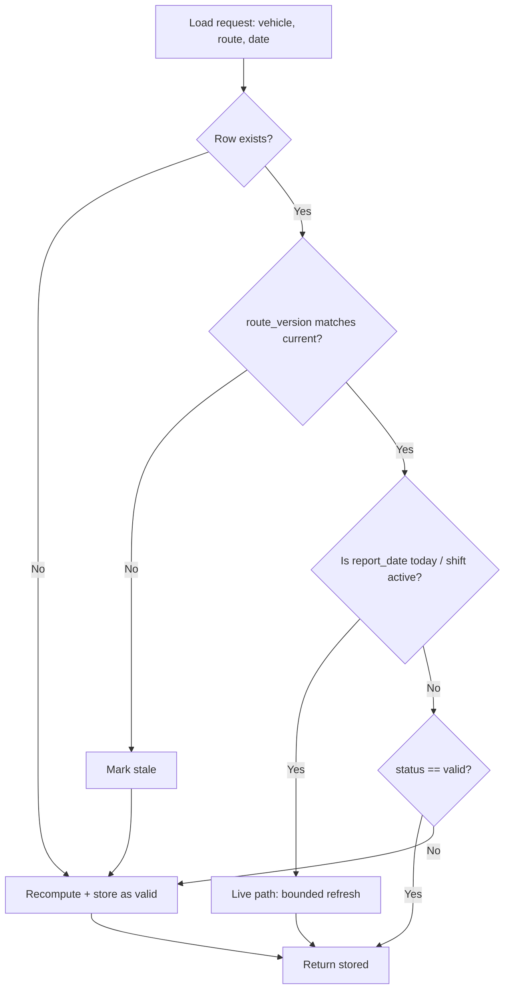

# Technical Design: Smart Report Loading & Automatic Recalculation Strategy

**Status:** Proposal — for review & approval. Do not implement until approved.
**Author:** Engineering
**Scope:** Reporting subsystem (Load / Recalculate), route-edit invalidation, live vs historical reports.

---

## 1. Executive Summary

Today the system exposes two implicit modes on the same report endpoints, switched by a
`force_recalc` query flag:

- **Load** — reads previously stored results. Fast, but returns stale/zero data when the
  underlying inputs (routes, GPS) have changed since the stored result was computed.
- **Recalculate** — recomputes from raw GPS + route geometry and overwrites the stored
  result. Correct, but heavy.

This design replaces the manual two-button model with a **dependency-aware "smart load"**:
the backend decides whether stored data is still valid, and only recomputes when it is
**missing, stale, or invalidated**. Staleness is tracked explicitly via a
**freshness/version model** and route edits actively **invalidate** affected historical
reports instead of silently orphaning them.

---

## 2. Current Architecture (As-Built)

### 2.1 How "Load" and "Recalculate" actually work

Both are the same request. The frontend (`web/src/app/vswm/d2d-vehicle-route-coverage-report/page.tsx`)
calls `handleLoad(forceRecalc)`; only the Load button currently exists and always passes `false`.

Backend (`internal/api/report_handlers.go`, `GetD2DRouteCoverageReport`):

```go
isToday := (a.Date == utils.CurrentTimeInIndia().Format("2006-01-02"))
localForceRecalc := forceRecalc || isToday
if localForceRecalc || !hasHistory {
    recalculateCoverage(...)   // heavy: pulls full-day GPS, matches checkpoints
}
logs, _ := h.routeRepo.GetCoverageHitLogs(...)   // read stored result
```

- `force_recalc=false` (Load): recompute **only** if there is no stored history, **or** the
  date is today. Otherwise read stored result.
- `force_recalc=true` (Recalculate): always recompute and overwrite, any date.
- `isToday` forces recompute on every load of the current day.

### 2.2 Storage model

Coverage is persisted in three tables, all keyed by `(vehicle_id, route_id, report_date)`:

| Table | Content |
|-------|---------|
| `vehicle_lane_point_coverage` | `details` JSON (`lane_point_id`, `status`, `hit_time`), `total_points`, `covered_points`, `in_order` |
| `route_coverage_logs` | per-checkpoint hit logs |
| `route_coverage_miss_reasons` | per-checkpoint miss reasons |

**There is no route-version column and no freshness/validity column.** `HasCoverageRecords`
only answers "do rows exist", not "are they still valid".

### 2.3 Report classes (investigation result)

| Class | Reports | How data is produced | Live? |
|-------|---------|----------------------|-------|
| **A. Pre-generated + finalized** | Vehicle Movement (`movement_reports`) | Nightly cron `ReportJob.Run()` computes *yesterday* for all vehicles, then `FinalizeForDate` locks rows (`is_finalized`, enforced in upsert `WHERE NOT is_finalized`) | No — fully precomputed |
| **B. Lazy-cached coverage** | D2D Route Coverage, Route Coverage (single), Shift-Based Ops | Computed on demand from raw GPS, cached in coverage tables, reused via `force_recalc`/`isToday` logic | Partial |
| **C. Fully live (direct GPS/events)** | Active Vehicle Summary, Ward Active Summary, Geofence Event, Ward Geofence, Early Departure, GTS Trip, Lane Monitoring, Alert Detail | Each call queries GPS/event tables directly via `gpsRepo.Pool()`; nothing cached | Yes |

### 2.4 Shift / night-shift / 24-hour handling

- Midnight-crossing shifts are handled in `internal/service/report_service.go` (~L585): if the
  end time is "earlier" than the start time, the end is rolled to `date + 1 day`.
- The same `curMin >= stMin || curMin <= etMin` window logic is duplicated in
  `report_handlers.go`, `handlers.go`, and `open_depot_repo.go`.
- **Operational date**: open-depot and shift-ops records carry an `operational_date` so a night
  shift (e.g. 18:00 → next-day 06:00) is attributed to the **start** day. This is the correct
  anchor and the redesign keeps it as the canonical reporting-day key.
- The nightly cron always runs for `yesterday`, so a night shift that ends at 06:00 today is
  only finalized the following night. There is currently **no "today is still live / shift in
  progress"** signal beyond the `isToday` recompute hack.

### 2.5 Route-edit behavior (root cause of Problem 4)

`UpdateRoute` (`internal/api/routes_handlers.go`) calls `syncRouteCheckpointsAndLanePoints`,
which does:

```sql
DELETE FROM route_checkpoints  WHERE route_id = $1;
DELETE FROM route_lane_points  WHERE route_id = $1;
-- then re-INSERT with fresh auto-increment IDs
```

It **never** touches `vehicle_lane_point_coverage`, `route_coverage_logs`, or
`route_coverage_miss_reasons`. Consequences:

1. Historical coverage `details` JSON still references **deleted** `lane_point_id` values.
2. On the next Load, `TotalCheckpoints` is read from the **new** checkpoint set while
   `uniqueHits` references **old** IDs → mismatch → coverage collapses to wrong/zero values.
3. There is no record of *when* the route changed, so the system cannot tell which historical
   reports are now invalid.

### 2.6 Performance defect (root cause of "today spins forever")

`GetD2DRouteCoverageReport` spawns **one goroutine per vehicle assignment with no concurrency
cap**. On today's date every goroutine forces a full `recalculateCoverage`, each of which calls
`gpsRepo.GetByVehicle(...)` to pull a whole day of GPS points. At production scale this
exhausts the DB pool/CPU; the HTTP handler blocks on `wg.Wait()` and appears to hang.

---

## 3. Weaknesses of the Current Load/Recalculate Model

1. **No validity concept.** "Has rows" ≠ "rows are correct". Load returns confidently wrong data.
2. **Manual recalculation.** Correctness depends on a human remembering to press a button that
   was also removed from the UI.
3. **Route edits silently corrupt history.** No invalidation, no versioning, no audit.
4. **Today is always fully recomputed** and does so with unbounded concurrency.
5. **Duplicated, inconsistent shift-window logic** across ≥4 files.
6. **All-or-nothing recompute.** No partial/per-shift/per-vehicle granularity; a single changed
   route forces full re-runs.
7. **No back-pressure / queueing.** Heavy recomputes run inline on the request path.

---

## 4. Options Considered

### 4.1 Load strategy

| Option | Behavior | Pros | Cons | Verdict |
|--------|----------|------|------|---------|
| 1. Always read stored | Never recompute on load | Fastest | Returns stale/zero data (current pain) | ❌ |
| 2. Always recompute | Recompute every load | Always accurate | Slow, high load, not scalable (current "today" path) | ❌ |
| 3. **Hybrid smart load** | Read if valid; recompute only if missing/stale/invalidated | Fast common case, correct, scalable | Needs validity tracking | ✅ **Recommended** |

### 4.2 Route-change handling

| Option | Behavior | Pros | Cons | Verdict |
|--------|----------|------|------|---------|
| A. Eager full recompute | Recompute all affected history on save | Always accurate immediately | Extremely heavy; route save becomes a long blocking op | ❌ |
| B. **Mark stale, regenerate on open** | Invalidate affected reports; recompute lazily when next viewed | Cheap save; cost paid only for reports actually viewed | First view after edit is slower | ✅ **Core mechanism** |
| C. Background job | Queue recomputation post-edit, fill cache gradually | Smooth UX; warm cache | Needs worker infra | ✅ **Complementary** |

**Recommendation:** B as the correctness guarantee (a stale report is *never* served), with C as
an optimization that pre-warms the most-viewed stale reports so users rarely pay the recompute
cost interactively. A is rejected except as an explicit admin "recompute now" action.

---

## 5. Recommended Architecture

### 5.1 Core idea — Freshness Model

Introduce explicit validity tracking so the backend can decide, per report cell, whether stored
data can be trusted.

Add to each cached coverage row (Class B) the following metadata:

- `route_version` — integer bumped every time the route geometry/lane points change.
- `computed_at` — when the row was computed.
- `input_hash` *(optional, phase 2)* — hash of `{route_version, engine_params, gps_high_watermark}`.
- `status` — `valid | stale | computing`.

A stored row is **servable without recompute** iff:

```
status = 'valid'
AND route_version = routes.current_version
AND report_date < today           (historical, inputs frozen)
```

For **today / in-progress shifts**, the row is treated as always-stale-but-cheap-to-refresh
(see 5.4).

### 5.2 Smart Load decision flow



This removes the user-facing distinction entirely: **Load becomes smart**. A manual
**"Force Recalculate"** action is retained but demoted to an admin/debug affordance (and for
correcting suspected engine bugs), mapping to the existing `force_recalc=true`.

### 5.3 Route-edit invalidation (fixes Problem 4)

On `UpdateRoute` (and lane-point edits):

1. `UPDATE routes SET current_version = current_version + 1 WHERE id = $route`.
2. Mark all dependent cached rows stale (cheap metadata write, not a recompute):
   ```sql
   UPDATE vehicle_lane_point_coverage SET status='stale'
   WHERE route_id = $route AND report_date < CURRENT_DATE;
   -- equivalent for route_coverage_logs / miss_reasons (or a shared validity table)
   ```
3. Enqueue a background recompute job for the affected `(route, recent dates)` window (Option C).
4. Smart Load (5.2) guarantees correctness even before the background job runs: a stale row is
   recomputed on first view.

This converts "silent corruption" into "explicit, self-healing invalidation".

### 5.4 Live reports (today / active shifts)

- **Class C (already live):** unchanged in correctness; they always read current data. We only
  add bounded concurrency + short-TTL caching where they are expensive.
- **Class B for today:** keep recompute-on-load **but**:
  - bound concurrency with a worker pool (see 5.6),
  - apply a short **TTL cache** (e.g. 60–120 s) so rapid reloads don't re-run the full GPS scan,
  - drive recompute from the **operational_date** anchor so a night shift in progress
    (18:00→06:00) is computed against the correct reporting day until the shift closes.
- A shift is "active" until `now > shift_end(operational_date)`. Once closed, the row is computed
  once more and marked `valid`; subsequent loads are pure reads. This naturally replaces the
  blanket `isToday` recompute.

### 5.5 Historical reports

- Inputs are frozen, so a `valid` row matching `current` route version is served directly.
- Movement reports (Class A) already implement this correctly via `is_finalized`; the new model
  generalizes the same guarantee to coverage reports via `status='valid'` + `route_version`.

### 5.6 Performance / scalability changes

1. **Bounded worker pool** for per-vehicle recompute in `GetD2DRouteCoverageReport`
   (semaphore of N = 8–16). Directly fixes the "spins forever" hang.
2. **Queue-based background recomputation** (Option C) for invalidated history, processed by a
   small pool of workers, prioritized by recency / view frequency.
3. **Short-TTL cache for live (today) cells** to absorb reload bursts.
4. **Partial / per-shift recompute**: recompute only the `(vehicle, route, date, shift)` cells
   affected, never the full history.
5. **Idempotent compute with row-level locking** (the existing `getRecalcMutex` pattern,
   extended to the worker pool) to avoid duplicate concurrent recomputes.

---

## 6. Backend Changes Required

1. **Schema-aware validity layer** (see §7) plus repository methods:
   - `MarkCoverageStale(routeID, beforeDate)`
   - `IsCoverageValid(vehicleID, routeID, date, currentRouteVersion) bool`
   - extend `HasCoverageRecords` → `GetCoverageValidity(...) (exists, valid, version)`.
2. **Route versioning**: add `current_version` to `routes`; bump in `UpdateRoute` and any
   lane-point mutation; stamp `route_version` when writing coverage rows in `recalculateCoverage`.
3. **Invalidation hook** in `UpdateRoute` / `syncRouteCheckpointsAndLanePoints` (mark stale +
   enqueue).
4. **Smart-load handler logic**: replace `localForceRecalc := forceRecalc || isToday` with the
   §5.2 decision (`forceRecalc || !valid || isLiveDay`).
5. **Bounded worker pool** in the D2D/coverage handlers.
6. **Background recompute queue + worker** (can start as an in-process buffered-channel worker
   pool; upgrade to a durable queue table if cross-restart durability is needed).
7. **Consolidate shift-window logic** into one `internal/shift` helper (`OperationalDate(now)`,
   `ShiftWindow(date, shift)`, `IsShiftActive(now, date, shift)`), used by all handlers.
8. **Frontend**: restore a clearly-labeled control set — primary **Load** (smart) + secondary
   **Force Recalculate** (admin), plus a per-row "stale/recomputing" indicator.

## 7. Database Changes Required

Minimal, additive, backward-compatible:

```sql
-- Route versioning
ALTER TABLE routes ADD COLUMN current_version INT NOT NULL DEFAULT 1;

-- Coverage validity (apply to each coverage table, or a shared validity table)
ALTER TABLE vehicle_lane_point_coverage
  ADD COLUMN route_version INT,
  ADD COLUMN computed_at   TIMESTAMPTZ DEFAULT now(),
  ADD COLUMN status        TEXT NOT NULL DEFAULT 'valid';   -- valid | stale | computing

CREATE INDEX idx_vlpc_validity
  ON vehicle_lane_point_coverage (route_id, report_date, status);

-- Optional durable recompute queue (if in-process worker is insufficient)
CREATE TABLE coverage_recompute_queue (
  id           BIGSERIAL PRIMARY KEY,
  vehicle_id   INT, route_id INT, report_date DATE,
  reason       TEXT,                 -- 'route_edit' | 'manual' | 'gps_late'
  enqueued_at  TIMESTAMPTZ DEFAULT now(),
  started_at   TIMESTAMPTZ,
  finished_at  TIMESTAMPTZ,
  status       TEXT DEFAULT 'pending' -- pending | running | done | failed
);
```

Existing rows default to `status='valid'`, `route_version=NULL`. Treat `NULL route_version` as
"unknown → recompute on first access" (or backfill to current version during migration if the
geometry is known to be unchanged).

---

## 8. Performance Impact Summary

| Change | Cost | Benefit |
|--------|------|---------|
| Bounded worker pool | Slightly higher latency per request under load | Eliminates DB-pool exhaustion / hangs |
| Validity check on load | One cheap indexed read | Avoids unnecessary heavy recompute |
| Stale-on-edit + lazy regen | Cost paid only for viewed reports | No full-history recompute on save |
| Background pre-warm | Off-peak worker CPU | Interactive loads stay fast |
| Today TTL cache | Small memory; up-to-TTL staleness | Absorbs reload bursts |
| Per-shift partial recompute | — | Avoids whole-day recompute for one shift |

---

## 9. Migration Strategy (Low-Disruption)

**Phase 0 — Hotfixes (safe, independent):**
- Add bounded worker pool to the D2D handler (fixes today-hang now).
- Restore the **Force Recalculate** button so operators can self-serve stale data immediately.

**Phase 1 — Versioning + invalidation (correctness):**
- Add `routes.current_version` + coverage `route_version/status/computed_at` columns (defaults
  keep current behavior).
- Bump version + mark stale in `UpdateRoute`. Smart Load recomputes stale rows on view.

**Phase 2 — Smart Load + live-day handling:**
- Replace `isToday` recompute with operational-date / shift-active logic and TTL cache.
- Make primary Load smart; demote Force Recalculate to admin.

**Phase 3 — Background queue + pre-warm:**
- Add recompute queue + workers; enqueue on route edit and late-GPS arrival.

**Phase 4 — Consolidation:**
- Extract shared `internal/shift` helpers; remove duplicated window logic.

Each phase is independently shippable and reversible; Phase 0 can go out immediately while the
rest is reviewed.

---

## 10. Open Questions for Review

1. Acceptable staleness window (TTL) for today's live coverage cells? (suggest 60–120 s)
2. Should Force Recalculate be admin-only, or available to all report users?
3. Durability requirement for the recompute queue — is an in-process pool acceptable, or must
   it survive restarts (DB-backed queue)?
4. Backfill policy for existing coverage rows: assume `valid` at current version, or force
   recompute-on-first-view?
5. Do Class C (live) reports need any caching, or is their current direct-query performance
   acceptable at production scale?
```
